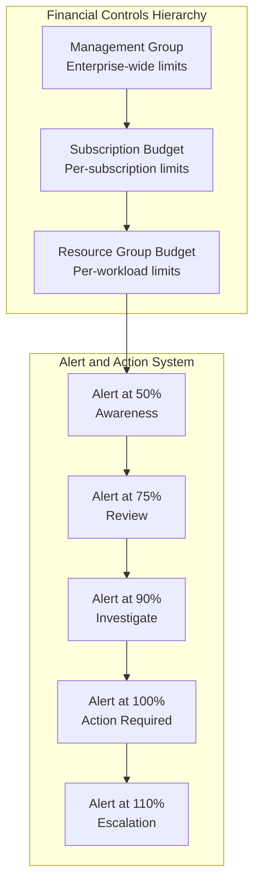
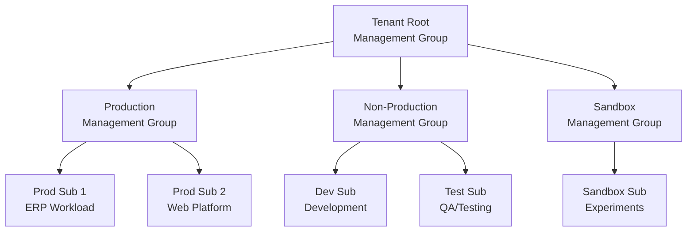
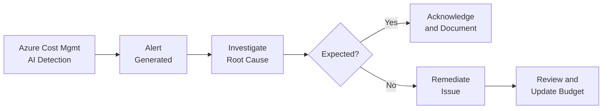
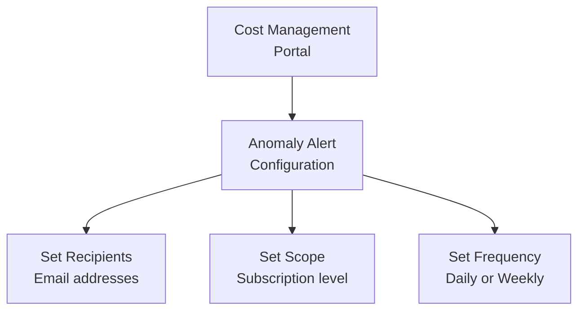

# Module 3: Financial Controls & Budgets

> **Duration:** 45 minutes | **Level:** Tactical  
> **WAF Alignment:** [CO:02 (Cost Model)](https://learn.microsoft.com/en-us/azure/well-architected/cost-optimization/cost-model), [CO:03 (Cost Data)](https://learn.microsoft.com/en-us/azure/well-architected/cost-optimization/collect-review-cost-data), [CO:04 (Spending Guardrails)](https://learn.microsoft.com/en-us/azure/well-architected/cost-optimization/set-spending-guardrails)

---

## 3.1 Financial Controls Architecture



Financial controls are the **guardrails** that prevent cloud cost overruns. They combine **budgets**, **alerts**, **policies**, and **governance hierarchies** to create a layered defense against uncontrolled spending.

> **Microsoft Learn:** [Cost Management best practices](https://learn.microsoft.com/en-us/azure/cost-management-billing/costs/cost-mgt-best-practices)

---

## 3.2 Azure Management Groups Hierarchy for Cost Governance

[Management Groups](https://learn.microsoft.com/en-us/azure/governance/management-groups/overview) provide a scope above subscriptions for organizing resources and applying governance at scale — including budgets, policies, and RBAC.



### Cost Governance at Each Level

| Scope | Budget Purpose | Policy Examples | Who Manages |
|-------|---------------|-----------------|-------------|
| **Tenant Root MG** | Total enterprise cloud spend cap | Global tagging, audit policies | Cloud CoE / FinOps team |
| **Production MG** | Production workload spend control | Allowed regions, allowed SKUs, deny public IPs | Platform team |
| **Non-Prod MG** | Dev/Test spend guardrails | Auto-shutdown, smaller SKU restrictions | Engineering leads |
| **Sandbox MG** | Innovation budget with strict cap | Maximum resource count, auto-delete after 30 days | Individual developers |
| **Subscription** | Per-subscription operational budget | Workload-specific policies | Subscription owner |
| **Resource Group** | Per-application cost tracking | Tag enforcement | Application team |

> **Microsoft Learn:** [Organize resources with Management Groups](https://learn.microsoft.com/en-us/azure/governance/management-groups/overview)  
> **Microsoft Learn:** [Management Group design in CAF](https://learn.microsoft.com/en-us/azure/cloud-adoption-framework/ready/landing-zone/design-area/resource-org-management-groups)

---

## 3.3 Budget Deployment Scopes

| Scope | Use Case | ARM Template Available | Schema |
|-------|----------|----------------------|--------|
| **Management Group** | Enterprise-wide cost governance | `budget-mg-deployment.json` | `managementGroupDeploymentTemplate` |
| **Subscription** | Per-subscription spending control | `budget-subscription-deployment.json` | `subscriptionDeploymentTemplate` |
| **Resource Group** | Per-workload/application control | `budget-resourcegroup-deployment.json` | `deploymentTemplate` |

---

## 3.4 Budget ARM Template - Complete Walkthrough

### Subscription-Level Budget Template

The following ARM template deploys a budget at the **subscription** scope with configurable thresholds, notification contacts, action groups, and resource filters.

```json
{
    "$schema": "https://schema.management.azure.com/schemas/2018-05-01/subscriptionDeploymentTemplate.json#",
    "contentVersion": "1.0.0.0",
    "parameters": {
        "budgetName": {
            "defaultValue": "MyBudget",
            "type": "String",
            "metadata": {
                "description": "Name of the Budget. It should be unique within a subscription."
            }
        },
        "amount": {
            "defaultValue": "1000",
            "type": "String",
            "metadata": {
                "description": "The total amount of cost or usage to track with the budget"
            }
        },
        "categoryType": {
            "defaultValue": "Cost",
            "allowedValues": ["Cost", "Usage"],
            "type": "String",
            "metadata": {
                "description": "The category of the budget, whether the budget tracks cost or usage."
            }
        },
        "timeGrain": {
            "defaultValue": "Monthly",
            "allowedValues": ["Monthly", "Quarterly", "Annually"],
            "type": "String",
            "metadata": {
                "description": "The time covered by a budget. Tracking of the amount will be reset based on the time grain."
            }
        },
        "startDate": {
            "type": "String",
            "metadata": {
                "description": "The start date must be first of the month in YYYY-MM-DD format. Future start date should not be more than three months. Past start date should be selected within the timegrain period."
            }
        },
        "endDate": {
            "type": "String",
            "metadata": {
                "description": "The end date for the budget in YYYY-MM-DD format. If not provided, we default this to 10 years from the start date."
            }
        },
        "firstThreshold": {
            "defaultValue": "90",
            "type": "String",
            "metadata": {
                "description": "Threshold value associated with a notification. Notification is sent when the cost exceeded the threshold. The number must be between 0 and 1000."
            }
        },
        "firstThresholdType": {
            "defaultValue": "Actual",
            "allowedValues": ["Actual", "Forecasted"],
            "type": "String",
            "metadata": {
                "description": "Threshold Type: 'Actual' triggers when spend reaches threshold. 'Forecasted' triggers when projected spend will exceed threshold."
            }
        },
        "secondThreshold": {
            "defaultValue": "110",
            "type": "String",
            "metadata": {
                "description": "Second threshold value. Use values >100 to get alerts for overspend (e.g., 110 = alert at 110% of budget)."
            }
        },
        "secondThresholdType": {
            "defaultValue": "Actual",
            "allowedValues": ["Actual", "Forecasted"],
            "type": "String",
            "metadata": {
                "description": "Threshold Type for the second notification."
            }
        },
        "contactRoles": {
            "defaultValue": ["Owner", "Contributor"],
            "type": "Array",
            "metadata": {
                "description": "The list of contact roles to send the budget notification to when the threshold is exceeded."
            }
        },
        "contactEmails": {
            "type": "Array",
            "metadata": {
                "description": "The list of email addresses to send the budget notification to when the threshold is exceeded."
            }
        },
        "contactGroups": {
            "type": "Array",
            "metadata": {
                "description": "The list of Action Group resource IDs to trigger when the threshold is exceeded."
            }
        },
        "resourceGroupFilterValues": {
            "type": "Array",
            "metadata": {
                "description": "Comma-separated list of resource groups to filter on. Only costs from these RGs are tracked."
            }
        },
        "meterCategoryFilterValues": {
            "type": "Array",
            "defaultValue": [],
            "metadata": {
                "description": "Comma-separated list of meter categories (e.g., 'Virtual Machines', 'Storage') to filter on."
            }
        }
    },
    "resources": [
        {
            "type": "Microsoft.Consumption/budgets",
            "apiVersion": "2021-10-01",
            "name": "[parameters('budgetName')]",
            "properties": {
                "timePeriod": {
                    "startDate": "[parameters('startDate')]",
                    "endDate": "[parameters('endDate')]"
                },
                "timeGrain": "[parameters('timeGrain')]",
                "amount": "[parameters('amount')]",
                "category": "[parameters('categoryType')]",
                "notifications": {
                    "NotificationForExceededBudget1": {
                        "enabled": true,
                        "operator": "GreaterThan",
                        "threshold": "[parameters('firstThreshold')]",
                        "thresholdType": "[parameters('firstThresholdType')]",
                        "contactEmails": "[parameters('contactEmails')]",
                        "contactRoles": "[parameters('contactRoles')]",
                        "contactGroups": "[parameters('contactGroups')]"
                    },
                    "NotificationForExceededBudget2": {
                        "enabled": true,
                        "operator": "GreaterThan",
                        "threshold": "[parameters('secondThreshold')]",
                        "thresholdType": "[parameters('secondThresholdType')]",
                        "contactEmails": "[parameters('contactEmails')]",
                        "contactRoles": "[parameters('contactRoles')]",
                        "contactGroups": "[parameters('contactGroups')]"
                    }
                }
            }
        }
    ]
}
```

### Parameter-by-Parameter Explanation

| Parameter | Type | Required | Description |
|-----------|------|----------|-------------|
| `budgetName` | String | Yes | Unique name within the scope. Use naming convention like `budget-<sub>-monthly` |
| `amount` | String | Yes | Total budget amount in billing currency (e.g., `10000` for $10,000/month) |
| `categoryType` | String | Yes | `Cost` = track monetary spend; `Usage` = track consumption units |
| `timeGrain` | String | Yes | Reset period: `Monthly` (most common), `Quarterly`, or `Annually` |
| `startDate` | String | Yes | Must be **first of a month** in `YYYY-MM-DD` format |
| `endDate` | String | Yes | Budget expiration date. Set 1-10 years out |
| `firstThreshold` | String | Yes | Percentage threshold (0-1000). Use `90` for early warning |
| `firstThresholdType` | String | Yes | `Actual` = alert on real spend; `Forecasted` = alert on projected spend |
| `secondThreshold` | String | Yes | Second threshold. `110` catches overspend |
| `contactEmails` | Array | Yes | Email recipients for alerts |
| `contactRoles` | Array | No | RBAC roles to notify (`Owner`, `Contributor`, `Reader`) |
| `contactGroups` | Array | No | Azure Action Group resource IDs for advanced alerting |
| `resourceGroupFilterValues` | Array | No | Restrict budget scope to specific resource groups |
| `meterCategoryFilterValues` | Array | No | Filter by service category (`Virtual Machines`, `Storage`, etc.) |

### Deploy the Template

```powershell
# Deploy subscription-level budget
az deployment sub create `
  --location "westeurope" `
  --template-file "budget-subscription-deployment.json" `
  --parameters `
    budgetName="Production-Monthly-Budget" `
    amount="15000" `
    timeGrain="Monthly" `
    startDate="2026-03-01" `
    endDate="2027-03-01" `
    firstThreshold="90" `
    firstThresholdType="Forecasted" `
    secondThreshold="100" `
    secondThresholdType="Actual" `
    contactEmails='["finops@company.com","cfo@company.com"]' `
    contactRoles='["Owner"]' `
    contactGroups='[]' `
    resourceGroupFilterValues='[]' `
    meterCategoryFilterValues='[]'
```

> **Full templates available in:** `knowledge_base/Module Financial Controls/Budgets/`
>
> **Microsoft Learn:** [Tutorial: Create and manage budgets](https://learn.microsoft.com/en-us/azure/cost-management-billing/costs/tutorial-acm-create-budgets)

---

## 3.5 Action Groups for Budget Alerts

[Action Groups](https://learn.microsoft.com/en-us/azure/azure-monitor/alerts/action-groups) define **who gets notified** and **what automated actions** to take when a budget threshold is breached.

### What Is an Action Group?

An Action Group is an Azure Monitor resource that specifies a collection of notification preferences and actions. Budget alerts can reference Action Groups to trigger:

| Action Type | What It Does | Example Use Case |
|-------------|-------------|------------------|
| **Email/SMS** | Send notifications to individuals | Alert FinOps team at 90% |
| **Azure Function** | Run serverless code | Auto-stop dev VMs after budget breach |
| **Logic App** | Run workflow automation | Create ServiceNow ticket for budget review |
| **Webhook** | Call external API | Post alert to Slack / Teams channel |
| **ITSM** | Create ticket in ITSM tool | Auto-create incident in ServiceNow |
| **Automation Runbook** | Run Azure Automation script | Scale down resources when budget exceeded |
| **Event Hub** | Stream alert to Event Hub | Feed into SIEM or analytics pipeline |

### Create an Action Group via CLI

```powershell
# Create an Action Group for budget notifications
az monitor action-group create `
  --resource-group "rg-finops" `
  --name "FinOps-Budget-Alerts" `
  --short-name "FinOpsBdgt" `
  --action email finops-team finops-team@company.com `
  --action email cfo cfo@company.com `
  --action webhook teams-webhook "https://company.webhook.office.com/webhookb2/..." `
  --tags CostCenter=IT-FinOps Environment=Production
```

### Create an Action Group via ARM Template

```json
{
  "$schema": "https://schema.management.azure.com/schemas/2019-04-01/deploymentTemplate.json#",
  "contentVersion": "1.0.0.0",
  "resources": [
    {
      "type": "Microsoft.Insights/actionGroups",
      "apiVersion": "2023-01-01",
      "name": "FinOps-Budget-Alerts",
      "location": "Global",
      "properties": {
        "groupShortName": "FinOpsBdgt",
        "enabled": true,
        "emailReceivers": [
          {
            "name": "FinOps Team",
            "emailAddress": "finops-team@company.com",
            "useCommonAlertSchema": true
          },
          {
            "name": "CFO Office",
            "emailAddress": "cfo@company.com",
            "useCommonAlertSchema": true
          }
        ],
        "smsReceivers": [
          {
            "name": "FinOps On-Call",
            "countryCode": "1",
            "phoneNumber": "5551234567"
          }
        ],
        "webhookReceivers": [
          {
            "name": "Teams Channel",
            "serviceUri": "https://company.webhook.office.com/webhookb2/...",
            "useCommonAlertSchema": true
          }
        ],
        "azureFunctionReceivers": [
          {
            "name": "Auto-Stop-DevVMs",
            "functionAppResourceId": "/subscriptions/<sub>/resourceGroups/<rg>/providers/Microsoft.Web/sites/<funcApp>",
            "functionName": "StopDevVMs",
            "httpTriggerUrl": "https://<funcApp>.azurewebsites.net/api/StopDevVMs",
            "useCommonAlertSchema": true
          }
        ]
      }
    }
  ]
}
```

### Link Action Group to Budget

Reference the Action Group resource ID in budget `contactGroups`:

```powershell
# Get the Action Group resource ID
$actionGroupId = az monitor action-group show `
  --resource-group "rg-finops" `
  --name "FinOps-Budget-Alerts" `
  --query id --output tsv

# Create budget with Action Group
az consumption budget create `
  --budget-name "Production-Monthly" `
  --amount 10000 `
  --time-grain Monthly `
  --start-date "2026-03-01" `
  --end-date "2027-03-01" `
  --category Cost `
  --notifications '{
    "90PercentForecasted": {
      "enabled": true,
      "operator": "GreaterThanOrEqualTo",
      "threshold": 90,
      "thresholdType": "Forecasted",
      "contactEmails": ["finops@company.com"],
      "contactGroups": ["'$actionGroupId'"]
    },
    "100PercentActual": {
      "enabled": true,
      "operator": "GreaterThanOrEqualTo",
      "threshold": 100,
      "contactEmails": ["finops@company.com","cfo@company.com"],
      "contactGroups": ["'$actionGroupId'"]
    }
  }'
```

> **Microsoft Learn:** [Create and manage Action Groups](https://learn.microsoft.com/en-us/azure/azure-monitor/alerts/action-groups)

---

## 3.6 Spending Guardrails with Azure Policy

### Azure Policy-Based Guardrails

| Guardrail | Policy Effect | What It Does | Built-in? |
|-----------|--------------|------------|-----------|
| **Allowed VM SKUs** | Deny | Restrict deployable VM sizes to approved list | Yes |
| **Allowed Regions** | Deny | Restrict deployments to approved regions | Yes |
| **Require Tags** | Deny | Block untagged resource creation | Yes |
| **Max Resource Count** | Deny | Limit number of resources per subscription | Custom |
| **Require Budget** | Audit | Flag subscriptions without budgets | Custom |
| **Deny Public IPs** | Deny | Prevent public IP creation | Yes |
| **Deny Premium Storage** | Deny | Block Premium SSD disks in Dev/Test | Custom |

> **Microsoft Learn:** [Azure Policy built-in definitions](https://learn.microsoft.com/en-us/azure/governance/policy/samples/built-in-policies)

### Policy: Restrict Allowed VM SKUs

This policy restricts which VM sizes can be deployed, preventing teams from spinning up expensive SKUs without approval.

**Built-in Policy ID:** `cccc23c7-8427-4f53-ad12-b6a63eb452b3`

```json
{
  "properties": {
    "displayName": "Allowed-VM-SKUs",
    "policyType": "Custom",
    "mode": "Indexed",
    "description": "Restrict VM creation to approved cost-effective SKUs only",
    "metadata": {
      "category": "Compute",
      "version": "1.0.0"
    },
    "parameters": {
      "allowedSKUs": {
        "type": "Array",
        "metadata": {
          "displayName": "Allowed VM SKUs",
          "description": "The list of approved VM SKUs. e.g., Standard_B2s, Standard_D2s_v5"
        },
        "defaultValue": [
          "Standard_B2s",
          "Standard_B2ms",
          "Standard_B4ms",
          "Standard_D2s_v5",
          "Standard_D4s_v5",
          "Standard_D8s_v5",
          "Standard_E2s_v5",
          "Standard_E4s_v5"
        ]
      }
    },
    "policyRule": {
      "if": {
        "allOf": [
          {
            "field": "type",
            "equals": "Microsoft.Compute/virtualMachines"
          },
          {
            "not": {
              "field": "Microsoft.Compute/virtualMachines/sku.name",
              "in": "[parameters('allowedSKUs')]"
            }
          }
        ]
      },
      "then": {
        "effect": "deny"
      }
    }
  }
}
```

### Policy: Restrict Allowed Regions

Limit deployments to approved regions to control data residency and cost (regions have different pricing).

**Built-in Policy ID:** `e56962a6-4747-49cd-b67b-bf8b01975c4c`

```json
{
  "properties": {
    "displayName": "Allowed-Regions",
    "policyType": "Custom",
    "mode": "Indexed",
    "description": "Restrict resource deployment to approved Azure regions only",
    "metadata": {
      "category": "General",
      "version": "1.0.0"
    },
    "parameters": {
      "allowedLocations": {
        "type": "Array",
        "metadata": {
          "displayName": "Allowed Locations",
          "description": "The list of approved Azure regions",
          "strongType": "location"
        },
        "defaultValue": [
          "westeurope",
          "northeurope",
          "germanywestcentral"
        ]
      }
    },
    "policyRule": {
      "if": {
        "not": {
          "field": "location",
          "in": "[parameters('allowedLocations')]"
        }
      },
      "then": {
        "effect": "deny"
      }
    }
  }
}
```

### Policy: Limit Maximum Resource Count per Resource Group

Prevent resource sprawl by setting a maximum number of resources a team can create.

```json
{
  "properties": {
    "displayName": "Max-Resource-Count-Per-RG",
    "policyType": "Custom",
    "mode": "All",
    "description": "Audit resource groups that exceed maximum resource count threshold",
    "metadata": {
      "category": "Cost Optimization",
      "version": "1.0.0"
    },
    "parameters": {
      "maxResourceCount": {
        "type": "Integer",
        "metadata": {
          "displayName": "Maximum Resource Count",
          "description": "Maximum number of resources allowed in a resource group"
        },
        "defaultValue": 50
      }
    },
    "policyRule": {
      "if": {
        "field": "type",
        "equals": "Microsoft.Resources/subscriptions/resourceGroups"
      },
      "then": {
        "effect": "audit"
      }
    }
  }
}
```

> **Note:** Azure Policy does not natively support counting resources within a resource group. Use this audit policy combined with Azure Resource Graph queries for monitoring, or implement an [Azure Function trigger](https://learn.microsoft.com/en-us/azure/azure-functions/functions-overview) that evaluates resource count and blocks deployments via an approval workflow.

### Policy: Deny Expensive Storage Tiers in Non-Production

```json
{
  "properties": {
    "displayName": "Deny-Premium-Storage-NonProd",
    "policyType": "Custom",
    "mode": "Indexed",
    "description": "Deny Premium SSD managed disks in non-production environments to reduce costs",
    "metadata": {
      "category": "Cost Optimization",
      "version": "1.0.0"
    },
    "policyRule": {
      "if": {
        "allOf": [
          {
            "field": "type",
            "equals": "Microsoft.Compute/disks"
          },
          {
            "field": "Microsoft.Compute/disks/sku.name",
            "in": ["Premium_LRS", "Premium_ZRS"]
          },
          {
            "field": "tags['Environment']",
            "in": ["Dev", "Test", "Staging"]
          }
        ]
      },
      "then": {
        "effect": "deny"
      }
    }
  }
}
```

### Assign Policies via CLI

```powershell
# Assign allowed VM SKUs policy at subscription scope
az policy assignment create `
  --name "Allowed-VM-SKUs" `
  --display-name "Restrict VM sizes to approved SKUs" `
  --policy "cccc23c7-8427-4f53-ad12-b6a63eb452b3" `
  --params '{
    "listOfAllowedSKUs": {
      "value": ["Standard_B2s","Standard_B2ms","Standard_D2s_v5","Standard_D4s_v5"]
    }
  }' `
  --scope "/subscriptions/<subscription-id>"

# Assign allowed regions policy at management group scope
az policy assignment create `
  --name "Allowed-Regions" `
  --display-name "Restrict to EU regions only" `
  --policy "e56962a6-4747-49cd-b67b-bf8b01975c4c" `
  --params '{
    "listOfAllowedLocations": {
      "value": ["westeurope","northeurope","germanywestcentral"]
    }
  }' `
  --scope "/providers/Microsoft.Management/managementGroups/<mg-id>"
```

> **Microsoft Learn:** [Assign policies via CLI](https://learn.microsoft.com/en-us/azure/governance/policy/assign-policy-azurecli)

---

## 3.7 Cost Anomaly Detection & Response

Azure Cost Management includes **ML-powered anomaly detection** that automatically identifies unusual spending patterns. It is **enabled by default** and available at no additional cost.



### How Anomaly Detection Works

| Aspect | Detail |
|--------|--------|
| **Algorithm** | Machine learning model trained on 90 days of historical spend |
| **Granularity** | Detects daily anomalies per subscription |
| **Dimensions** | Analyzes by service, resource group, and resource |
| **Sensitivity** | Adjusts automatically based on spend variability |
| **Latency** | Anomalies detected within 24-36 hours of occurrence |
| **Cost** | Free, included with Azure Cost Management |

### Configuring Anomaly Alert Emails



1. Navigate to **Azure Portal > Cost Management > Cost alerts**
2. Under **Anomaly alerts**, click **Manage**
3. Configure email recipients (supports up to 20 email addresses)
4. Set alert frequency: **Daily** (same-day detection) or **Weekly** (digest)
5. Anomaly alerts are scoped to **subscription level**

> **Microsoft Learn:** [Analyze unexpected charges](https://learn.microsoft.com/en-us/azure/cost-management-billing/understand/analyze-unexpected-charges)

### Common Anomaly Root Causes

| Cause | Example | Immediate Response | Long-term Fix |
|-------|---------|-------------------|---------------|
| **Resource sprawl** | Unauthorized VM creation | Identify who created, stop/delete | Apply deny policies |
| **Scale event** | Autoscaler triggered aggressively | Validate if expected, set max limits | Tune autoscaler settings |
| **Pricing change** | New billing model applied | Review plan change history | Set up price change alerts |
| **Data explosion** | Log Analytics ingestion spike | Apply daily cap | Implement data collection rules |
| **Forgotten resources** | Dev/test resources never cleaned up | Delete orphaned resources | Automate cleanup scripts |
| **Reservation expiry** | RI expired, resources on pay-as-you-go | Renew or exchange reservation | Set RI expiry reminders |
| **New service deployment** | Large-scale deployment without budget | Review deployment, add to budget | Require budget approval tag |

### Anomaly Investigation with Cost Analysis

Use the **Cost Analysis** smart views to investigate:

```
Azure Portal > Cost Management > Cost Analysis > Select "DailyCosts" view
  > Filter by: Subscription, Date Range (last 7 days)
  > Group by: Service name
  > Look for spikes in the chart
```

---

## 3.8 Cost Management Exports

[Cost Management exports](https://learn.microsoft.com/en-us/azure/cost-management-billing/costs/tutorial-export-acm-data) allow you to schedule automated cost data delivery to an Azure Storage Account, where it can be consumed by Power BI, Fabric, or custom analytics pipelines.

### Export Types

| Export Type | Description | Best For |
|-------------|-------------|----------|
| **Actual Cost** | Costs as billed (RI purchases shown as lump sums) | Invoice reconciliation |
| **Amortized Cost** | RI/savings plan costs distributed over usage period | Showback/chargeback |
| **FOCUS Cost** | FOCUS-specification aligned format | Multi-cloud normalization |
| **Usage** | Usage quantity without cost information | Consumption analysis |

### Configure Exports via CLI

```powershell
# Create a daily amortized cost export
az costmanagement export create `
  --name "Daily-Amortized-Export" `
  --scope "/subscriptions/<subscription-id>" `
  --type "AmortizedCost" `
  --timeframe "MonthToDate" `
  --storage-account-id "/subscriptions/<sub>/resourceGroups/<rg>/providers/Microsoft.Storage/storageAccounts/<sa>" `
  --storage-container "cost-exports" `
  --storage-directory "amortized" `
  --schedule-recurrence "Daily" `
  --schedule-status "Active"

# Create a monthly actual cost export
az costmanagement export create `
  --name "Monthly-Actual-Export" `
  --scope "/subscriptions/<subscription-id>" `
  --type "ActualCost" `
  --timeframe "TheLastMonth" `
  --storage-account-id "/subscriptions/<sub>/resourceGroups/<rg>/providers/Microsoft.Storage/storageAccounts/<sa>" `
  --storage-container "cost-exports" `
  --storage-directory "actual" `
  --schedule-recurrence "Monthly" `
  --schedule-status "Active"

# List all configured exports
az costmanagement export list `
  --scope "/subscriptions/<subscription-id>" `
  --output table

# Trigger an export manually (run now)
az costmanagement export execute `
  --name "Daily-Amortized-Export" `
  --scope "/subscriptions/<subscription-id>"
```

### Storage Account Best Practices for Exports

| Setting | Recommendation | Reason |
|---------|---------------|--------|
| **SKU** | Standard LRS | Cost-effective for analytical data |
| **Access Tier** | Cool | Data accessed infrequently (monthly reporting) |
| **Lifecycle policy** | Delete after 13 months | Retain 1 year + current month |
| **Network access** | Private endpoint or service endpoint | Security |
| **Container name** | Clear naming: `cost-exports` | Discoverability |

### Connect Exports to Power BI

1. Open **Power BI Desktop**
2. **Get Data > Azure > Azure Blob Storage** or **Azure Cost Management connector**
3. Enter Storage Account name and container
4. Navigate to the CSV/Parquet files in the export directory
5. Transform data as needed (parse dates, pivot tags)
6. Publish to Power BI Service for scheduled refresh

> **Microsoft Learn:** [Analyze costs with Power BI](https://learn.microsoft.com/en-us/azure/cost-management-billing/costs/analyze-cost-data-azure-cost-management-power-bi-template-app)  
> **Microsoft Learn:** [Cost Management Power BI App](https://learn.microsoft.com/en-us/azure/cost-management-billing/costs/analyze-cost-data-azure-cost-management-power-bi-template-app)

---

## 3.9 Managing Budgets via Azure CLI

### Create Budgets

```powershell
# Create a monthly budget with email alerts
az consumption budget create `
  --budget-name "Production-Monthly" `
  --amount 10000 `
  --time-grain Monthly `
  --start-date "2026-03-01" `
  --end-date "2027-03-01" `
  --category Cost

# Create budget with multiple threshold alerts
az consumption budget create `
  --budget-name "DevTest-Budget" `
  --amount 5000 `
  --time-grain Monthly `
  --start-date "2026-03-01" `
  --end-date "2027-03-01" `
  --category Cost `
  --notifications '{
    "50Percent": {
      "enabled": true,
      "operator": "GreaterThanOrEqualTo",
      "threshold": 50,
      "contactEmails": ["team-lead@company.com"],
      "contactRoles": ["Owner"]
    },
    "75Percent": {
      "enabled": true,
      "operator": "GreaterThanOrEqualTo",
      "threshold": 75,
      "contactEmails": ["team-lead@company.com","finops@company.com"]
    },
    "90PercentForecasted": {
      "enabled": true,
      "operator": "GreaterThanOrEqualTo",
      "threshold": 90,
      "thresholdType": "Forecasted",
      "contactEmails": ["finops@company.com"]
    },
    "100Percent": {
      "enabled": true,
      "operator": "GreaterThanOrEqualTo",
      "threshold": 100,
      "contactEmails": ["finops@company.com","cfo@company.com"]
    },
    "110Percent": {
      "enabled": true,
      "operator": "GreaterThanOrEqualTo",
      "threshold": 110,
      "contactEmails": ["finops@company.com","cfo@company.com","vp-engineering@company.com"]
    }
  }'
```

### List and Manage Budgets

```powershell
# List all budgets for the current subscription
az consumption budget list --output table

# Show details of a specific budget
az consumption budget show --budget-name "Production-Monthly"

# Delete a budget
az consumption budget delete --budget-name "Old-Budget-2025"

# Update budget amount
az consumption budget update `
  --budget-name "Production-Monthly" `
  --amount 12000
```

### Resource-Scoped Budgets via REST API

For resource-group-level budgets, use the REST API or ARM templates:

```powershell
# Deploy a resource-group-scoped budget via ARM template
az deployment group create `
  --resource-group "rg-production-erp" `
  --template-file "budget-resourcegroup-deployment.json" `
  --parameters `
    budgetName="ERP-Monthly-Budget" `
    amount="8000" `
    startDate="2026-03-01" `
    endDate="2027-03-01" `
    contactEmails='["erp-team@company.com"]' `
    contactRoles='["Owner","Contributor"]' `
    contactGroups='[]' `
    resourceGroupFilterValues='[]' `
    meterFilterValues='[]'
```

> **Microsoft Learn:** [Create budgets programmatically](https://learn.microsoft.com/en-us/azure/cost-management-billing/costs/quick-create-budget-template)  
> **Microsoft Learn:** [Budgets API reference](https://learn.microsoft.com/en-us/rest/api/consumption/budgets)

---

## 3.10 Cost Management Copilot Capabilities

Azure Cost Management includes **Microsoft Copilot** integration that allows natural language queries about your cloud spend.

### What You Can Ask Copilot

| Query Type | Example Prompt | What It Returns |
|------------|---------------|-----------------|
| **Spend summary** | "What did I spend last month?" | Total cost with service breakdown |
| **Cost comparison** | "Compare this month vs last month" | Variance analysis with % change |
| **Top spenders** | "What are my top 5 most expensive resources?" | Ranked resource list with costs |
| **Anomaly investigation** | "Why did my cost spike on Feb 15?" | Root cause analysis with details |
| **Service breakdown** | "How much am I spending on VMs vs Storage?" | Service-level cost comparison |
| **Forecast** | "What will I spend this month?" | Projected month-end total |
| **Savings opportunities** | "Where can I save money?" | Advisor recommendations summary |

### How to Access

1. Navigate to **Azure Portal > Cost Management > Cost Analysis**
2. Click the **Copilot icon** (sparkle icon) in the top toolbar
3. Type your cost question in natural language
4. Copilot generates analysis with charts and data tables

### Prerequisites

- Must have **Cost Management Reader** role or higher
- Feature may require opt-in via [Cost Management Labs](https://learn.microsoft.com/en-us/azure/cost-management-billing/costs/enable-preview-features-cost-management-labs)
- Available for EA, MCA, and CSP billing accounts

> **Microsoft Learn:** [Microsoft Copilot in Azure Cost Management](https://learn.microsoft.com/en-us/azure/cost-management-billing/costs/enable-preview-features-cost-management-labs)

---

## 3.11 Cost Governance Best Practices

| Practice | Level | Description | Learn More |
|----------|-------|-------------|------------|
| Set budgets at **every scope** | Basic | MG, Subscription, and RG level budgets | [Link](https://learn.microsoft.com/en-us/azure/cost-management-billing/costs/tutorial-acm-create-budgets) |
| Configure **multi-threshold alerts** | Basic | 50%, 75%, 90%, 100%, 110% | [Link](https://learn.microsoft.com/en-us/azure/cost-management-billing/costs/cost-mgt-alerts-monitor-usage-spending) |
| Enable **anomaly alerts** | Basic | AI-powered anomaly detection (free) | [Link](https://learn.microsoft.com/en-us/azure/cost-management-billing/understand/analyze-unexpected-charges) |
| Create **Action Groups** | Basic | Route alerts to email, SMS, webhooks, automation | [Link](https://learn.microsoft.com/en-us/azure/azure-monitor/alerts/action-groups) |
| Implement **Azure Policy** | Intermediate | Restrict SKUs, regions, require tags | [Link](https://learn.microsoft.com/en-us/azure/governance/policy/overview) |
| Schedule **weekly cost reviews** | Intermediate | Review Cost Analysis with stakeholders | [Link](https://learn.microsoft.com/en-us/azure/cost-management-billing/costs/quick-acm-cost-analysis) |
| Automate **cost exports** | Intermediate | Export to Storage, process with Power BI | [Link](https://learn.microsoft.com/en-us/azure/cost-management-billing/costs/tutorial-export-acm-data) |
| Use **forecasted thresholds** | Intermediate | Alert on projected overspend before it happens | [Link](https://learn.microsoft.com/en-us/azure/cost-management-billing/costs/tutorial-acm-create-budgets) |
| Implement **resource locks** | Advanced | Prevent accidental deletion of critical resources | [Link](https://learn.microsoft.com/en-us/azure/azure-resource-manager/management/lock-resources) |
| Use **Management Groups** | Advanced | Hierarchical governance across subscriptions | [Link](https://learn.microsoft.com/en-us/azure/governance/management-groups/overview) |
| Try **Copilot in Cost Mgmt** | Advanced | Natural language cost investigation | [Link](https://learn.microsoft.com/en-us/azure/cost-management-billing/costs/enable-preview-features-cost-management-labs) |
| Automate via **Action Groups** | Advanced | Trigger Functions/Runbooks on budget breach | [Link](https://learn.microsoft.com/en-us/azure/azure-monitor/alerts/action-groups) |

### Recommended Alert Thresholds

| Threshold | Type | Recipient | Purpose |
|-----------|------|-----------|---------|
| **50%** | Actual | Team Lead | Awareness checkpoint |
| **75%** | Actual | Team Lead + FinOps | Review spending trajectory |
| **80%** | Forecasted | FinOps Team | Early warning on projected overspend |
| **90%** | Actual | FinOps + Engineering VP | Investigation required |
| **100%** | Actual | FinOps + CFO | Budget exceeded, action required |
| **110%** | Actual | FinOps + CFO + CTO | Escalation, remediation mandatory |

### Implementation Checklist

| # | Task | Priority | Status |
|---|------|----------|--------|
| 1 | Design **Management Group hierarchy** for cost governance | **P0** | |
| 2 | Create **budgets** at MG, subscription, and RG scopes | **P0** | |
| 3 | Configure **multi-threshold alerts** (50%, 75%, 90%, 100%, 110%) | **P0** | |
| 4 | Set up **Action Groups** with email + webhook notifications | **P0** | |
| 5 | Enable **anomaly detection** alerts | **P1** | |
| 6 | Deploy **allowed VM SKUs** policy at Production MG | **P1** | |
| 7 | Deploy **allowed regions** policy at Tenant Root MG | **P1** | |
| 8 | Configure **daily amortized cost exports** to Storage Account | **P1** | |
| 9 | Connect **Power BI** to cost export data | **P2** | |
| 10 | Implement **forecasted threshold** alerts at 80% | **P2** | |
| 11 | Set up **automated remediation** via Action Group + Functions | **P3** | |
| 12 | Trial **Copilot in Cost Management** for ad-hoc analysis | **P3** | |

---

## References

- [Create Budgets in Azure](https://learn.microsoft.com/en-us/azure/cost-management-billing/costs/tutorial-acm-create-budgets)
- [Create Budgets with ARM Templates](https://learn.microsoft.com/en-us/azure/cost-management-billing/costs/quick-create-budget-template)
- [Budgets REST API](https://learn.microsoft.com/en-us/rest/api/consumption/budgets)
- [Azure Policy Overview](https://learn.microsoft.com/en-us/azure/governance/policy/overview)
- [Azure Policy Built-in Definitions](https://learn.microsoft.com/en-us/azure/governance/policy/samples/built-in-policies)
- [Azure Policy Assignment via CLI](https://learn.microsoft.com/en-us/azure/governance/policy/assign-policy-azurecli)
- [Action Groups](https://learn.microsoft.com/en-us/azure/azure-monitor/alerts/action-groups)
- [Cost Management Alerts](https://learn.microsoft.com/en-us/azure/cost-management-billing/costs/cost-mgt-alerts-monitor-usage-spending)
- [Analyze Unexpected Charges](https://learn.microsoft.com/en-us/azure/cost-management-billing/understand/analyze-unexpected-charges)
- [Cost Management Exports](https://learn.microsoft.com/en-us/azure/cost-management-billing/costs/tutorial-export-acm-data)
- [Cost Management Power BI App](https://learn.microsoft.com/en-us/azure/cost-management-billing/costs/analyze-cost-data-azure-cost-management-power-bi-template-app)
- [Copilot in Cost Management](https://learn.microsoft.com/en-us/azure/cost-management-billing/costs/enable-preview-features-cost-management-labs)
- [Management Groups Overview](https://learn.microsoft.com/en-us/azure/governance/management-groups/overview)
- [Management Group Design in CAF](https://learn.microsoft.com/en-us/azure/cloud-adoption-framework/ready/landing-zone/design-area/resource-org-management-groups)
- [Resource Locks](https://learn.microsoft.com/en-us/azure/azure-resource-manager/management/lock-resources)
- [Cost Management Best Practices](https://learn.microsoft.com/en-us/azure/cost-management-billing/costs/cost-mgt-best-practices)
- Knowledge Base: `Module Financial Controls/Budgets/` folder
