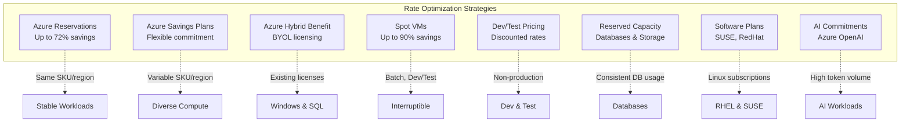
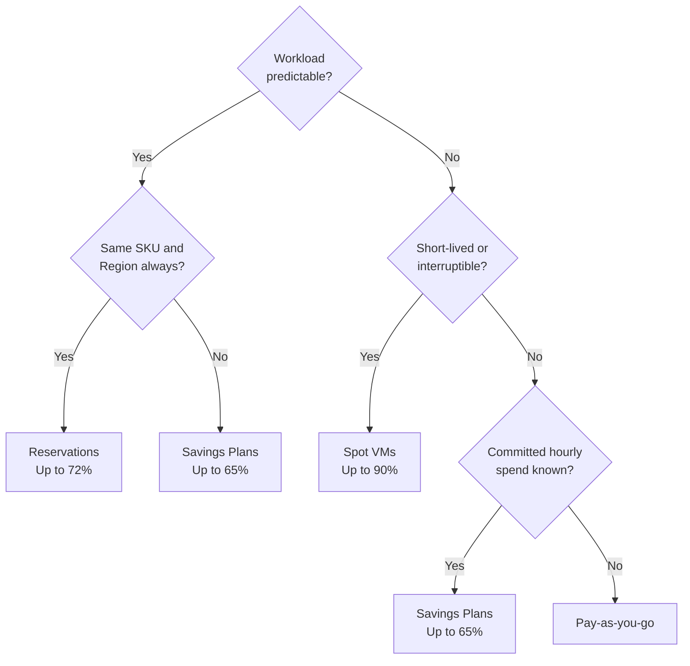
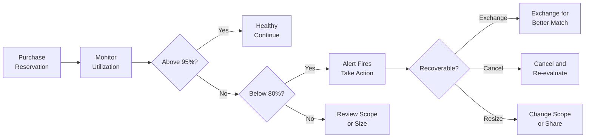
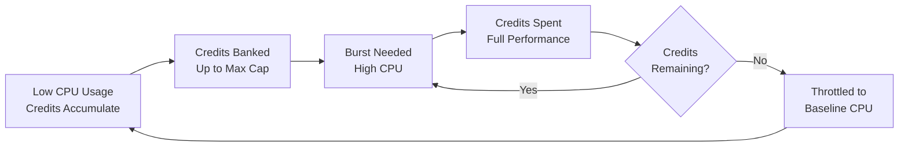

# Module 4: Rate Optimization

> **Duration:** 60 minutes | **Level:** Tactical + Strategic  
> **WAF Alignment:** CO:05 (Best Rates), CO:06 (Billing Increments)

---

## 4.1 Rate Optimization Overview

Rate optimization is the practice of reducing Azure unit costs **without changing workload behavior**. While usage optimization eliminates waste, rate optimization ensures you pay the lowest possible price for every resource you actually need. Microsoft offers multiple discount mechanisms — the key is selecting the right combination for each workload.



> **Key Principle:** Combine multiple strategies for maximum savings. For example, a Windows SQL VM can benefit from Azure Hybrid Benefit (Windows OS) + AHB (SQL license) + Reserved Instance = up to **82% total savings**.

📖 [Azure Well-Architected Framework: CO:05 – Get the best rates](https://learn.microsoft.com/en-us/azure/well-architected/cost-optimization/get-best-rates)

---

## 4.2 Azure Reservations vs Savings Plans — Deep Comparison

### Feature Comparison

| Feature | Azure Reservations | Azure Savings Plans |
|---------|-------------------|---------------------|
| **Maximum Savings** | Up to 72% | Up to 65% |
| **Term Options** | 1 year or 3 years | 1 year or 3 years |
| **Flexibility** | Fixed SKU + Region | Any VM family, any region |
| **Scope Options** | Shared, Subscription, Resource Group, Management Group | Shared, Subscription, Resource Group, Management Group |
| **Applies To** | Compute, Database, Storage, Analytics, and more | Compute only (VMs, Dedicated Hosts, Container Instances, App Service, Azure Functions Premium) |
| **Auto-apply** | Yes (auto-applied to matching usage) | Yes (auto-applied to eligible compute) |
| **Instance Size Flexibility** | Yes (within same VM series/region) | Inherent (any size, any series) |
| **Exchange Policy** | Exchange for same type reservation (value must be ≥ original). **Exchanges retired for compute after Oct 2024** — use Savings Plans instead | Not exchangeable |
| **Refund/Cancellation** | Self-service cancel with early termination fee. Lifetime refund limit of $50,000 USD per enrollment | Self-service cancel with early termination fee. Lifetime refund limit of $50,000 USD per enrollment |
| **Payment Options** | Upfront, Monthly, or combination | Upfront or Monthly |
| **Best For** | Stable, predictable workloads staying on same SKU/region | Variable compute across families/regions |

> ⚠️ **Important Policy Change:** As of **October 2024**, reservation exchanges for compute services are retired. Microsoft recommends purchasing Savings Plans for flexibility going forward. Non-compute reservations (databases, storage) can still be exchanged.

📖 [Changes to the Azure reservation exchange policy](https://learn.microsoft.com/en-us/azure/cost-management-billing/reservations/reservation-exchange-policy-changes)

### When to Stack Both

You can hold both Reservations and Savings Plans simultaneously. Azure applies discounts in this priority order:

1. **Reservations** (applied first to exact-match usage)
2. **Savings Plans** (applied next to remaining eligible compute)
3. **Pay-as-you-go** (remaining usage)

This means you can buy Reservations for your most stable workloads and a Savings Plan as a "safety net" for variable compute — maximizing discount coverage.

### Decision Matrix



📖 [Azure Reservations documentation](https://learn.microsoft.com/en-us/azure/cost-management-billing/reservations/save-compute-costs-reservations)  
📖 [Azure Savings Plans documentation](https://learn.microsoft.com/en-us/azure/cost-management-billing/savings-plan/savings-plan-compute-overview)

---

## 4.3 Reservation Utilization Monitoring & Alerts

Low reservation utilization means you are paying for committed capacity that sits unused. Target **>95% utilization** across all reservations.

### How to Monitor Utilization

**In the Azure Portal:**

1. Navigate to **Cost Management + Billing** > **Reservations**
2. Click on any reservation to see its **Utilization (%)** over the past 7/30 days
3. Azure Advisor will flag reservations below 100% utilization as a recommendation

**Via Azure CLI:**

```bash
# List all reservations and their utilization summary
az reservations reservation list \
  --reservation-order-id <order-id> \
  --output table

# Get reservation utilization details
az consumption reservation summary list \
  --reservation-order-id <order-id> \
  --grain daily \
  --start-date 2025-01-01 \
  --end-date 2025-01-31 \
  --output table
```

**Via Azure Resource Graph (KQL):**

```kusto
// Find reservations with low utilization via Advisor
AdvisorResources
| where type == "microsoft.advisor/recommendations"
| where properties.category == "Cost"
| where properties.shortDescription.solution contains "reservation"
| project
    Recommendation = tostring(properties.shortDescription.solution),
    Impact = tostring(properties.impact),
    ResourceId = tostring(properties.resourceMetadata.resourceId)
```

### Setting Up Utilization Alerts

1. Go to **Cost Management + Billing** > **Reservations**
2. Click **Alerts** in the left menu
3. Configure an alert rule:
   - **Utilization threshold:** Alert when utilization drops below 80% (or 90%)
   - **Granularity:** Daily or weekly
   - **Notification:** Email to FinOps team or Action Group
4. Alternatively, create a **Budget Alert** scoped to reservation charges



📖 [Monitor reservation utilization](https://learn.microsoft.com/en-us/azure/cost-management-billing/reservations/reservation-utilization)  
📖 [Set up reservation utilization alerts](https://learn.microsoft.com/en-us/azure/cost-management-billing/costs/reservation-utilization-alerts)

---

## 4.4 Services Supporting Reservations & Reserved Capacity

### Compute Reservations

| Service | Savings | Notes |
|---------|---------|-------|
| **Virtual Machines** | Up to 72% | Instance size flexibility within same series |
| **VM Scale Sets (VMSS)** | Up to 72% | Same reservation as VMs |
| **Dedicated Hosts** | Up to 60% | Entire physical server |
| **Azure VMware Solution** | Up to 60% | Dedicated VMware nodes |
| **Azure Red Hat OpenShift** | Up to 50% | Worker node compute |

### Database Reserved Capacity

| Service | Savings | Commitment |
|---------|---------|------------|
| **Azure SQL Database** | Up to 55% | vCore-based, 1 or 3 year |
| **Azure SQL Managed Instance** | Up to 55% | vCore-based, 1 or 3 year |
| **Azure Cosmos DB** | Up to 65% | Request Units (RU/s), 1 or 3 year |
| **Azure Database for MySQL** | Up to 55% | vCore-based, 1 or 3 year |
| **Azure Database for PostgreSQL** | Up to 55% | vCore-based, 1 or 3 year |
| **Azure Database for MariaDB** | Up to 55% | vCore-based, 1 or 3 year |
| **Azure Cache for Redis** | Up to 55% | Node-based, 1 or 3 year |

### Storage Reservations

| Service | Savings | Commitment |
|---------|---------|------------|
| **Azure Blob Storage** | Up to 38% | 100 TB or 1 PB blocks, 1 or 3 year |
| **Azure Data Lake Storage** | Up to 38% | 100 TB or 1 PB blocks, 1 or 3 year |
| **Azure Files** | Up to 36% | 10 TiB or 100 TiB blocks |
| **Azure Managed Disks** | Up to 30% | P30/P40/P50 Premium SSD, 1 year |

### Analytics & Other Reservations

| Service | Savings | Notes |
|---------|---------|-------|
| **Azure Synapse Analytics** | Up to 60% | cDWU-based commitment |
| **Azure Databricks** | Up to 38% | DBU-based commitment |
| **Azure Data Explorer** | Up to 52% | Markup units, 1 or 3 year |
| **Azure App Service (Premium v3)** | Up to 55% | Stamp fee savings |
| **Azure Backup** | Up to 25% | Protected instances |
| **Azure Data Factory** | Up to 40% | Data flow vCore-hours |
| **Microsoft Fabric** | Up to 40% | Capacity Units, 1 year |

📖 [Products that support reservations](https://learn.microsoft.com/en-us/azure/cost-management-billing/reservations/save-compute-costs-reservations#charges-covered-by-reservation)  
📖 [Azure SQL reserved capacity](https://learn.microsoft.com/en-us/azure/azure-sql/database/reserved-capacity-overview)  
📖 [Cosmos DB reserved capacity](https://learn.microsoft.com/en-us/azure/cosmos-db/reserved-capacity)  
📖 [Azure Cache for Redis reservations](https://learn.microsoft.com/en-us/azure/azure-cache-for-redis/cache-reserved-pricing)

---

## 4.5 Azure Hybrid Benefit (AHB) — Comprehensive Guide

### What Licenses Qualify?

| License Type | Azure Benefit | Max Savings |
|-------------|---------------|-------------|
| **Windows Server** (with SA or subscription) | Free Windows OS on Azure VMs | Up to 40% |
| **SQL Server** (with SA or subscription) | Free SQL license on Azure SQL DB, SQL MI, SQL VM | Up to 55% |
| **Linux** (RHEL/SUSE subscriptions) | Discounted subscription pricing | Up to 60% |
| **Combined** (Windows + SQL Server) | Stacked benefits on same VM | Up to 82% |
| **AKS Windows Containers** | Free Windows node licensing | Up to 40% |
| **Azure Stack HCI** | Free Azure Stack HCI host licensing | Up to 40% |

### AHB for AKS (Windows Containers)

Azure Hybrid Benefit applies to **Windows node pools in AKS**. Each Windows Server core license with active Software Assurance covers up to *one Windows node* in AKS. This eliminates the per-vCPU Windows licensing surcharge.

**How to enable AHB on an AKS cluster:**

```bash
# Enable AHB when creating a new AKS cluster with Windows node pool
az aks create \
  --resource-group myRG \
  --name myAKSCluster \
  --windows-admin-username azureuser \
  --windows-admin-password $WIN_PASSWORD \
  --node-count 1 \
  --enable-ahub

# Enable AHB on an existing AKS cluster
az aks update \
  --resource-group myRG \
  --name myAKSCluster \
  --enable-ahub

# Disable AHB on an AKS cluster
az aks update \
  --resource-group myRG \
  --name myAKSCluster \
  --disable-ahub
```

📖 [Azure Hybrid Benefit for AKS](https://learn.microsoft.com/en-us/azure/aks/hybrid-benefit)

### AHB for Azure Stack HCI

Azure Stack HCI customers with Windows Server Datacenter licenses (with SA) can use AHB to avoid paying the Azure Stack HCI host fee. This benefit applies to the host-level licensing for running Azure Stack HCI clusters.

**Key Points:**
- Requires Windows Server Datacenter with active Software Assurance or subscription licenses
- Covers the Azure Stack HCI host fee (currently billed per physical core per month)
- Must be enabled per-cluster through the Azure portal or Azure CLI
- Can be combined with Azure Hybrid Benefit for guest Windows Server VMs running on the cluster

📖 [Azure Hybrid Benefit for Azure Stack HCI](https://learn.microsoft.com/en-us/azure-stack/hci/concepts/azure-hybrid-benefit-hci)

### Tracking AHB Using Azure Workbooks

Azure provides a **Hybrid Benefit Tracking Workbook** to monitor AHB usage across your entire estate:

1. Navigate to **Azure Portal** > **Azure Advisor** > **Workbooks**
2. Open the **Azure Hybrid Benefit** workbook (or search in the Workbooks gallery)
3. The workbook shows:
   - Total VMs with and without AHB enabled
   - Potential savings from enabling AHB on remaining VMs
   - License utilization vs. entitlements
   - Breakdown by subscription, resource group, and VM size
4. You can also build a custom workbook using this Azure Resource Graph query:

```kusto
// Find VMs without AHB enabled
Resources
| where type == "microsoft.compute/virtualmachines"
| where properties.storageProfile.imageReference.publisher == "MicrosoftWindowsServer"
| extend licenseType = tostring(properties.licenseType)
| summarize
    AHB_Enabled = countif(licenseType == "Windows_Server"),
    AHB_Not_Enabled = countif(licenseType != "Windows_Server")
| extend Total = AHB_Enabled + AHB_Not_Enabled
| extend Pct_Without_AHB = round(todouble(AHB_Not_Enabled) / todouble(Total) * 100, 1)
```

📖 [Azure Hybrid Benefit Workbook](https://learn.microsoft.com/en-us/azure/advisor/advisor-azure-hybrid-benefit-workbook)

### AHB Enforcement Policies

The following Azure Policy enforces Azure Hybrid Benefit for Windows VMs:

```json
{
  "properties": {
    "displayName": "Enforce Azure Hybrid Benefit for Windows",
    "policyType": "Custom",
    "mode": "All",
    "description": "Deny Windows VMs without Azure Hybrid Benefit enabled",
    "policyRule": {
      "if": {
        "allOf": [
          {
            "field": "type",
            "in": ["Microsoft.Compute/virtualMachines",
                    "Microsoft.Compute/VirtualMachineScaleSets"]
          },
          {
            "field": "Microsoft.Compute/imagePublisher",
            "in": ["MicrosoftWindowsServer", "MicrosoftWindowsDesktop"]
          },
          {
            "field": "Microsoft.Compute/licenseType",
            "notin": ["Windows_Server", "Windows_Client"]
          }
        ]
      },
      "then": { "effect": "deny" }
    }
  }
}
```

### AHB for SQL VMs Policy

```json
{
  "properties": {
    "displayName": "Enforce Azure Hybrid Benefit for SQL",
    "policyType": "Custom",
    "mode": "All",
    "description": "Deny SQL VMs without Azure Hybrid Benefit enabled",
    "policyRule": {
      "if": {
        "allOf": [
          { "field": "type", "equals": "Microsoft.SqlVirtualMachine/SqlVirtualMachines" },
          { "field": "Microsoft.SqlVirtualMachine/SqlVirtualMachines/sqlImageSku",
            "in": ["Standard", "Enterprise"] },
          { "field": "Microsoft.SqlVirtualMachine/SqlVirtualMachines/sqlServerLicenseType",
            "notequals": "AHUB" }
        ]
      },
      "then": { "effect": "deny" }
    }
  }
}
```

> **Available in knowledge base:** `Module Rate Optimization/Policy-Enforce-AHB-Windows.json`, `Policy-Enforce-AHB-SQLVMs.json`

### Checking AHB Status via Azure CLI

```bash
# Check AHB status for all VMs in a subscription
az vm list \
  --query "[].{Name:name, RG:resourceGroup, LicenseType:licenseType, OSType:storageProfile.osDisk.osType}" \
  --output table

# Find all Windows VMs WITHOUT AHB enabled
az vm list \
  --query "[?storageProfile.imageReference.publisher=='MicrosoftWindowsServer' && licenseType!='Windows_Server'].{Name:name, RG:resourceGroup, LicenseType:licenseType}" \
  --output table

# Enable AHB on a specific VM
az vm update \
  --resource-group myRG \
  --name myVM \
  --license-type Windows_Server

# Bulk-enable AHB on all Windows VMs in a resource group
az vm list --resource-group myRG \
  --query "[?storageProfile.imageReference.publisher=='MicrosoftWindowsServer' && licenseType!='Windows_Server'].name" \
  --output tsv | \
  xargs -I {} az vm update --resource-group myRG --name {} --license-type Windows_Server

# Check AHB status for SQL VMs
az sql vm list \
  --query "[].{Name:name, RG:resourceGroup, LicenseType:sqlServerLicenseType}" \
  --output table
```

📖 [Azure Hybrid Benefit overview](https://azure.microsoft.com/en-us/pricing/hybrid-benefit/)  
📖 [Azure Hybrid Benefit for Windows Server](https://learn.microsoft.com/en-us/azure/virtual-machines/windows/hybrid-use-benefit-licensing)  
📖 [Azure Hybrid Benefit for SQL Server](https://learn.microsoft.com/en-us/azure/azure-sql/azure-hybrid-benefit)

---

## 4.6 Spot VMs — Deep Dive

### Spot VM Overview

Azure Spot VMs let you access unused Azure compute capacity at discounts of up to **90%** compared to pay-as-you-go pricing. In return, Azure can evict your VM when it needs the capacity back.

### Eviction Types

| Eviction Type | Behavior | When to Use |
|---------------|----------|-------------|
| **Capacity-Only** | VM is evicted only when Azure needs the capacity back. Price does not trigger eviction. | When you want to keep running as long as capacity exists, regardless of price fluctuations |
| **Price-or-Capacity** | VM is evicted if Azure needs capacity back **OR** if the Spot price exceeds your maximum price. You set a max price you are willing to pay. | When you want cost control — will not pay above a certain threshold |

### Eviction Policies

| Policy | What Happens on Eviction | Use Case |
|--------|-------------------------|----------|
| **Deallocate** | VM is stopped and deallocated. Disks are retained. VM can be restarted later (if capacity available). You continue to pay for disk storage. | Batch jobs where you want to resume later |
| **Delete** | VM and its disks are fully deleted. Nothing is retained. | Ephemeral/stateless workloads, CI/CD runners |

### Configuration Examples

```bash
# Create a Spot VM with Price-or-Capacity eviction, max price $0.05/hr
az vm create \
  --resource-group myRG \
  --name mySpotVM \
  --image Ubuntu2204 \
  --size Standard_D4s_v5 \
  --priority Spot \
  --eviction-policy Deallocate \
  --max-price 0.05

# Create a Spot VM with Capacity-Only eviction (max price = -1 means up to PAYG rate)
az vm create \
  --resource-group myRG \
  --name mySpotVM2 \
  --image Ubuntu2204 \
  --size Standard_D4s_v5 \
  --priority Spot \
  --eviction-policy Delete \
  --max-price -1

# Check current Spot pricing history for a VM size
az vm list-skus \
  --location eastus \
  --resource-type virtualMachines \
  --size Standard_D4s_v5 \
  --output table
```

### Spot VM Best Practices

| # | Practice | Details |
|---|----------|---------|
| 1 | Use Spot Priority Mix for VMSS | Configure 80% Spot / 20% regular in VMSS for cost-effective reliability |
| 2 | Implement checkpointing | Save progress periodically for long-running batch jobs |
| 3 | Multi-region deployment | Spread Spot VMs across regions to reduce eviction likelihood |
| 4 | Handle eviction signals | Azure sends a 30-second eviction notice via Metadata Service — hook into this programmatically |
| 5 | Combine with on-demand | Use Spot for burst capacity, on-demand for baseline |
| 6 | AKS Spot node pools | Add Spot node pools for non-critical and batch workloads on Kubernetes |
| 7 | Avoid single-SKU dependence | Use multiple VM sizes in VMSS to increase Spot allocation success |

### Handling Eviction Notifications

```bash
# Query the Azure Instance Metadata Service for eviction notice (run inside the VM)
curl -H "Metadata:true" \
  "http://169.254.169.254/metadata/scheduledevents?api-version=2020-07-01"
```

📖 [Spot VMs overview](https://learn.microsoft.com/en-us/azure/virtual-machines/spot-vms)  
📖 [Spot VMs for VMSS](https://learn.microsoft.com/en-us/azure/virtual-machine-scale-sets/use-spot)  
📖 [AKS Spot node pools](https://learn.microsoft.com/en-us/azure/aks/spot-node-pool)

---

## 4.7 On-Demand Capacity Reservations

On-Demand Capacity Reservations guarantee compute capacity in a specific Azure region **without any term commitment**. Unlike Reserved Instances (which discount price but do not guarantee capacity), Capacity Reservations guarantee capacity but **do not provide a price discount**.

| Feature | On-Demand Capacity Reservation | Reserved Instances |
|---------|-------------------------------|-------------------|
| **Capacity Guarantee** | Yes (guaranteed in-region) | No (best-effort) |
| **Price Discount** | No (full pay-as-you-go) | Yes (up to 72%) |
| **Term** | None (pay hourly) | 1 or 3 years |
| **Use Case** | DR readiness, product launches, critical capacity needs | Cost savings for stable workloads |

**Best Practice:** Combine On-Demand Capacity Reservations with Reserved Instances or Savings Plans. The RI/SP provides the price discount; the Capacity Reservation provides the capacity guarantee. Both can be applied to the same VM simultaneously.

```bash
# Create a capacity reservation group
az capacity reservation group create \
  --resource-group myRG \
  --name myCapacityGroup \
  --location eastus

# Create a capacity reservation for 5x Standard_D4s_v5
az capacity reservation create \
  --resource-group myRG \
  --capacity-reservation-group myCapacityGroup \
  --name myReservation \
  --sku Standard_D4s_v5 \
  --capacity 5 \
  --location eastus
```

📖 [On-Demand Capacity Reservations](https://learn.microsoft.com/en-us/azure/virtual-machines/capacity-reservation-overview)

---

## 4.8 Software Plans (SUSE & Red Hat)

Software Plans provide **discounted pricing for Linux subscription software** bundled with Azure VMs. Instead of paying hourly PAYG rates for RHEL or SUSE subscriptions, you commit to a 1- or 3-year plan.

| Software Plan | Savings | Covers |
|---------------|---------|--------|
| **SUSE Linux Enterprise Server** | Up to 67% vs PAYG | SLES subscription (Standard or HPC) |
| **Red Hat Enterprise Linux** | Up to 50% vs PAYG | RHEL subscription |
| **SUSE Linux Enterprise for SAP** | Up to 67% vs PAYG | SLES for SAP, includes priority support |
| **Red Hat for SAP** | Up to 44% vs PAYG | RHEL for SAP with HA and Update Services |

**Key Characteristics:**
- Purchased separately from VM reservations
- Stack with VM Reserved Instances for combined savings (compute + software)
- Scope can be shared across subscription or resource group
- No exchange or refund after purchase

```bash
# View available software plans via Azure CLI
az reservations catalog show \
  --subscription-id <sub-id> \
  --reserved-resource-type SuseLinux \
  --location eastus

az reservations catalog show \
  --subscription-id <sub-id> \
  --reserved-resource-type RedHat \
  --location eastus
```

📖 [SUSE software plans](https://learn.microsoft.com/en-us/azure/cost-management-billing/reservations/understand-suse-reservation-charges)  
📖 [Red Hat software plans](https://learn.microsoft.com/en-us/azure/cost-management-billing/reservations/understand-rhel-reservation-charges)

---

## 4.9 Dev/Test Pricing — Complete Guide

Dev/Test subscriptions provide **discounted (or free) pricing** for non-production workloads. There is **no SLA** for Dev/Test subscriptions.

### Complete List of Discounted Services

| Service | Dev/Test Discount |
|---------|------------------|
| **Windows VMs** | Pay Linux rates only (no Windows license charge) |
| **Azure SQL Database** | Up to 55% discount (no SQL license charge for vCore) |
| **Azure SQL Managed Instance** | Up to 55% discount (no SQL license charge for vCore) |
| **Logic Apps** | Up to 50% discount on enterprise connectors |
| **App Service (Basic, Standard, Premium)** | Reduced rates (varies by tier) |
| **Azure Cloud Services** | Discounted compute pricing |
| **HDInsight** | No Windows node surcharge |
| **Azure DevTest Labs** | Auto-shutdown, quota management, artifact repos (free orchestration layer) |
| **BizTalk Services** | Discounted processing |
| **Virtual Network (VPN Gateway)** | Lower gateway rates |
| **Azure API Management** | Reduced pricing on Dev/Test tiers |

### Subscription Types

| Subscription Offer | Who Can Use | How to Get |
|--------------------|-------------|------------|
| **Enterprise Dev/Test** | EA customers only | Create under EA enrollment in Azure EA Portal |
| **Pay-As-You-Go Dev/Test** | Visual Studio subscribers | Create in Azure portal with VS subscription credentials |
| **MSDN Platforms** | MSDN subscribers | Monthly Azure credits + Dev/Test pricing |

### How to Enable

1. Ensure the user has an active **Visual Studio subscription** (for PAYG Dev/Test) or an **EA enrollment** (for Enterprise Dev/Test)
2. Create a new subscription under the appropriate offer type
3. Place the subscription under the correct **Management Group** (e.g., "Non-Production")
4. Deploy dev, test, staging, and sandbox workloads there
5. **Never deploy production workloads** — no SLA, compliance, or support guarantees

📖 [Azure Dev/Test pricing](https://azure.microsoft.com/en-us/pricing/dev-test/)  
📖 [Enterprise Dev/Test offer](https://learn.microsoft.com/en-us/azure/devtest/offer/overview-what-is-devtest-offer-visual-studio)

---

## 4.10 Commitment-Based Pricing for Azure OpenAI

Azure OpenAI offers **Provisioned Throughput Units (PTUs)** with commitment-based pricing for organizations with predictable, high-volume AI workloads.

| Pricing Model | How It Works | Best For |
|---------------|-------------|----------|
| **Pay-as-you-go (Token-based)** | Pay per 1K tokens consumed. No commitment. | Variable, low-to-moderate usage |
| **Provisioned Throughput (PTU) — Monthly** | Reserve dedicated throughput capacity. Monthly commitment. | Predictable, high-volume production workloads |
| **Provisioned Throughput (PTU) — Yearly** | Same as monthly but with annual commitment. Deeper discount. | Stable, enterprise-scale AI deployments |

**Key Details:**
- PTU commitment provides **guaranteed throughput** (tokens-per-minute) with **latency SLAs**
- Monthly PTU reservations offer discounts over PAYG; yearly commitments yield greater discounts
- You select a model (e.g., GPT-4, GPT-4o) and region — pricing varies by model
- Minimum commitment is typically 50–100 PTUs depending on the model
- Unused PTUs are still billed — right-size your commitment to actual usage

**When to Use PTU Pricing:**
- Production applications serving >1M tokens/minute
- Applications requiring consistent low-latency responses
- Batch processing with guaranteed throughput windows
- Cost predictability for AI spend in budgeting and forecasting

📖 [Azure OpenAI Provisioned Throughput](https://learn.microsoft.com/en-us/azure/ai-services/openai/concepts/provisioned-throughput)  
📖 [Azure OpenAI pricing](https://azure.microsoft.com/en-us/pricing/details/cognitive-services/openai-service/)

---

## 4.11 B-Series Burstable VMs

B-Series VMs are **economical burstable VMs** designed for workloads that do not need continuous full CPU performance. They use a **CPU credit model** — the VM earns credits during low-usage periods and spends them during bursts.

### How the Credit Model Works



### Key Characteristics

| Feature | Detail |
|---------|--------|
| **Pricing** | 20–60% cheaper than equivalent D-series |
| **Baseline CPU** | Typically 5–40% of full vCPU performance (varies by SKU) |
| **Credit Earning** | Continuously earned when running below baseline |
| **Credit Cap** | Each SKU has a maximum credit balance |
| **Burst Duration** | Depends on credits banked and burst intensity |
| **Persistent Credits** | Credits persist while VM is running; lost on deallocation |

### When to Use B-Series

| Good Fit | Poor Fit |
|----------|----------|
| Dev/test machines | High-CPU production workloads |
| Low-traffic web servers | Database servers under constant load |
| Build agents (idle between builds) | Machine learning training |
| Small databases with occasional queries | Video encoding |
| Microservices with sporadic traffic | Real-time analytics |
| Jump boxes / bastion hosts | Sustained high-throughput processing |

```bash
# List available B-series SKUs in a region
az vm list-skus --location eastus \
  --resource-type virtualMachines \
  --query "[?starts_with(name, 'Standard_B')].[name, capabilities[?name=='vCPUs'].value | [0], capabilities[?name=='MemoryGB'].value | [0]]" \
  --output table

# Create a B-series VM
az vm create \
  --resource-group DevTestRG \
  --name dev-web-01 \
  --image Ubuntu2204 \
  --size Standard_B2s \
  --admin-username azureuser \
  --generate-ssh-keys
```

📖 [B-series burstable VM sizes](https://learn.microsoft.com/en-us/azure/virtual-machines/sizes-b-series-burstable)

---

## 4.12 Rate Optimization Implementation Roadmap

```mermaid
graph LR
    subgraph "Week 1-2: Assess"
        A1[Inventory VMs<br>and services]
        A2[Review Advisor<br>recommendations]
        A3[Analyze 30-day<br>usage patterns]
    end

    subgraph "Week 3-4: Quick Wins"
        B1[Enable AHB on<br>all eligible VMs]
        B2[Deploy AHB<br>deny policies]
        B3[Move to DevTest<br>subscriptions]
    end

    subgraph "Week 5-8: Commitments"
        C1[Purchase RI for<br>stable workloads]
        C2[Purchase SP for<br>variable compute]
        C3[Buy DB reserved<br>capacity]
    end

    subgraph "Week 9-12: Optimize"
        D1[Add Spot pools<br>for AKS and VMSS]
        D2[Monitor RI and SP<br>utilization]
        D3[Evaluate B-series<br>for dev and test]
    end

    A1 --> A2 --> A3
    A3 --> B1 --> B2 --> B3
    B3 --> C1 --> C2 --> C3
    C3 --> D1 --> D2 --> D3
```



### Detailed Timeline

| Phase | Timeline | Actions | Expected Savings |
|-------|----------|---------|-----------------|
| **1. Assessment** | Week 1–2 | Inventory all compute, DB, and storage. Review Azure Advisor cost recommendations. Analyze 30/60-day usage patterns. Identify AHB-eligible VMs. | Baseline established |
| **2. Quick Wins** | Week 3–4 | Enable AHB on all eligible Windows/SQL VMs and AKS clusters. Deploy deny policies. Move non-production workloads to Dev/Test subscriptions. Switch dev VMs to B-series. | 15–30% on eligible VMs |
| **3. Commitments** | Week 5–8 | Purchase Reserved Instances for top 10 stable VM SKUs. Purchase Savings Plans for variable compute. Buy reserved capacity for databases (SQL, Cosmos DB). Purchase software plans (SUSE/RHEL). | 30–65% on committed |
| **4. Spot & Tune** | Week 9–12 | Deploy Spot node pools in AKS. Configure Spot Priority Mix for VMSS. Monitor reservation utilization (target >95%). Adjust scope/size as needed. Evaluate Azure OpenAI PTU. | Additional 10–30% on batch/burst |
| **5. Ongoing** | Monthly | Review reservation utilization alerts. Assess new Advisor recommendations. Right-size commitments quarterly. Track AHB compliance via workbook. | Maintain optimized state |

---

## 4.13 Rate Optimization Checklist

| # | Action | Priority | Status |
|---|--------|----------|--------|
| 1 | Review Azure Advisor reservation and savings plan recommendations | High | |
| 2 | Analyze 30/60-day usage patterns for commitment decisions | High | |
| 3 | Enable Azure Hybrid Benefit on all eligible Windows VMs | High | |
| 4 | Enable Azure Hybrid Benefit on all eligible SQL VMs | High | |
| 5 | Enable Azure Hybrid Benefit on AKS Windows node pools | High | |
| 6 | Deploy AHB enforcement policies (deny without AHB) | High | |
| 7 | Set up AHB tracking workbook for compliance visibility | Medium | |
| 8 | Move dev/test workloads to Dev/Test subscriptions | High | |
| 9 | Switch dev/test VMs to B-series burstable SKUs | Medium | |
| 10 | Purchase Reserved Instances for stable compute workloads | High | |
| 11 | Purchase Savings Plans for variable compute spend | High | |
| 12 | Purchase reserved capacity for stable databases (SQL, Cosmos DB, MySQL, PostgreSQL) | Medium | |
| 13 | Purchase SUSE/RHEL Software Plans where applicable | Medium | |
| 14 | Evaluate Spot VMs for batch, CI/CD, and non-critical workloads | Medium | |
| 15 | Configure Spot Priority Mix in VMSS (80/20 Spot/On-demand) | Medium | |
| 16 | Set up On-Demand Capacity Reservations for DR / critical launches | Low | |
| 17 | Monitor reservation utilization weekly (target >95%) | High | |
| 18 | Set up reservation utilization alerts (threshold below 80%) | High | |
| 19 | Evaluate Azure OpenAI PTU commitment for high-volume AI workloads | Low | |
| 20 | Review and re-optimize commitments quarterly | High | |

---

## References

- [Azure Reservations](https://learn.microsoft.com/en-us/azure/cost-management-billing/reservations/save-compute-costs-reservations)
- [Azure Savings Plans](https://learn.microsoft.com/en-us/azure/cost-management-billing/savings-plan/savings-plan-compute-overview)
- [Reservation exchange policy changes](https://learn.microsoft.com/en-us/azure/cost-management-billing/reservations/reservation-exchange-policy-changes)
- [Monitor reservation utilization](https://learn.microsoft.com/en-us/azure/cost-management-billing/reservations/reservation-utilization)
- [Reservation utilization alerts](https://learn.microsoft.com/en-us/azure/cost-management-billing/costs/reservation-utilization-alerts)
- [Azure Hybrid Benefit](https://azure.microsoft.com/en-us/pricing/hybrid-benefit/)
- [Azure Hybrid Benefit for Windows Server](https://learn.microsoft.com/en-us/azure/virtual-machines/windows/hybrid-use-benefit-licensing)
- [Azure Hybrid Benefit for SQL Server](https://learn.microsoft.com/en-us/azure/azure-sql/azure-hybrid-benefit)
- [Azure Hybrid Benefit for AKS](https://learn.microsoft.com/en-us/azure/aks/hybrid-benefit)
- [Azure Hybrid Benefit for Azure Stack HCI](https://learn.microsoft.com/en-us/azure-stack/hci/concepts/azure-hybrid-benefit-hci)
- [AHB Tracking Workbook](https://learn.microsoft.com/en-us/azure/advisor/advisor-azure-hybrid-benefit-workbook)
- [Spot VMs](https://learn.microsoft.com/en-us/azure/virtual-machines/spot-vms)
- [Spot VMs for VMSS](https://learn.microsoft.com/en-us/azure/virtual-machine-scale-sets/use-spot)
- [AKS Spot node pools](https://learn.microsoft.com/en-us/azure/aks/spot-node-pool)
- [On-Demand Capacity Reservations](https://learn.microsoft.com/en-us/azure/virtual-machines/capacity-reservation-overview)
- [B-series burstable VMs](https://learn.microsoft.com/en-us/azure/virtual-machines/sizes-b-series-burstable)
- [Azure Dev/Test pricing](https://azure.microsoft.com/en-us/pricing/dev-test/)
- [Enterprise Dev/Test offer](https://learn.microsoft.com/en-us/azure/devtest/offer/overview-what-is-devtest-offer-visual-studio)
- [SUSE software plans](https://learn.microsoft.com/en-us/azure/cost-management-billing/reservations/understand-suse-reservation-charges)
- [Red Hat software plans](https://learn.microsoft.com/en-us/azure/cost-management-billing/reservations/understand-rhel-reservation-charges)
- [Azure OpenAI Provisioned Throughput](https://learn.microsoft.com/en-us/azure/ai-services/openai/concepts/provisioned-throughput)
- [Azure OpenAI pricing](https://azure.microsoft.com/en-us/pricing/details/cognitive-services/openai-service/)
- [Azure SQL reserved capacity](https://learn.microsoft.com/en-us/azure/azure-sql/database/reserved-capacity-overview)
- [Cosmos DB reserved capacity](https://learn.microsoft.com/en-us/azure/cosmos-db/reserved-capacity)
- [Azure Cache for Redis reservations](https://learn.microsoft.com/en-us/azure/azure-cache-for-redis/cache-reserved-pricing)
- [WAF CO:05 – Get best rates](https://learn.microsoft.com/en-us/azure/well-architected/cost-optimization/get-best-rates)
- [WAF CO:06 – Billing increments](https://learn.microsoft.com/en-us/azure/well-architected/cost-optimization/align-usage-to-billing-increments)
- Knowledge Base: `Module Rate Optimization/` folder

---

> **Previous Module:** [Module 3 — Financial Controls & Budgets](./03-Module-Financial-Controls.md)  
> **Next Module:** [Module 5 — Usage Optimization & Waste Reduction](./05-Module-Usage-Optimization.md)  
> **Back to Overview:** [README — Cost Optimization](./README.md)
