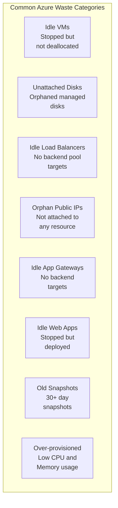
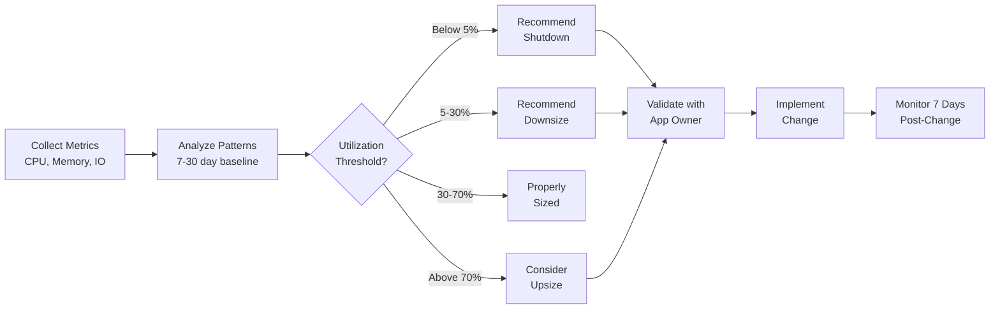
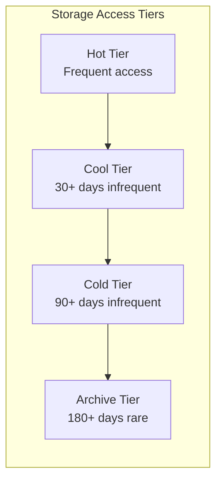
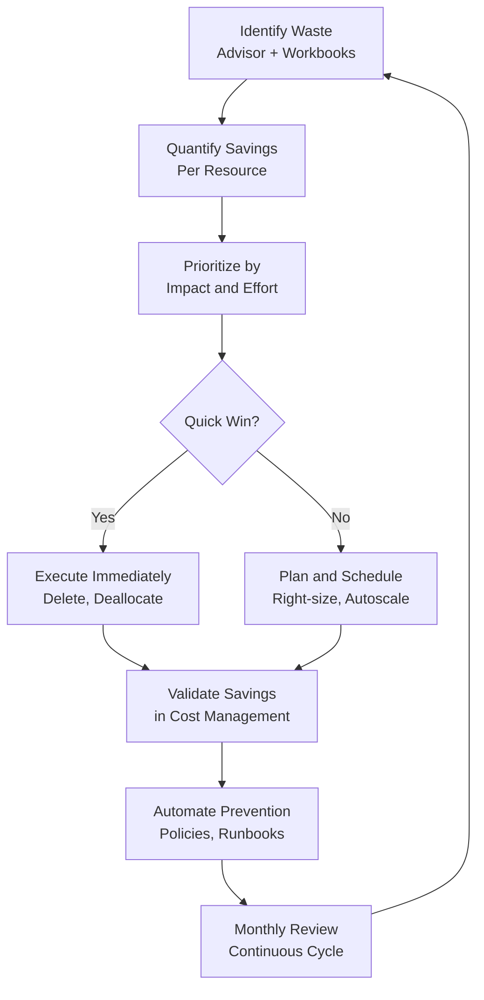

# Module 5: Usage Optimization & Waste Reduction

> **Duration:** 60 minutes | **Level:** Tactical + Hands-on  
> **WAF Alignment:** CO:07 (Component Costs), CO:08 (Environment Costs), CO:12 (Scaling Costs)

---

## 5.1 The Cost of Waste

Cloud waste — resources provisioned but not effectively used — typically represents **25–35% of total cloud spend** in organizations without active FinOps practices. The most common waste categories are idle resources, orphaned components, and over-provisioned infrastructure.



### Waste Impact by Category

| Waste Category | Typical Monthly Cost Per Instance | Detection Difficulty | Remediation Effort |
|---------------|----------------------------------|---------------------|-------------------|
| Idle VMs (not deallocated) | $50–$2,000+ | Easy | Low |
| Unattached Premium Disks | $20–$300 | Easy | Low |
| Orphan Public IPs (Standard) | ~$3.60/month each | Easy | Low |
| Idle Application Gateways | $175–$500+ | Medium | Medium |
| Idle Load Balancers (Standard) | ~$18/month base | Easy | Low |
| Over-provisioned VMs | 30–70% of VM cost | Medium | Medium |
| Old snapshots | $0.05/GB/month | Easy | Low |
| Idle Web Apps (on paid plans) | $50–$500+ | Medium | Medium |

📖 [Azure Well-Architected Framework: CO:07 – Component costs](https://learn.microsoft.com/en-us/azure/well-architected/cost-optimization/optimize-component-costs)

---

## 5.2 Azure Advisor Cost Recommendations

### Recommendation Categories

Azure Advisor provides recommendations across five categories. For cost optimization, focus on the **Cost** category, but other categories also impact cost indirectly:

| Advisor Category | Cost Relevance | Examples |
|-----------------|----------------|----------|
| **Cost** | Direct | Right-size VMs, shutdown idle resources, buy reservations, use AHB |
| **Performance** | Indirect | Avoid over-provisioning by matching SKU to performance needs |
| **Reliability** | Indirect | Prevent costly outages and over-provisioned HA configurations |
| **Security** | Indirect | Avoid cost of breach remediation |
| **Operational Excellence** | Indirect | Automate cost-saving operations |

### Accessing Advisor Recommendations Programmatically

```bash
# Get all cost recommendations
az advisor recommendation list --category Cost --output table

# Get right-sizing recommendations specifically
az advisor recommendation list \
  --category Cost \
  --query "[?shortDescription.solution=='Right-size or shutdown underutilized virtual machines']" \
  --output table

# Get reservation purchase recommendations
az advisor recommendation list \
  --category Cost \
  --query "[?shortDescription.solution contains 'reservation']" \
  --output table

# Export all cost recommendations to JSON
az advisor recommendation list \
  --category Cost \
  --output json > advisor-cost-recommendations.json
```

**Via Azure Resource Graph (for cross-subscription visibility):**

```kusto
// All Advisor cost recommendations across subscriptions
AdvisorResources
| where type == "microsoft.advisor/recommendations"
| where properties.category == "Cost"
| project
    subscriptionId,
    Resource = tostring(properties.resourceMetadata.resourceId),
    Recommendation = tostring(properties.shortDescription.solution),
    Impact = tostring(properties.impact),
    AnnualSavings = tostring(properties.extendedProperties.annualSavingsAmount),
    Currency = tostring(properties.extendedProperties.savingsCurrency)
| order by AnnualSavings desc
```

**Via REST API:**

```bash
# Get cost recommendations via REST API
az rest --method GET \
  --url "https://management.azure.com/subscriptions/{sub-id}/providers/Microsoft.Advisor/recommendations?api-version=2022-10-01&$filter=Category eq 'Cost'" \
  --output json
```

📖 [Azure Advisor Cost recommendations](https://learn.microsoft.com/en-us/azure/advisor/advisor-reference-cost-recommendations)  
📖 [Advisor REST API](https://learn.microsoft.com/en-us/rest/api/advisor/)

---

## 5.3 Usage Optimization Workbook (Azure Advisor)

The **Cost Optimization Workbook** in Azure Advisor provides a centralized view of waste across your entire Azure estate:

| Category | Checks Included |
|----------|----------------|
| **Compute** | Stopped (not deallocated) VMs, Deallocated VMs, VMSS optimization, Advisor right-sizing recommendations |
| **Storage** | Storage v1 accounts, Unattached disks, Old snapshots, Premium storage snapshots, Idle backups |
| **Networking** | Azure Firewall Premium misuse, Firewall instances per region, Idle App Gateways, Idle Load Balancers, Orphan Public IPs, Idle VNet Gateways |
| **Services** | Web Apps, AKS clusters, Azure Synapse, Log Analytics workspaces |

### How to Access

1. Navigate to **Azure Portal** > **Azure Advisor**
2. Click **Workbooks** in the left menu
3. Open **Cost Optimization (Preview)** workbook
4. Use subscription and tag filters to scope your view

📖 [Cost Optimization Workbook](https://learn.microsoft.com/en-us/azure/advisor/advisor-cost-optimization-workbook)

---

## 5.4 Azure Orphaned Resources Workbook

The **Azure Orphaned Resources Workbook** (by Dolev Shor, Microsoft) is a community-driven Azure Workbook that identifies orphaned and idle resources across your subscriptions. It goes beyond Advisor by checking a broader set of resource types.

### What It Checks

| Resource Type | Detection Logic |
|--------------|-----------------|
| **Managed Disks** | Disks with `diskState == "Unattached"` |
| **Public IP Addresses** | PIPs with no `ipConfiguration` association |
| **Network Interfaces** | NICs not attached to any VM or service |
| **Network Security Groups** | NSGs not associated with any subnet or NIC |
| **Route Tables** | Route tables not associated with any subnet |
| **Load Balancers** | LBs with empty backend address pools |
| **Application Gateways** | AppGWs with empty backend pools |
| **Front Door WAF Policies** | WAF policies not linked to any Front Door |
| **Traffic Manager Profiles** | Profiles with no endpoints |
| **Availability Sets** | Availability sets with no VMs |
| **Resource Groups** | Empty resource groups (no child resources) |
| **API Connections** | API connections not used by any Logic App |
| **Certificates** | Expired certificates |
| **App Service Plans** | Plans with no apps deployed |

### How to Deploy

1. Go to the [Azure Orphaned Resources Workbook GitHub repo](https://github.com/dolevshor/azure-orphan-resources)
2. Click **Deploy to Azure** button or manually import the workbook JSON
3. Select your subscription and resource group
4. Once deployed, open the workbook from **Monitor** > **Workbooks** or **Advisor** > **Workbooks**

📖 [Azure Orphaned Resources GitHub](https://github.com/dolevshor/azure-orphan-resources)

---

## 5.5 Azure Optimization Engine (AOE)

The **Azure Optimization Engine (AOE)** by Hélder Pinto (Microsoft) is an extensible solution that generates optimization recommendations by collecting and analyzing Azure resource metadata beyond what Azure Advisor natively covers.

### Key Capabilities

| Capability | Description |
|-----------|-------------|
| **Custom Recommendations** | Generates recommendations not found in Advisor (e.g., unused App Service Plans, idle Azure SQL DBs) |
| **Programmatic Analysis** | Runs on Azure Automation + Logic Apps + Log Analytics |
| **Export & Reporting** | Results stored in Log Analytics for querying, Power BI dashboards |
| **Multi-subscription** | Analyzes across an entire tenant or management group hierarchy |
| **Extensible** | Add custom recommendation scripts (PowerShell runbooks) |
| **Scheduled** | Automated weekly or daily runs with email notifications |

### Recommendations AOE Generates

- VMs with AHB not enabled
- VMs with auto-shutdown not configured
- Unmanaged disks (Classic)
- Storage accounts with suboptimal access tier
- Unused App Service Plans
- Unused or idle Azure SQL Databases
- VMs with public IPs in production
- Resource groups with no resources
- NSGs with no associations
- And many more via community modules

### How to Deploy

1. Go to the [Azure Optimization Engine GitHub repo](https://github.com/helderpinto/AzureOptimizationEngine)
2. Follow the deployment guide (ARM template deploys Automation Account, Log Analytics Workspace, Logic Apps)
3. Configure scope (subscriptions/management groups)
4. Results appear in the Log Analytics Workspace and can feed into Power BI

📖 [Azure Optimization Engine GitHub](https://github.com/helderpinto/AzureOptimizationEngine)

---

## 5.6 WACO Waste Reduction Scripts — Detailed Descriptions

The following PowerShell scripts are available in the knowledge base for automated waste cleanup. All scripts follow the same operational pattern:

**Common Pattern:**
1. Set the CSV file path (exported from Azure Advisor or a custom query)
2. Set the Tenant ID
3. The script installs required Az PowerShell modules (Az.Resources, Az.Accounts, etc.)
4. Authenticates to Azure via `Connect-AzAccount`
5. Iterates through each resource in the CSV
6. Performs the remediation action (delete, deallocate, stop)

### Script Details

| # | Script | Target Resource | What It Does | Required Modules | Input CSV Format |
|---|--------|----------------|-------------|------------------|-----------------|
| 1 | `DeleteIdleAppGW_v2.ps1` | Application Gateways | Reads a CSV of idle Application Gateways (those with no backend pool targets or zero healthy backend instances). For each gateway, it removes the resource using `Remove-AzResource`. AppGWs can cost **$175–$500+/month** even when idle, making this one of the highest-value cleanup scripts. | Az.Resources 6.1.0, Az.Accounts 2.9.1 | `IdleAppGw.csv` — Resource IDs from Advisor |
| 2 | `DeleteIdleDisk_v2.ps1` | Managed Disks | Reads a CSV of unattached managed disks (state = `Unattached`). Iterates through and deletes each disk using `Remove-AzResource`. Targets orphaned disks left behind after VM deletion or disk detachment. Premium disks can cost **$20–$300/month** each while completely unused. | Az.Resources 6.1.0, Az.Accounts 2.9.1 | `UnattachedDisks.csv` — Resource IDs |
| 3 | `DeleteIdleLB_v2.ps1` | Load Balancers | Reads a CSV of idle Standard Load Balancers that have empty backend address pools (no VMs or NICs associated). Removes each LB using `Remove-AzResource`. Standard LBs incur a **~$18/month base cost** plus data processing charges even with no traffic flowing. | Az.Resources 6.1.0, Az.Accounts 2.9.1 | `IdleLB.csv` — Resource IDs |
| 4 | `DeleteIdlePIP_v2.ps1` | Public IP Addresses | Reads a CSV of orphaned Public IP addresses (not associated with any NIC, Load Balancer, or NAT Gateway). Removes each PIP using `Remove-AzResource`. Standard SKU PIPs cost **~$3.60/month** each, and organizations often accumulate hundreds of orphaned PIPs over time. | Az.Resources 6.1.0, Az.Accounts 2.9.1 | `PublicIPs.csv` — Resource IDs |
| 5 | `DeleteIdleWebApp_v2.ps1` | App Services (Web Apps) | Reads a CSV of idle or stopped Web Applications. Uses `Remove-AzWebApp` to delete idle web apps. Web apps on paid plans (Basic, Standard, Premium) continue to incur App Service Plan costs even when stopped, unless the entire plan is also removed. | Az.Websites 2.11.3, Az.Accounts 2.9.1 | `WebApps.csv` — Resource group + name |
| 6 | `DeprovisionStoppedVM_v2.ps1` | Virtual Machines | Reads a CSV of VMs in a **Stopped** (but not deallocated) state. Uses `Stop-AzVM -Force` with the deallocate flag to properly deallocate each VM. VMs in "Stopped" state (via guest OS shutdown) still incur full compute charges. Only **Deallocated** VMs stop billing for compute. | Az.Compute 4.30.0, Az.Accounts 2.9.1 | `StoppedVMs.csv` — Resource group + name |
| 7 | `StopAksCluster.ps1` | AKS Clusters | Uses an Azure Automation **Workflow** runbook to stop non-production AKS clusters. Authenticates via system-assigned managed identity (`Connect-AzAccount -Identity`), then calls `Stop-AzAksCluster` to fully stop the cluster. Stopped AKS clusters incur no compute charges (only storage for disks). Ideal for dev/test clusters used only during business hours. | Az.Aks (implicit via Automation) | Hardcoded RG and cluster name in script |
| 8 | `IdentifyingNotModifiedBlobs.ps1` | Blob Storage | Scans a storage account using a SAS token, enumerating all blobs via `Get-AzStorageBlob` with pagination (1000 blobs per batch). For each blob, checks its `LastModified` date against configurable thresholds: **30 days** for Cool tier candidates and **365 days** for Archive tier candidates. Reports total blob count and aggregate size for each tier recommendation. Helps build the business case for lifecycle management policies. | Az.Storage 4.2.0 | Parameterized: storage account name + SAS token |

### Script Usage Pattern

```powershell
# General usage pattern for CSV-based scripts:

# 1. Export idle resources from Azure Advisor or Resource Graph to CSV
# 2. Set parameters in the script:
$CsvFilePath = "C:\Temp\UnattachedDisks.csv"
$tenantID = "<YourTenantID>"

# 3. Run the script:
.\DeleteIdleDisk_v2.ps1

# For AKS stop script, edit the hardcoded parameters:
# $ResourceGroupName = "Wasteful-rg"
# $Name = "WastefulK8S"
# Then run via Azure Automation as a scheduled runbook

# For blob identification, set:
$storageAccountName = "<StorageAccountName>"
$sasToken = "<SASToken>"
$daysBeforeCoolTier = 30
$daysBeforeArchiveTier = 365
```

> **Scripts location:** `knowledge_base/Module Usage Optimization/Usage Optimization PowerShell Scripts/`

---

## 5.7 Azure Resource Graph Queries for Finding Idle Resources

Azure Resource Graph enables querying resource metadata at scale across subscriptions. These queries can be run in the Azure Portal (Resource Graph Explorer), Azure CLI, or PowerShell.

### Unattached Managed Disks

```kusto
Resources
| where type == "microsoft.compute/disks"
| where properties.diskState == "Unattached"
| project
    name,
    resourceGroup,
    subscriptionId,
    sku = tostring(properties.sku.name),
    diskSizeGB = tostring(properties.diskSizeGB),
    location,
    tags
| order by sku desc
```

### Orphaned Public IP Addresses

```kusto
Resources
| where type == "microsoft.network/publicipaddresses"
| where properties.ipConfiguration == ""
    or isnull(properties.ipConfiguration)
| project
    name,
    resourceGroup,
    subscriptionId,
    sku = tostring(sku.name),
    ipAddress = tostring(properties.ipAddress),
    location
```

### Stopped (Not Deallocated) VMs

```kusto
Resources
| where type == "microsoft.compute/virtualmachines"
| where properties.extended.instanceView.powerState.code == "PowerState/stopped"
| project
    name,
    resourceGroup,
    subscriptionId,
    vmSize = tostring(properties.hardwareProfile.vmSize),
    location
```

### Idle Network Interfaces

```kusto
Resources
| where type == "microsoft.network/networkinterfaces"
| where isnull(properties.virtualMachine)
| where isnull(properties.privateEndpoint)
| project
    name,
    resourceGroup,
    subscriptionId,
    location
```

### Empty Resource Groups

```kusto
ResourceContainers
| where type == "microsoft.resources/subscriptions/resourcegroups"
| join kind=leftouter (
    Resources
    | summarize resourceCount = count() by resourceGroup, subscriptionId
) on $left.name == $right.resourceGroup, $left.subscriptionId == $right.subscriptionId
| where isnull(resourceCount) or resourceCount == 0
| project
    name,
    subscriptionId,
    location,
    tags
```

### App Service Plans with No Apps

```kusto
Resources
| where type == "microsoft.web/serverfarms"
| where properties.numberOfSites == 0
| project
    name,
    resourceGroup,
    subscriptionId,
    sku = tostring(sku.name),
    location
```

### Idle Load Balancers (No Backend Pools)

```kusto
Resources
| where type == "microsoft.network/loadbalancers"
| where sku.name == "Standard"
| where array_length(properties.backendAddressPools) == 0
    or properties.backendAddressPools == "[]"
| project
    name,
    resourceGroup,
    subscriptionId,
    location
```

**Running Resource Graph queries via CLI:**

```bash
# Run any of the above queries
az graph query -q "Resources | where type == 'microsoft.compute/disks' | where properties.diskState == 'Unattached' | project name, resourceGroup, subscriptionId" --output table
```

📖 [Azure Resource Graph overview](https://learn.microsoft.com/en-us/azure/governance/resource-graph/overview)  
📖 [Resource Graph query samples](https://learn.microsoft.com/en-us/azure/governance/resource-graph/samples/starter)

---

## 5.8 Right-Sizing VMs — Complete Workflow

### Key Metrics to Monitor

| Metric | Threshold | Action |
|--------|-----------|--------|
| **CPU Average** | < 5% for 14+ days | Strongly consider shutdown or downsize |
| **CPU Average** | 5–20% for 7+ days | Review and evaluate downsizing |
| **CPU P95** | < 30% for 14+ days | Safe to downsize (even bursts are low) |
| **Memory Average** | < 10% for 14+ days | Consider downsizing or B-series |
| **Memory Average** | 10–30% for 7+ days | Review memory-optimized alternatives |
| **Network I/O** | Minimal traffic for 14+ days | Evaluate if VM is still needed |
| **Disk IOPS** | < 5% of provisioned for 14+ days | Consider Standard SSD or smaller disk |

### Azure Monitor Metrics Queries (KQL)

Use these queries in **Azure Monitor Logs** or **Log Analytics** to analyze VM utilization:

```kusto
// Average CPU utilization per VM over the last 30 days
Perf
| where ObjectName == "Processor" and CounterName == "% Processor Time"
| where TimeGenerated > ago(30d)
| summarize AvgCPU = avg(CounterValue), P95CPU = percentile(CounterValue, 95) by Computer
| where AvgCPU < 20
| order by AvgCPU asc
```

```kusto
// Memory utilization per VM over the last 30 days
Perf
| where ObjectName == "Memory"
| where CounterName == "% Committed Bytes In Use"
    or CounterName == "% Used Memory"
| where TimeGenerated > ago(30d)
| summarize AvgMemory = avg(CounterValue), P95Memory = percentile(CounterValue, 95) by Computer
| where AvgMemory < 30
| order by AvgMemory asc
```

```kusto
// Combined CPU + Memory view for right-sizing decisions
Perf
| where TimeGenerated > ago(30d)
| where (ObjectName == "Processor" and CounterName == "% Processor Time")
    or (ObjectName == "Memory" and (CounterName == "% Committed Bytes In Use" or CounterName == "% Used Memory"))
| summarize AvgValue = avg(CounterValue) by Computer, ObjectName
| evaluate pivot(ObjectName, take_any(AvgValue))
| project
    Computer,
    AvgCPU = column_ifexists("Processor", 0.0),
    AvgMemory = column_ifexists("Memory", 0.0)
| where AvgCPU < 20 or AvgMemory < 30
| order by AvgCPU asc
```

### Right-Sizing Workflow



### Right-Sizing via Azure Advisor

```bash
# Get right-sizing recommendations from Azure Advisor
az advisor recommendation list \
  --category Cost \
  --query "[?shortDescription.solution=='Right-size or shutdown underutilized virtual machines']" \
  --output table

# Get the detailed savings amount for each recommendation
az advisor recommendation list \
  --category Cost \
  --query "[?shortDescription.solution=='Right-size or shutdown underutilized virtual machines'].{Resource:resourceMetadata.resourceId, Savings:extendedProperties.annualSavingsAmount, Currency:extendedProperties.savingsCurrency, CurrentSKU:extendedProperties.currentSku, TargetSKU:extendedProperties.targetSku}" \
  --output table
```

📖 [VM right-sizing recommendations](https://learn.microsoft.com/en-us/azure/advisor/advisor-cost-recommendations#right-size-or-shutdown-underutilized-virtual-machines)  
📖 [Azure Monitor for VMs](https://learn.microsoft.com/en-us/azure/azure-monitor/vm/vminsights-overview)

---

## 5.9 Autoscaling Deep Dive

### Autoscaling Options Matrix

| Autoscaler | Level | Best For | Key Feature |
|-----------|-------|----------|-------------|
| **Horizontal Pod Autoscaler (HPA)** | Application (AKS) | Predictable demand | Scale pod replicas based on CPU/memory/custom metrics |
| **Vertical Pod Autoscaler (VPA)** | Application (AKS) | Fluctuating resource needs | Adjust CPU/memory requests automatically |
| **KEDA** | Application (AKS) | Event-driven | Scale to zero based on event sources (queues, topics, etc.) |
| **Cluster Autoscaler** | Infrastructure (AKS) | Node management | Add/remove nodes based on pending pod scheduling |
| **Node Autoprovision (NAP)** | Infrastructure (AKS) | Optimal VM selection | Auto-select best VM SKU for workload requirements |
| **VMSS Autoscale** | Infrastructure | General compute | Scale VM instances based on metrics or schedules |
| **App Service Autoscale** | Platform | Web apps | Scale plan instances based on metrics or schedules |

### VMSS Autoscale Rules — Deep Dive

VMSS autoscale supports three types of scaling triggers:

**1. Metric-Based Scaling:**

```bash
# Create a VMSS autoscale setting based on CPU
az monitor autoscale create \
  --resource-group myRG \
  --resource myVMSS \
  --resource-type Microsoft.Compute/virtualMachineScaleSets \
  --name myAutoscaleSetting \
  --min-count 2 \
  --max-count 10 \
  --count 2

# Add a scale-out rule (add 1 VM when CPU > 70% for 10 minutes)
az monitor autoscale rule create \
  --resource-group myRG \
  --autoscale-name myAutoscaleSetting \
  --condition "Percentage CPU > 70 avg 10m" \
  --scale out 1

# Add a scale-in rule (remove 1 VM when CPU < 25% for 10 minutes)
az monitor autoscale rule create \
  --resource-group myRG \
  --autoscale-name myAutoscaleSetting \
  --condition "Percentage CPU < 25 avg 10m" \
  --scale in 1
```

**2. Custom Metrics Scaling:**

You can scale based on Application Insights metrics, Storage queue depth, Service Bus queue length, or any custom metric:

```bash
# Scale based on Storage queue message count
az monitor autoscale rule create \
  --resource-group myRG \
  --autoscale-name myAutoscaleSetting \
  --condition "ApproximateMessageCount > 100 avg 5m" \
  --scale out 2 \
  --source "/subscriptions/{sub}/resourceGroups/{rg}/providers/Microsoft.Storage/storageAccounts/{account}/services/queue/queues/{queue}"
```

**3. Schedule-Based Scaling:**

```bash
# Add a schedule profile for business hours (Mon-Fri 8am-6pm: 5 instances)
az monitor autoscale profile create \
  --resource-group myRG \
  --autoscale-name myAutoscaleSetting \
  --name "BusinessHours" \
  --min-count 5 \
  --max-count 15 \
  --count 5 \
  --recurrence week Mon Tue Wed Thu Fri \
  --start "08:00" \
  --end "18:00" \
  --timezone "Pacific Standard Time"

# Add a schedule profile for nights/weekends (min 1 instance)
az monitor autoscale profile create \
  --resource-group myRG \
  --autoscale-name myAutoscaleSetting \
  --name "OffHours" \
  --min-count 1 \
  --max-count 3 \
  --count 1 \
  --recurrence week Mon Tue Wed Thu Fri Sat Sun \
  --start "18:00" \
  --end "08:00" \
  --timezone "Pacific Standard Time"
```

### Autoscaling Best Practices

| # | Practice | Why |
|---|----------|-----|
| 1 | Always set both scale-out AND scale-in rules | Prevent "scale-up only" cost leaks |
| 2 | Use a cooldown period (5–10 min) | Avoid flapping between scale actions |
| 3 | Set reasonable min/max instance counts | Prevent runaway scaling costs |
| 4 | Combine metric-based + schedule-based | Proactive scaling for known patterns, reactive for spikes |
| 5 | Monitor autoscale activity logs | Detect unexpected scaling events |
| 6 | Test scale-in behavior | Ensure graceful connection draining |

📖 [VMSS Autoscale](https://learn.microsoft.com/en-us/azure/virtual-machine-scale-sets/virtual-machine-scale-sets-autoscale-overview)  
📖 [Autoscale best practices](https://learn.microsoft.com/en-us/azure/azure-monitor/autoscale/autoscale-best-practices)  
📖 [Predictive autoscale](https://learn.microsoft.com/en-us/azure/azure-monitor/autoscale/autoscale-predictive)

---

## 5.10 Azure Automation: Start/Stop VMs

Azure Automation provides a **built-in Start/Stop VMs v2** solution (now based on Azure Functions + Logic Apps) for scheduling VM start/stop operations to reduce costs during non-business hours.

### Option 1: Auto-Shutdown (Single VM)

```bash
# Enable auto-shutdown for a single VM
az vm auto-shutdown \
  --resource-group "DevTest-RG" \
  --name "dev-vm-01" \
  --time "1900" \
  --timezone "Pacific Standard Time"

# Enable with email notification 30 minutes before
az vm auto-shutdown \
  --resource-group "DevTest-RG" \
  --name "dev-vm-01" \
  --time "1900" \
  --timezone "Pacific Standard Time" \
  --email "team@contoso.com"
```

### Option 2: Start/Stop VMs v2 (Fleet-Level)

The Start/Stop VMs v2 solution deploys to your subscription and provides:

| Feature | Description |
|---------|-------------|
| **Scheduled stop/start** | Cron-based schedules for groups of VMs |
| **Tag-based targeting** | Target VMs by tag (e.g., `AutoShutdown: true`) |
| **Sequenced operations** | Stop/start VMs in a specific order (multi-tier apps) |
| **Notifications** | Email alerts on action completion |
| **Exclusion list** | Exclude specific VMs from automation |
| **Scope** | Subscriptions, resource groups, or individual VMs |

**Deployment:**

1. Search for **Start/Stop VMs v2** in the Azure Marketplace
2. Deploy to a resource group
3. Configure schedules, targets, and notifications in the deployed Logic Apps

### Option 3: Custom Azure Automation Runbook

```powershell
# Example: Stop all VMs in a resource group tagged for auto-shutdown
workflow Stop-TaggedVMs
{
    # Authenticate with managed identity
    Disable-AzContextAutosave -Scope Process
    $AzureContext = (Connect-AzAccount -Identity).context
    $AzureContext = Set-AzContext -SubscriptionName $AzureContext.Subscription -DefaultProfile $AzureContext

    # Get VMs with auto-shutdown tag
    $VMs = Get-AzVM -Status | Where-Object {
        $_.Tags["AutoShutdown"] -eq "true" -and
        $_.PowerState -eq "VM running"
    }

    foreach -parallel ($VM in $VMs) {
        Write-Output "Stopping VM: $($VM.Name)"
        Stop-AzVM -Name $VM.Name -ResourceGroupName $VM.ResourceGroupName -Force
    }
}
```

📖 [VM Auto-Shutdown](https://learn.microsoft.com/en-us/azure/virtual-machines/auto-shutdown-vm)  
📖 [Start/Stop VMs v2](https://learn.microsoft.com/en-us/azure/azure-functions/start-stop-vms/overview)  
📖 [Azure Automation runbooks](https://learn.microsoft.com/en-us/azure/automation/automation-runbook-types)

---

## 5.11 Storage Optimization

### Storage Tiering Strategy



### Blob Tier Cost Comparison (Approximate)

Using Hot tier as the 100% baseline for storage costs (per GB/month). Access costs scale inversely:

| Tier | Storage Cost<br>(vs Hot) | Read Access Cost<br>(vs Hot) | Min Retention | Rehydration |
|------|--------------------------|------------------------------|---------------|-------------|
| **Hot** | 100% (baseline) | 100% (baseline) | None | Instant |
| **Cool** | ~50% of Hot | ~10x Hot reads | 30 days | Instant |
| **Cold** | ~35% of Hot | ~14x Hot reads | 90 days | Instant |
| **Archive** | ~5–10% of Hot | ~500x+ Hot reads | 180 days | Hours (standard) or minutes (high priority) |

> **Rule of Thumb:** If data is accessed less than once per month, Cool tier saves money. If accessed less than once per quarter, Cold tier. If accessed less than once per year, Archive tier.

### Storage Lifecycle Management Policy (JSON Example)

```json
{
  "rules": [
    {
      "enabled": true,
      "name": "MoveOldBlobsToCool",
      "type": "Lifecycle",
      "definition": {
        "actions": {
          "baseBlob": {
            "tierToCool": {
              "daysAfterModificationGreaterThan": 30
            }
          }
        },
        "filters": {
          "blobTypes": ["blockBlob"],
          "prefixMatch": ["data/", "logs/", "reports/"]
        }
      }
    },
    {
      "enabled": true,
      "name": "MoveOldBlobsToCold",
      "type": "Lifecycle",
      "definition": {
        "actions": {
          "baseBlob": {
            "tierToCold": {
              "daysAfterModificationGreaterThan": 90
            }
          }
        },
        "filters": {
          "blobTypes": ["blockBlob"],
          "prefixMatch": ["data/", "logs/", "reports/"]
        }
      }
    },
    {
      "enabled": true,
      "name": "ArchiveOldBlobs",
      "type": "Lifecycle",
      "definition": {
        "actions": {
          "baseBlob": {
            "tierToArchive": {
              "daysAfterModificationGreaterThan": 180
            }
          }
        },
        "filters": {
          "blobTypes": ["blockBlob"],
          "prefixMatch": ["data/", "logs/"]
        }
      }
    },
    {
      "enabled": true,
      "name": "DeleteOldSnapshots",
      "type": "Lifecycle",
      "definition": {
        "actions": {
          "snapshot": {
            "delete": {
              "daysAfterCreationGreaterThan": 90
            }
          }
        },
        "filters": {
          "blobTypes": ["blockBlob"]
        }
      }
    },
    {
      "enabled": true,
      "name": "DeleteOldVersions",
      "type": "Lifecycle",
      "definition": {
        "actions": {
          "version": {
            "delete": {
              "daysAfterCreationGreaterThan": 60
            }
          }
        },
        "filters": {
          "blobTypes": ["blockBlob"]
        }
      }
    }
  ]
}
```

**Applying lifecycle policy via CLI:**

```bash
az storage account management-policy create \
  --account-name <storage-account> \
  --resource-group <resource-group> \
  --policy @lifecycle-policy.json
```

### Storage Optimization Checklist

| # | Action | Savings Potential |
|---|--------|-------------------|
| 1 | Upgrade Storage v1 to v2 (GPv2) | Enables tiering |
| 2 | Enable lifecycle management policies | Automate tiering |
| 3 | Delete unattached managed disks | Immediate savings |
| 4 | Remove old snapshots (30+ days) | Storage reduction |
| 5 | Move snapshots from Premium to Standard tier | ~60% savings |
| 6 | Use reserved capacity for stable storage workloads | Up to 38% savings |
| 7 | Enable soft delete with reasonable retention (7–14 days) | Avoid over-retention |
| 8 | Review backup redundancy (GRS vs LRS for dev/test) | ~50% backup savings |
| 9 | Delete empty storage containers | Cleanup |
| 10 | Review and reduce blob versioning retention | Reduce version sprawl |

📖 [Storage Lifecycle Management](https://learn.microsoft.com/en-us/azure/storage/blobs/lifecycle-management-overview)  
📖 [Access tiers overview](https://learn.microsoft.com/en-us/azure/storage/blobs/access-tiers-overview)  
📖 [Storage pricing](https://azure.microsoft.com/en-us/pricing/details/storage/blobs/)

---

## 5.12 Data Lifecycle Management — Log Analytics Retention

Log Analytics workspaces can accumulate significant data volumes. Azure charges for both **ingestion** and **retention** beyond the default free period.

### Retention Strategies

| Strategy | Detail | Cost Impact |
|----------|--------|-------------|
| **Default retention** | 30 days included free (interactive). Up to 730 days configurable per table. | Free first 30 days, then ~$0.10/GB/month |
| **Archive tier** | Data older than interactive retention moves to archive tier. Up to 7 years total. Query via search jobs (slower). | ~$0.02/GB/month (vs $0.10 interactive) |
| **Data collection rules** | Filter or transform data at ingestion time to reduce volume | Reduce ingestion costs by 30–80% |
| **Table-level retention** | Set different retention per table. Keep security logs longer, performance logs shorter. | Optimize cost vs compliance |
| **Basic logs tier** | Lower-cost ingestion for high-volume, low-query tables (e.g., verbose traces) | ~60–70% cheaper ingestion |

### Configuration

```bash
# Set workspace-level retention to 90 days
az monitor log-analytics workspace update \
  --resource-group myRG \
  --workspace-name myWorkspace \
  --retention-time 90

# Set table-level retention (SecurityEvent table: 365 days interactive, 730 total)
az monitor log-analytics workspace table update \
  --resource-group myRG \
  --workspace-name myWorkspace \
  --name SecurityEvent \
  --retention-time 365 \
  --total-retention-time 730

# Set a table to Basic logs tier (cheaper ingestion)
az monitor log-analytics workspace table update \
  --resource-group myRG \
  --workspace-name myWorkspace \
  --name ContainerLogV2 \
  --plan Basic
```

📖 [Log Analytics data retention and archive](https://learn.microsoft.com/en-us/azure/azure-monitor/logs/data-retention-configure)  
📖 [Basic logs](https://learn.microsoft.com/en-us/azure/azure-monitor/logs/basic-logs-configure)

---

## 5.13 Environment Optimization (CO:08)

| Environment | Optimization Strategy |
|-------------|----------------------|
| **Production** | Right-size, reserved instances, autoscaling, monitoring |
| **Staging/UAT** | Use smaller SKUs, schedule off-hours shutdown, consider B-series |
| **Dev/Test** | Dev/Test pricing, Spot VMs, auto-shutdown, B-series VMs, KEDA scale-to-zero |
| **DR** | Active-active where paid, minimal active-passive, On-Demand Capacity Reservations |
| **Sandbox** | Strict budgets, auto-delete after N days, resource locks on essential infra only |

### Sandbox Cleanup Policies

Sandbox environments often grow uncontrolled. Implement these governance controls:

**1. Auto-Delete Resource Groups After N Days:**

Use Azure Policy with a `deployIfNotExists` effect to apply an expiration tag, then use Azure Automation to regularly scan and delete expired resource groups:

```bash
# Tag resource groups with an expiration date on creation
az group update \
  --name sandbox-rg-01 \
  --tags ExpirationDate=2026-03-25 Environment=Sandbox Owner=user@contoso.com

# Azure Automation runbook snippet to delete expired RGs
# (Schedule this runbook to run daily)
```

```powershell
# Delete expired sandbox resource groups
$today = Get-Date
$resourceGroups = Get-AzResourceGroup | Where-Object {
    $_.Tags["Environment"] -eq "Sandbox" -and
    $_.Tags["ExpirationDate"] -and
    [datetime]$_.Tags["ExpirationDate"] -lt $today
}

foreach ($rg in $resourceGroups) {
    Write-Output "Deleting expired sandbox RG: $($rg.ResourceGroupName)"
    Remove-AzResourceGroup -Name $rg.ResourceGroupName -Force
}
```

**2. Budget Controls for Sandbox Subscriptions:**

Set aggressive budgets ($50–$200/month) with auto-action to disable new resource creation at 100% threshold.

### Resource Locks for Production Resources

Prevent accidental deletion of critical production resources using **Azure Resource Locks**:

| Lock Type | Effect |
|-----------|--------|
| **ReadOnly** | Resource can be read but not modified or deleted (very restrictive) |
| **CanNotDelete** | Resource can be modified but not deleted |

```bash
# Apply a CanNotDelete lock to a production resource group
az lock create \
  --name "ProtectProdRG" \
  --lock-type CanNotDelete \
  --resource-group production-rg \
  --notes "Prevents accidental deletion of production resources"

# Apply a lock to a specific resource
az lock create \
  --name "ProtectProdDB" \
  --lock-type CanNotDelete \
  --resource-group production-rg \
  --resource-name prod-sqldb \
  --resource-type Microsoft.Sql/servers

# List all locks
az lock list --resource-group production-rg --output table

# Remove a lock (when intentional changes are needed)
az lock delete \
  --name "ProtectProdRG" \
  --resource-group production-rg
```

> **Best Practice:** Apply `CanNotDelete` locks on production databases, storage accounts, key vaults, and networking infrastructure. Use Azure Policy to require locks on production resource groups.

📖 [Azure Resource Locks](https://learn.microsoft.com/en-us/azure/azure-resource-manager/management/lock-resources)  
📖 [WAF CO:08 – Environment costs](https://learn.microsoft.com/en-us/azure/well-architected/cost-optimization/optimize-environment-costs)

---

## 5.14 Usage Optimization Implementation Workflow



---

## Key Takeaways

1. **Idle resources are the biggest waste** — use the Advisor Workbook, Orphaned Resources Workbook, and WACO scripts to find and remediate them
2. **Right-sizing is continuous** — review monthly with Advisor recommendations and Azure Monitor metrics (target <30% CPU avg for right-sizing candidates)
3. **Autoscaling prevents over-provisioning** — implement at both application and infrastructure level; combine metric-based and schedule-based rules
4. **Storage tiering is free money** — lifecycle policies automate the process; archive tier reduces storage costs by 90–95%
5. **Environment optimization** — not all environments need production-grade resources; use B-series, Spot VMs, auto-shutdown, and Dev/Test pricing
6. **Log Analytics costs add up** — use Basic logs, archive tiers, and data collection rules to control ingestion volume
7. **Automate waste prevention** — Azure Policy, resource locks, expiration tags, and scheduled Automation runbooks prevent waste from recurring
8. **Resource Graph is your search engine** — use it to find idle resources across hundreds of subscriptions in seconds

---

## References

- [Azure Advisor Cost Recommendations](https://learn.microsoft.com/en-us/azure/advisor/advisor-reference-cost-recommendations)
- [Cost Optimization Workbook](https://learn.microsoft.com/en-us/azure/advisor/advisor-cost-optimization-workbook)
- [Azure Orphaned Resources Workbook (GitHub)](https://github.com/dolevshor/azure-orphan-resources)
- [Azure Optimization Engine (GitHub)](https://github.com/helderpinto/AzureOptimizationEngine)
- [Azure Resource Graph overview](https://learn.microsoft.com/en-us/azure/governance/resource-graph/overview)
- [Resource Graph query samples](https://learn.microsoft.com/en-us/azure/governance/resource-graph/samples/starter)
- [VM right-sizing recommendations](https://learn.microsoft.com/en-us/azure/advisor/advisor-cost-recommendations#right-size-or-shutdown-underutilized-virtual-machines)
- [Azure Monitor for VMs](https://learn.microsoft.com/en-us/azure/azure-monitor/vm/vminsights-overview)
- [VMSS Autoscale](https://learn.microsoft.com/en-us/azure/virtual-machine-scale-sets/virtual-machine-scale-sets-autoscale-overview)
- [Autoscale best practices](https://learn.microsoft.com/en-us/azure/azure-monitor/autoscale/autoscale-best-practices)
- [Predictive autoscale](https://learn.microsoft.com/en-us/azure/azure-monitor/autoscale/autoscale-predictive)
- [VM Auto-Shutdown](https://learn.microsoft.com/en-us/azure/virtual-machines/auto-shutdown-vm)
- [Start/Stop VMs v2](https://learn.microsoft.com/en-us/azure/azure-functions/start-stop-vms/overview)
- [Azure Automation runbooks](https://learn.microsoft.com/en-us/azure/automation/automation-runbook-types)
- [Storage Lifecycle Management](https://learn.microsoft.com/en-us/azure/storage/blobs/lifecycle-management-overview)
- [Access tiers overview](https://learn.microsoft.com/en-us/azure/storage/blobs/access-tiers-overview)
- [Log Analytics data retention](https://learn.microsoft.com/en-us/azure/azure-monitor/logs/data-retention-configure)
- [Basic logs](https://learn.microsoft.com/en-us/azure/azure-monitor/logs/basic-logs-configure)
- [Azure Resource Locks](https://learn.microsoft.com/en-us/azure/azure-resource-manager/management/lock-resources)
- [Advisor REST API](https://learn.microsoft.com/en-us/rest/api/advisor/)
- [WAF CO:07 – Component costs](https://learn.microsoft.com/en-us/azure/well-architected/cost-optimization/optimize-component-costs)
- [WAF CO:08 – Environment costs](https://learn.microsoft.com/en-us/azure/well-architected/cost-optimization/optimize-environment-costs)
- [WAF CO:12 – Scaling costs](https://learn.microsoft.com/en-us/azure/well-architected/cost-optimization/optimize-scaling-costs)
- Knowledge Base: `Module Usage Optimization/` folder

---

> **Previous Module:** [Module 4 — Rate Optimization](./04-Module-Rate-Optimization.md)  
> **Next Module:** [Module 6 — Workload-Specific Cost Optimization](./06-Module-Workload-Optimization.md)  
> **Back to Overview:** [README — Cost Optimization](./README.md)
