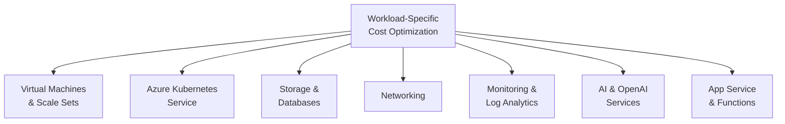
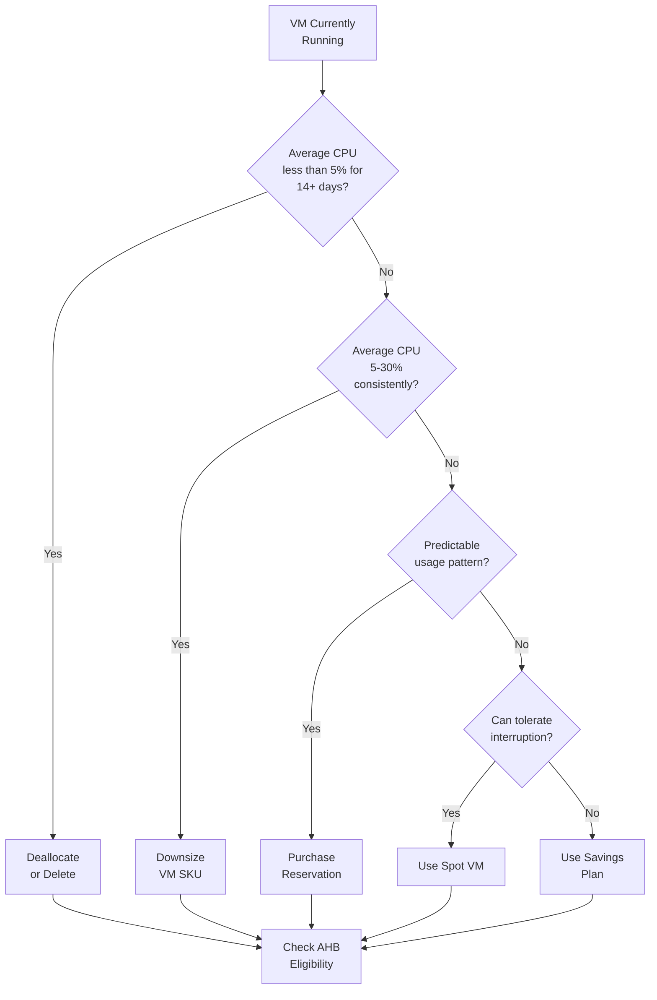
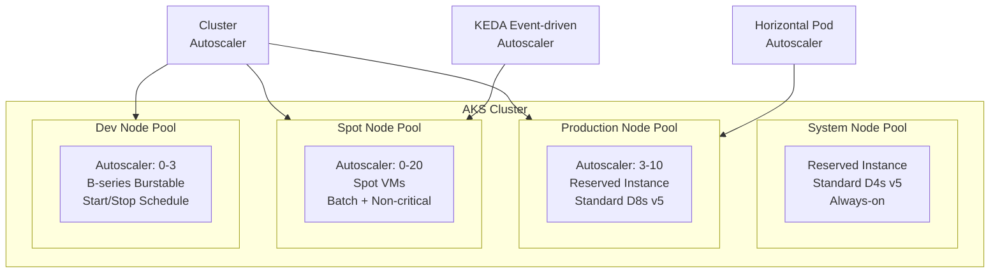
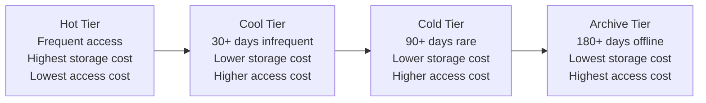
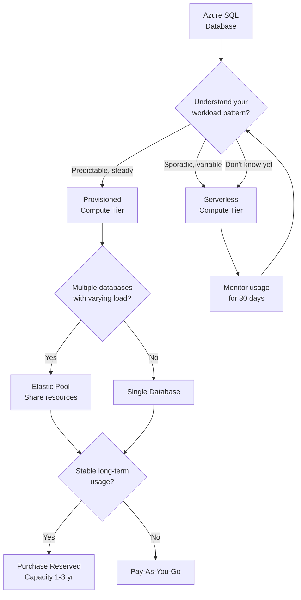
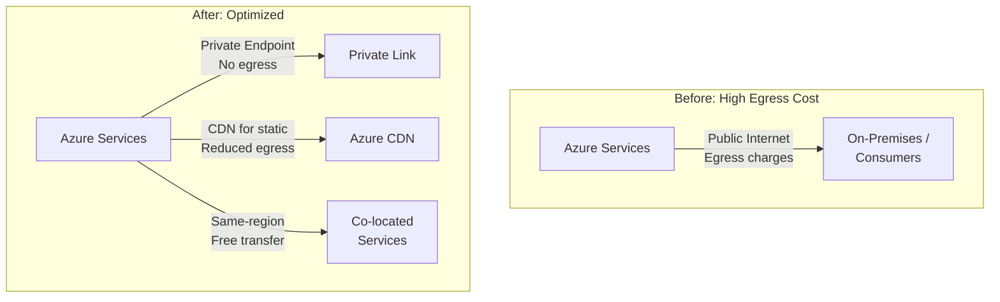
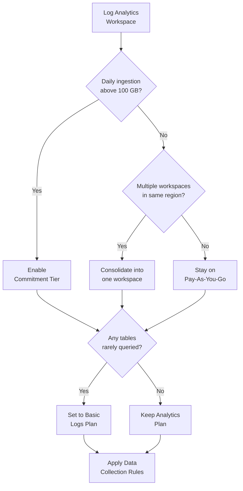

# Module 6: Workload-Specific Cost Optimization

> **Duration:** 60 minutes | **Level:** Deep-Dive Technical  
> **WAF Alignment:** CO:05 (Best Rates), CO:07 (Component Costs), CO:08 (Environment Costs), CO:10 (Data Costs), CO:11 (Code Costs), CO:12 (Scaling Costs), CO:14 (Consolidation)

---

## 6.1 Workload Optimization Map



Each workload type has unique cost levers. This module provides prescriptive guidance, CLI commands, and decision trees for the most common Azure services.

---

## 6.2 Virtual Machines

### Cost Optimization Matrix

| Optimization | Savings Potential | Complexity | Implementation Time |
|-------------|-------------------|------------|---------------------|
| Right-size underutilized VMs | 10-50% | Low | Days |
| Azure Hybrid Benefit (Windows/SQL) | 40-82% | Low | Hours |
| Reserved Instances (1yr/3yr) | 40-72% | Low | Hours |
| B-series for burstable workloads | 15-55% | Low | Days |
| Spot VMs for interruptible workloads | Up to 90% | Medium | Days |
| Auto-shutdown schedule for non-prod | 30-70% | Low | Hours |
| Migrate to containers/serverless | 30-60% | High | Months |

### VM Cost Optimization Decision Tree



### Key Azure CLI Commands for VMs

```powershell
# Find underutilized VMs via Azure Resource Graph
az graph query -q "
  Resources
  | where type =~ 'microsoft.compute/virtualMachines'
  | project name, resourceGroup, 
            vmSize=properties.hardwareProfile.vmSize,
            location, os=properties.storageProfile.osDisk.osType
  | order by vmSize asc
"

# Resize a VM
az vm resize --resource-group myRG --name myVM --size Standard_D2s_v5

# Enable Azure Hybrid Benefit on a Windows VM
az vm update --resource-group myRG --name myVM --set licenseType=Windows_Server

# Deallocate a stopped VM to stop compute billing
az vm deallocate --resource-group myRG --name myVM

# Set auto-shutdown schedule
az vm auto-shutdown \
  --resource-group "DevTest-RG" \
  --name "dev-vm-01" \
  --time "1900" \
  --timezone "Pacific Standard Time"

# Find VMs without Azure Hybrid Benefit enabled
az graph query -q "
  Resources
  | where type =~ 'microsoft.compute/virtualMachines'
  | where properties.storageProfile.imageReference.publisher == 'MicrosoftWindowsServer'
  | where properties.licenseType != 'Windows_Server'
  | project name, resourceGroup, vmSize=properties.hardwareProfile.vmSize
"
```

### VM Right-Sizing: Metrics to Monitor

| Metric | Right-Sized Range | Action if Below | Action if Above |
|--------|-------------------|-----------------|-----------------|
| CPU Average | 30-70% | Downsize or deallocate | Upsize |
| Memory Average | 30-70% | Downsize | Upsize |
| Network I/O | Varies by workload | Consider smaller SKU | Consider network-optimized |
| Disk IOPS | Varies by workload | Step down disk tier | Step up disk tier |

**Rule of thumb:** If CPU average is below 5% for 14 days, the VM is likely not needed. If CPU is between 5-30%, it is over-provisioned and should be downsized.

### WAF Service Guide: VM Cost Optimization Configuration Recommendations

These come directly from the [Azure Well-Architected Framework VM Service Guide](https://learn.microsoft.com/en-us/azure/well-architected/service-guides/virtual-machines-review):

| Recommendation | Why It Matters |
|----------------|----------------|
| Choose the right VM plan size and SKU. Use the [VM Selector](https://azure.microsoft.com/en-us/pricing/vm-selector/) to identify the best VM for your workload | SKUs are priced by capabilities. Don't overspend on SKUs with features you don't need |
| Use Spot VMs for batch processing, dev/test, and interruptible workloads | Up to 90% savings. Flexible orchestration lets you mix Spot and regular VMs by percentage |
| Scale in when demand decreases -- set a scale-in policy on VMSS | Scaling in reduces the number of running VMs and directly reduces costs |
| Stop VMs during off-hours using Azure Automation Start/Stop | This low-cost automation can significantly reduce idle instance costs for non-production |
| Use Azure Hybrid Benefit for Windows Server and SQL licenses | Reuse on-premises Software Assurance licenses at no extra cost on Azure |
| Use Azure Boost for CPU offloading on supported SKUs | Offloading virtualization frees up CPU for your workload -- better performance at same cost |
| Implement cost guardrails via Azure Policy | Restrict resource types, SKUs, configurations and locations to prevent overspend |

### VM Family Selection Guide for Cost Optimization

| VM Series | Use Case | Cost Characteristic |
|-----------|---------|---------------------|
| **B-series** (Burstable) | Dev/test, low-traffic web servers, small DBs | 15-55% cheaper than equivalent general purpose. Accumulate credits during idle, burst when needed |
| **D-series** (General Purpose) | Balanced CPU/memory for most production workloads | Standard pricing, good all-rounder. Use Dv5 for latest generation savings |
| **E-series** (Memory Optimized) | In-memory databases, SAP HANA, caching | Higher per-hour cost but fewer VMs needed for memory-heavy apps |
| **F-series** (Compute Optimized) | Batch, gaming servers, analytics | High CPU-to-memory. Cost-effective for CPU-bound workloads |
| **L-series** (Storage Optimized) | Big data, SQL, NoSQL, data warehousing | High throughput local NVMe storage. Avoid Premium SSD cost for temp data |
| **N-series** (GPU) | ML training, inference, rendering | Expensive per hour. Use Spot where possible and shutdown when idle |
| **Arm64** (Dpsv6, Epsv6) | Cloud-native, scale-out, containerized | Up to 50% better price-performance vs x86 for eligible workloads |

### Comprehensive VM Cost Checklist for Customers

| # | Action | Quick Win? | Est. Savings |
|---|--------|-----------|-------------|
| 1 | Identify and deallocate VMs with < 5% CPU for 14 days | Yes | 100% of those VMs |
| 2 | Right-size VMs with 5-30% CPU to next smaller SKU | Yes | 20-50% per VM |
| 3 | Enable Azure Hybrid Benefit on all eligible Windows/SQL VMs | Yes | 40-82% |
| 4 | Set auto-shutdown on all dev/test VMs | Yes | 30-70% |
| 5 | Move dev/test to B-series burstable VMs | Yes | 15-55% |
| 6 | Purchase 1-year RI for stable production VMs | No | 40-60% |
| 7 | Purchase 3-year RI for long-term stable VMs | No | 60-72% |
| 8 | Use Spot VMs for batch, CI/CD, non-critical | No | Up to 90% |
| 9 | Evaluate Arm64 for scale-out workloads | No | Up to 50% |
| 10 | Apply Azure Policy to restrict allowed SKUs | No | Prevents sprawl |

---

## 6.3 Azure Kubernetes Service (AKS)

### AKS Cost Optimization Strategies

| Strategy | Description | Savings Potential | Best For |
|----------|-------------|-------------------|----------|
| Cluster Autoscaler | Scale nodes based on pod demand | 20-40% | All production clusters |
| Spot Node Pools | Non-critical workloads on interruptible nodes | Up to 90% | Batch, dev/test |
| Cluster Start/Stop | Shutdown dev/test clusters off-hours | 50-70% | Non-production |
| Node Autoprovision (NAP) | Auto-select optimal VM SKU for pending pods | 10-30% | Complex workloads |
| HPA | Scale pods horizontally based on CPU/memory | Variable | Predictable demand |
| VPA | Right-size pod CPU/memory requests and limits | 10-30% | Fluctuating resource needs |
| KEDA | Event-driven scaling, can scale to zero | Up to 100% idle | Sporadic workloads |
| Arm64 Nodes | Cost-efficient ARM-based processors | Up to 50% | Cloud-native apps |
| AKS Cost Analysis | Granular cluster cost breakdown by K8s construct | Visibility | All clusters |

### AKS Architecture for Cost Optimization



### AKS CLI Commands

```powershell
# Stop an AKS cluster (saves all compute costs)
az aks stop --name myAKSCluster --resource-group myRG

# Start an AKS cluster
az aks start --name myAKSCluster --resource-group myRG

# Add a Spot node pool for batch workloads
az aks nodepool add \
  --resource-group myRG \
  --cluster-name myAKSCluster \
  --name spotnodepool \
  --priority Spot \
  --eviction-policy Delete \
  --spot-max-price -1 \
  --enable-cluster-autoscaler \
  --min-count 0 --max-count 10

# Enable cluster autoscaler on existing node pool
az aks nodepool update \
  --resource-group myRG \
  --cluster-name myAKSCluster \
  --name nodepool1 \
  --enable-cluster-autoscaler \
  --min-count 1 --max-count 5

# Enable AKS cost analysis add-on
az aks update --resource-group myRG --name myAKSCluster --enable-cost-analysis
```

### AKS Autoscaling Decision Guide

| Autoscaler | Layer | Trigger | Scale to Zero? | Best For |
|-----------|-------|---------|----------------|----------|
| HPA | Pod (horizontal) | CPU, memory, custom metrics | No | Predictable demand apps |
| VPA | Pod (vertical) | Historical CPU/memory usage | No | Right-sizing requests |
| KEDA | Pod (event-driven) | Queue length, HTTP traffic, events | **Yes** | Sporadic/event-driven |
| Cluster Autoscaler | Node | Pending pods, idle nodes | No (min 1) | All clusters |
| NAP | Node | Pod requirements | No | Complex multi-SKU |

> **Important:** Do not use VPA and HPA on the same CPU or memory metrics simultaneously. You can use VPA for CPU/memory with HPA for custom metrics.

---

## 6.4 Storage & Databases

### Storage -- WAF Service Guide Recommendations

These come from the [Azure Well-Architected Framework Blob Storage Service Guide](https://learn.microsoft.com/en-us/azure/well-architected/service-guides/storage-accounts/cost-optimization):

| WAF Recommendation | Customer Action |
|-------------------|-----------------|
| Identify the meters used to calculate your bill (capacity, operations, optional features) | Run a billing review to understand which meters drive cost |
| Choose a billing model for capacity -- evaluate commitment-based (reserved) vs consumption | For stable storage, pre-purchase reserved capacity for up to 38% savings |
| Choose the most cost-effective default access tier | Set default to Cool if most blobs are infrequently accessed |
| Upload data directly to the most cost-efficient tier | Specify Cool/Cold/Archive at upload time instead of uploading to Hot first |
| Use lifecycle management policies to auto-tier data | Automate Hot-to-Cool (30d), Cool-to-Cold (90d), Cold-to-Archive (180d) transitions |
| Disable features you don't need (versioning, soft delete on high-churn accounts) | Every blob overwrite creates a version/snapshot -- this can explode storage cost silently |
| Create budgets and monitor usage | Use Storage insights to identify accounts with no or low use |
| Pack small files before moving to cooler tiers | Cooler tiers have higher per-operation costs. Fewer large files = fewer operations |
| Use standard-priority rehydration from archive (not high-priority) | High-priority rehydration costs significantly more |

### Storage Cost Optimization -- Actionable Checklist

| # | Action | Impact | Azure CLI / Portal |
|---|--------|--------|-------------------|
| 1 | Upgrade all Storage v1 accounts to GPv2 | Enables tiering, reserved capacity | `az storage account update --kind StorageV2` |
| 2 | Enable Lifecycle Management Policy | Auto-tier blobs by last-modified date | Portal > Storage Account > Lifecycle management |
| 3 | Find and delete unattached managed disks | Immediate storage savings | `az disk list --query "[?managedBy==null]"` |
| 4 | Delete old disk snapshots (30+ days) | Reduce snapshot storage cost | `az snapshot list --query "[?timeCreated < '...']"` |
| 5 | Move snapshots from Premium to Standard | 60% savings on snapshot storage | Portal > Snapshot > Change tier |
| 6 | Review backup redundancy (GRS vs LRS for dev/test) | 50% backup storage savings | Portal > Recovery Services vault > Properties |
| 7 | Disable blob versioning on high-churn accounts | Prevent silent cost explosion | Portal > Storage Account > Data protection |
| 8 | Enable reserved capacity for stable storage | Up to 38% savings on capacity | Portal > Reservations > Add > Storage |
| 9 | Review soft delete retention periods | Long retention on high-churn = high cost | Start with 7 days, increase as needed |
| 10 | Disable SFTP support when not actively transferring | Billed hourly even when idle | Portal > Storage Account > SFTP |

### Storage Tiering Flow



**Key action:** Enable Lifecycle Management Policy to automate blob transitions between tiers based on last-modified date.

```powershell
# Find unattached managed disks
az disk list \
  --query "[?managedBy==null].[name, diskSizeGb, sku.name, resourceGroup]" \
  --output table

# Find old disk snapshots (30+ days)
$threshold = (Get-Date).AddDays(-30).ToString("yyyy-MM-ddTHH:mm:ssZ")
az snapshot list \
  --query "[?timeCreated < '$threshold'].[name, diskSizeGb, resourceGroup]" \
  --output table

# Find Storage v1 accounts that should be upgraded
az graph query -q "
  Resources
  | where type =~ 'microsoft.storage/storageaccounts'
  | where kind == 'Storage' or kind == 'BlobStorage'
  | project name, resourceGroup, kind, location
"
```

### Azure SQL Database Cost Optimization -- Comprehensive Guide

Based on the [Azure SQL Database Cost Management documentation](https://learn.microsoft.com/en-us/azure/azure-sql/database/cost-management):

#### Purchasing Model Decision



#### SQL Cost Optimization Strategies

| Strategy | Description | Savings | When to Use |
|----------|-------------|---------|-------------|
| **Serverless tier** | Auto-pause when idle, pay per second of compute used | Up to 70% for sporadic | Dev/test, apps with idle periods |
| **Elastic Pools** | Share provisioned resources across multiple databases | 30-50% vs individual DBs | Multi-tenant apps, varying DB workloads |
| **Reserved Capacity** | Pre-commit to vCores for 1 or 3 years | 33-65% | Stable, predictable production databases |
| **Azure Hybrid Benefit** | Use existing SQL Server licenses | Up to 55% | Customers with Software Assurance |
| **DTU to vCore migration** | Move from DTU to vCore for more granular control | Variable | When DTU model is inefficient |
| **Right-size compute** | Match provisioned vCores/DTUs to actual usage | 20-50% | Over-provisioned databases |
| **Scale down non-prod** | Use lower tiers for dev/test/staging | 50-80% | Non-production environments |
| **Free tier** | 100,000 vCore seconds + 32 GB storage per month free | 100% | Small apps, prototyping |

```powershell
# Find Azure SQL Databases and their pricing tiers
az graph query -q "
  Resources
  | where type =~ 'microsoft.sql/servers/databases'
  | where name != 'master'
  | project name, resourceGroup,
            sku=sku.name, tier=sku.tier,
            capacity=sku.capacity,
            location
  | order by tier asc
"

# Check if any SQL DBs can use serverless
az graph query -q "
  Resources
  | where type =~ 'microsoft.sql/servers/databases'
  | where sku.tier == 'GeneralPurpose'
  | where sku.name !contains 'Serverless'
  | project name, resourceGroup, sku=sku.name
"
```

### Cosmos DB Cost Optimization

| Strategy | Description | Savings |
|----------|-------------|---------|
| Autoscale throughput | Automatically scale RUs up/down based on demand | 10-70% vs fixed provisioned |
| Reserved capacity | Pre-purchase RUs for 1 or 3 years | Up to 65% |
| Serverless mode | Pay per request for sporadic workloads | Up to 90% vs provisioned idle |
| Optimize query RU cost | Use indexing policies, avoid cross-partition queries | 30-80% per query |
| Rate limiting | Implement client-side rate limiting to avoid 429s | Prevents over-provisioning |
| Time-to-live (TTL) | Auto-delete old documents to reduce storage | Variable |

### PostgreSQL / MySQL Flexible Server

| Strategy | Description |
|----------|-------------|
| Burstable tier (B-series) | For dev/test and low-traffic workloads |
| Stopped server | Stop the server when not in use (no compute charges) |
| Reserved capacity | Pre-commit for 1 or 3 years for 30-65% savings |
| Scale compute tier | Match compute to actual workload requirements |
| Storage auto-grow | Prevent manual over-provisioning of storage |

---

## 6.5 Networking -- The Hidden Cost Driver

> **Key insight:** Data transfer (egress) is often the most overlooked cost in Azure. Many customers pay 10-20% of their bill on egress without realizing it if architecture is not well designed.

### Networking Cost Drivers Ranked by Impact

| # | Resource / Cost Driver | Typical Monthly Cost | How It Accumulates |
|---|----------------------|---------------------|-------------------|
| 1 | **Data Transfer (Egress)** | $0.05-$0.087/GB | Cross-region, internet-bound data adds up fast |
| 2 | **ExpressRoute** | $55-$500/month + per-GB metered | Charges even when unused. Metered plans charge per GB |
| 3 | **Azure Firewall** | $912/month (Standard) or $1,827/month (Premium) | Base cost per hour + per-GB processed |
| 4 | **Application Gateway / WAF** | $250-$700/month | Fixed capacity units + per-GB processed |
| 5 | **VPN Gateway** | $139-$1,012/month | Charged per hour. VpnGw1 vs VpnGw5 varies 7x |
| 6 | **Load Balancer (Standard)** | $18/month + per-rule | Charged per rule per hour. Idle LBs still cost |
| 7 | **Public IPs (Standard)** | $3.65/month each | Charged even when unattached. Orphaned PIPs add up |
| 8 | **NAT Gateway** | $32/month + per-GB | Steady charge even with low traffic |

### Egress Cost Reduction Architecture



### Networking Cost Optimization Checklist

| # | Action | Azure CLI / Resource Graph | Savings |
|---|--------|--------------------------|---------|
| 1 | Delete orphaned Public IPs | `az graph query -q "Resources \| where type =~ 'microsoft.network/publicIPAddresses' \| where isnull(properties.ipConfiguration)"` | $3.65/month each |
| 2 | Remove idle Load Balancers | Check for empty backend pools | $18+/month each |
| 3 | Remove idle Application Gateways | Check for empty backend pools | $250+/month each |
| 4 | Delete unused VNet Gateways | Check for zero connections | $139+/month each |
| 5 | Downgrade Azure Firewall Premium to Standard | Verify no Premium features (TLS inspection, IDPS) used | $900+/month |
| 6 | Consolidate Azure Firewalls (hub-spoke) | One central Firewall per region, not per spoke | $900+/month per extra |
| 7 | Deprovision unused ExpressRoute circuits | Check traffic, confirm no active peerings | $55-500/month each |
| 8 | Use Private Endpoints for PaaS services | Eliminates public internet egress | Variable |
| 9 | Co-locate services in same region | Free intra-region data transfer | Variable |
| 10 | Use Azure CDN for static content delivery | Free Azure-to-CDN transfer | Variable |

### Key Egress Rules of Thumb

- **Intra-region transfer:** Free (between services in the same Azure region)
- **Inter-region transfer:** $0.02-$0.087/GB depending on regions
- **Internet egress:** $0.05-$0.087/GB (first 5 GB/month free)
- **ExpressRoute metered egress:** $0.025/GB for Zone 1
- **Azure CDN delivery:** Free from Azure origin to CDN PoP
- **Target:** No more than 15% of total Azure spend on data transfer

```powershell
# Find orphaned Public IPs
az graph query -q "
  Resources
  | where type =~ 'microsoft.network/publicIPAddresses'
  | where isnull(properties.ipConfiguration)
  | project name, resourceGroup, sku=sku.name, location
"

# Find idle Load Balancers (empty backend pools)
az graph query -q "
  Resources
  | where type =~ 'microsoft.network/loadbalancers'
  | where array_length(properties.backendAddressPools) == 0
  | project name, resourceGroup, sku=sku.name, location
"

# Find Azure Firewalls and their SKU (Premium vs Standard)
az graph query -q "
  Resources
  | where type =~ 'microsoft.network/azureFirewalls'
  | project name, resourceGroup, sku=properties.sku.tier, location
"

# Find VNet Gateways with no connections
az graph query -q "
  Resources
  | where type =~ 'microsoft.network/virtualNetworkGateways'
  | project name, resourceGroup, gatewayType=properties.gatewayType,
            sku=properties.sku.name, location
"
```

---

## 6.6 Monitoring & Log Analytics

### Log Analytics Cost Optimization

| Optimization | Description | Savings Potential |
|-------------|-------------|-------------------|
| Commitment Tiers | Pre-commit to daily ingestion volume (100, 200, 300+ GB/day) | 15-30% |
| Basic Logs Plan | Lower cost for infrequently queried tables | 60-80% |
| Data Collection Rules (DCR) | Filter and transform data before ingestion | Reduce volume 30-50% |
| Table-level Retention | Set different retention per table based on compliance needs | Variable |
| Dedicated Cluster | Aggregate 500+ GB/day across workspaces | Volume discount |
| Managed Prometheus | Replace Container Insights metrics for AKS | Significant |
| Transformations | Modify/filter control plane and data plane logs before storage | 20-50% |

### Log Analytics Decision Tree



### AKS Monitoring Cost Optimization

| Before | After | Impact |
|--------|-------|--------|
| Container Insights (full metrics) | Managed Prometheus + Grafana | Significant cost reduction |
| All control plane logs enabled | Disable unnecessary log categories | Reduce Log Analytics ingestion |
| Default data collection | Custom DCR with filtering | Ingest only needed data |

```powershell
# Check Log Analytics workspace pricing tier
az monitor log-analytics workspace show \
  --resource-group myRG \
  --workspace-name myWorkspace \
  --query "{name:name, sku:sku.name, retentionDays:retentionInDays}" \
  --output table
```

---

## 6.7 App Service & Azure Functions

### App Service Cost Optimization -- Deep Guide

| Strategy | Description | Savings | Portal / CLI |
|----------|-------------|---------|-------------|
| Upgrade v2 to v3 SKU | v3 is cheaper AND supports RI/Savings Plan | 10-30% | Portal > App Service Plan > Scale up |
| Delete Stopped apps | Stopped App Services still incur plan charges | 100% of those apps | `az webapp delete` |
| Enable autoscale | Scale instances based on CPU/memory/HTTP queue | 20-50% | Portal > Scale out > Custom autoscale |
| Reserved Instances | Pre-commit for P1v3, P2v3, P3v3 plans | 35-55% | Portal > Reservations > App Service |
| Use Free/Shared tier for dev prototyping | F1 (free) or D1 (shared) for non-production | 100% | Portal > Scale up |
| Consolidate apps onto fewer plans | Multiple apps can share one App Service Plan | Variable | Move apps to shared plan |
| Use Deployment Slots only when needed | Each slot consumes resources on the plan | Reduce instance count | Portal > Deployment slots |

```powershell
# Find stopped App Services (still being charged)
az graph query -q "
  Resources
  | where type =~ 'microsoft.web/sites'
  | where properties.state == 'Stopped'
  | project name, resourceGroup, kind, location
"

# Find App Service Plans and their SKUs
az graph query -q "
  Resources
  | where type =~ 'microsoft.web/serverfarms'
  | project name, resourceGroup,
            sku=sku.name, tier=sku.tier,
            workers=properties.numberOfWorkers,
            location
  | order by tier asc
"

# Find App Service Plans with zero apps (wasted cost)
az graph query -q "
  Resources
  | where type =~ 'microsoft.web/serverfarms'
  | where properties.numberOfSites == 0
  | project name, resourceGroup, sku=sku.name, location
"
```

### Azure Functions Cost Optimization

| Plan | Best For | Cost Model | Key Optimization |
|------|---------|------------|-----------------|
| **Consumption** | Sporadic, event-driven workloads | Pay per execution + execution time | First 1M executions/month free. Scale to zero |
| **Flex Consumption** | Variable workloads needing VNET | Per-second billing with always-ready instances | Set always-ready minimum low |
| **Premium (EP)** | Sustained load with VNET/unlimited execution | Pre-warmed instances, per-second billing | Right-size minimum instances |
| **Dedicated** | Apps sharing App Service Plan | App Service Plan pricing | Already paying for plan |

### Logic Apps Cost Tips

| Scenario | Recommendation |
|----------|---------------|
| High-volume workflows (100k+ actions/month) | Standard tier (fixed, predictable pricing) |
| Sporadic triggers (< 1000 runs/month) | Consumption tier (pay per action) |
| Enterprise integration with ISE | Evaluate migration to Standard + VNET integration |

---

## 6.8 AI & Azure OpenAI Services -- Cost Optimization Deep Dive

### Azure OpenAI Pricing Models

| Model | Pricing Approach | Best For |
|-------|-----------------|----------|
| **Pay-as-you-go (Standard)** | Per 1K tokens consumed | Variable, unpredictable workloads |
| **Provisioned Throughput (PTU)** | Fixed hourly rate for reserved capacity | Predictable, high-volume production |
| **Batch API** | Same tokens at reduced rate, async processing | Non-real-time inference (reports, analysis) |
| **Global Standard** | Lower per-token cost, Microsoft routes to optimal region | Latency-insensitive workloads |

### Token Cost Comparison (Illustrative)

| Model | Input (per 1M tokens) | Output (per 1M tokens) | Use When |
|-------|----------------------|----------------------|----------|
| GPT-4o | $2.50 | $10.00 | Complex reasoning, code generation |
| GPT-4o-mini | $0.15 | $0.60 | Summarization, classification, simple Q&A |
| GPT-3.5-turbo | $0.50 | $1.50 | Legacy workloads, simple completions |

> **Key insight:** GPT-4o-mini is 16x cheaper than GPT-4o for input and delivers excellent quality for most business tasks. Always test if a cheaper model meets your quality bar.

### Azure OpenAI Cost Optimization Strategies

| Strategy | Description | Savings Potential |
|----------|-------------|-------------------|
| **Model right-sizing** | Use GPT-4o-mini instead of GPT-4o where quality allows | 80-95% per request |
| **Prompt engineering** | Reduce system prompt tokens, use structured output, fewer examples | 20-50% per request |
| **Semantic caching** | Cache embeddings of similar queries, return cached responses | 50-90% for repeated queries |
| **Batch API** | Process non-urgent requests in batch at reduced rates | 50% per token |
| **PTU commitment** | Pre-purchase provisioned throughput for predictable workloads | 30-50% vs pay-as-you-go |
| **Max tokens limit** | Set `max_tokens` to prevent unnecessarily long responses | 10-40% per request |
| **Content filtering** | Only enable needed content filters (custom filters cost more) | Variable |
| **Chargeback by API key** | Separate API keys per business unit to track and allocate costs | Accountability |
| **Azure Budgets** | Set budget alerts on OpenAI resource groups | Prevention |

```powershell
# Find all Azure OpenAI resources and their configurations
az graph query -q "
  Resources
  | where type =~ 'microsoft.cognitiveservices/accounts'
  | where kind == 'OpenAI'
  | project name, resourceGroup, sku=sku.name, location
"
```

### Azure Cognitive Search Cost Tips

| Strategy | Description |
|----------|-------------|
| Right-size replicas | Use minimum replicas that meet query performance SLA |
| Right-size partitions | Match partition count to index size, not peak projections |
| Use Basic/Free tier for dev/test | Standard S1+ is expensive |
| Semantic ranker | Only enable when needed (per-query cost) |

---

## 6.9 Implementation Timeline

```mermaid
graph LR
    subgraph W1["Quick Wins<br/>Week 1-2"]
        QW1["Delete idle resources"]
        QW2["Enable AHB on all VMs"]
        QW3["Right-size top 10 VMs"]
        QW4["Set auto-shutdown"]
        QW5["Tag all resources"]
    end
    subgraph M1["Medium Term<br/>Month 1-3"]
        MT1["Purchase Reservations"]
        MT2["Implement autoscaling"]
        MT3["Storage lifecycle policies"]
        MT4["Budget enforcement"]
        MT5["Deploy Azure Policies"]
    end
    subgraph M3["Long Term<br/>Month 3-12"]
        LT1["FinOps practice"]
        LT2["Containerization"]
        LT3["Serverless migration"]
        LT4["Chargeback model"]
        LT5["Continuous optimization"]
    end
    W1 --> M1 --> M3
```



---

## Key Takeaways

1. **Every workload type has unique cost levers** -- there is no one-size-fits-all
2. **VMs:** Right-size first, then AHB, then Reservations/Savings Plans, then Spot for eligible workloads
3. **AKS:** Cluster Autoscaler + Spot node pools + Start/Stop for non-prod + KEDA for event-driven
4. **Storage:** Lifecycle policies are free money; delete orphaned disks and old snapshots
5. **Networking:** Egress is the hidden cost -- use Private Endpoints, CDN, same-region co-location
6. **Monitoring:** Basic Logs plan, commitment tiers, DCRs, and managed Prometheus for AKS
7. **Start with quick wins** (hours), then structured optimization (months), then FinOps culture (ongoing)

---

## References

### WAF Service Guides (Cost Optimization per Resource)

| Resource | WAF Service Guide Link |
|----------|----------------------|
| Virtual Machines & VMSS | [learn.microsoft.com/.../virtual-machines-review](https://learn.microsoft.com/en-us/azure/well-architected/service-guides/virtual-machines-review) |
| Blob Storage | [learn.microsoft.com/.../storage-accounts/cost-optimization](https://learn.microsoft.com/en-us/azure/well-architected/service-guides/storage-accounts/cost-optimization) |
| Azure SQL Database | [learn.microsoft.com/.../azure-sql/database/cost-management](https://learn.microsoft.com/en-us/azure/azure-sql/database/cost-management) |
| AKS | [learn.microsoft.com/.../aks/best-practices-cost](https://learn.microsoft.com/en-us/azure/aks/best-practices-cost) |
| Azure Firewall | [learn.microsoft.com/.../azure-firewall](https://learn.microsoft.com/en-us/azure/well-architected/service-guides/azure-firewall) |
| App Service | [learn.microsoft.com/.../app-service-web-apps](https://learn.microsoft.com/en-us/azure/well-architected/service-guides/app-service-web-apps) |
| Cosmos DB | [learn.microsoft.com/.../cosmos-db](https://learn.microsoft.com/en-us/azure/well-architected/service-guides/cosmos-db) |
| Log Analytics | [learn.microsoft.com/.../azure-log-analytics](https://learn.microsoft.com/en-us/azure/well-architected/service-guides/azure-log-analytics) |

### Other References

- [AKS Cost Best Practices](https://learn.microsoft.com/en-us/azure/aks/best-practices-cost)
- [VM Right-Sizing Recommendations](https://learn.microsoft.com/en-us/azure/advisor/advisor-cost-recommendations)
- [Storage Lifecycle Management](https://learn.microsoft.com/en-us/azure/storage/blobs/lifecycle-management-overview)
- [Log Analytics Cost](https://learn.microsoft.com/en-us/azure/azure-monitor/logs/cost-logs)
- [Azure OpenAI Cost Management](https://learn.microsoft.com/en-us/azure/ai-services/openai/how-to/manage-costs)
- [Azure Cost Optimization Workbook](https://learn.microsoft.com/en-us/azure/advisor/advisor-cost-optimization-workbook)
- [WAF Cost Optimization Checklist](https://learn.microsoft.com/en-us/azure/well-architected/cost-optimization/checklist)
- [Azure Pricing Calculator](https://azure.microsoft.com/pricing/calculator/)
- [VM Selector Tool](https://azure.microsoft.com/en-us/pricing/vm-selector/)
- [Azure FinOps Guide](https://github.com/dolevshor/azure-finops-guide)

---

> **Previous Module:** [Module 5 — Usage Optimization & Waste Reduction](./05-Module-Usage-Optimization.md)  
> **Next Module:** [Module 7 — AI Workload Cost Optimization](./07-Module-AI-Cost-Optimization.md)  
> **Back to Overview:** [README — Cost Optimization](./README.md)
