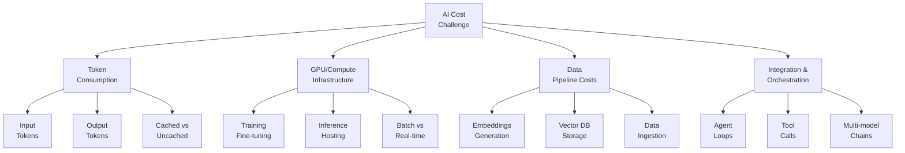
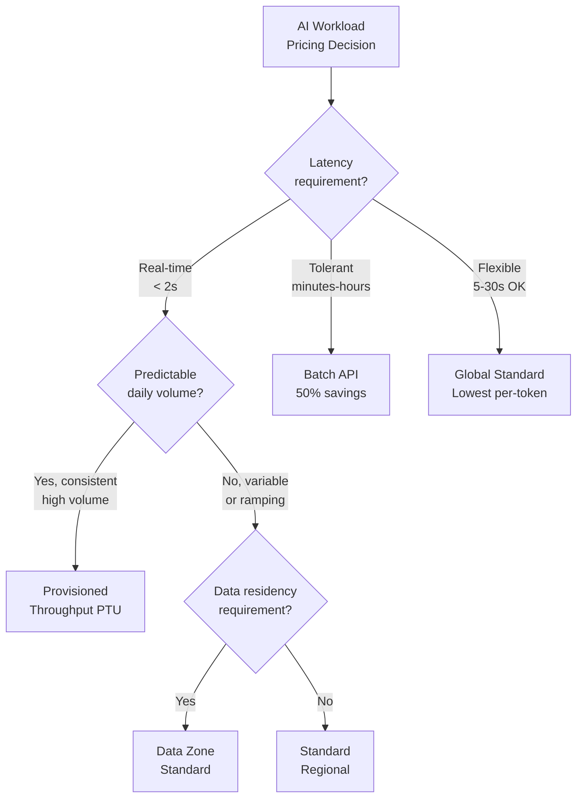
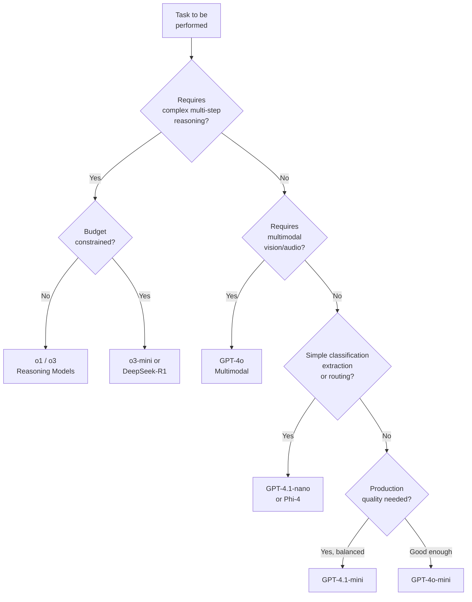
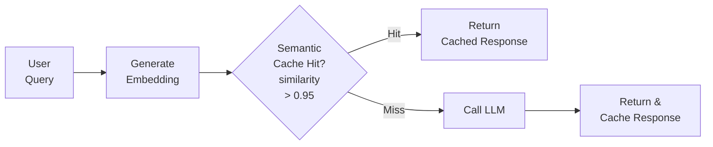
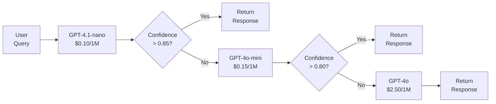
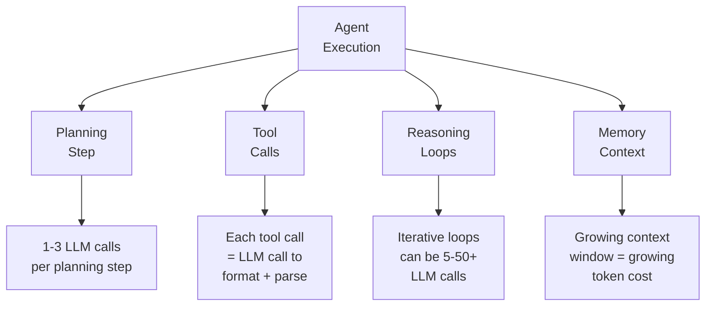
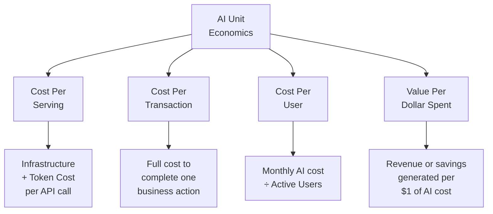
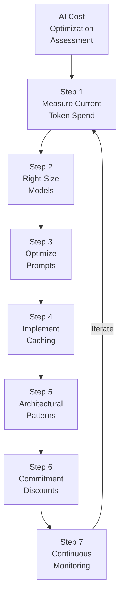

# Module 7: AI Workload Cost Optimization

> **Duration:** 90–120 minutes | **Level:** Strategic + Deep-Dive Technical  
> **Aligned with:** [Microsoft Azure Well-Architected Framework — Cost Optimization Pillar](https://learn.microsoft.com/en-us/azure/well-architected/cost-optimization/), [Azure AI Services Pricing](https://azure.microsoft.com/en-us/pricing/details/cognitive-services/openai-service/)  
> **Audience:** Cloud Architects, AI Engineers, FinOps Practitioners, Platform Engineers, IT Leadership  
> **Last Updated:** March 2026

---

## Table of Contents

- [7.1 The AI Cost Challenge](#71-the-ai-cost-challenge)
- [7.2 Token Economics — The New Unit of Cloud Cost](#72-token-economics--the-new-unit-of-cloud-cost)
- [7.3 AI Pricing Models on Azure — Deep Comparison](#73-ai-pricing-models-on-azure--deep-comparison)
- [7.4 Model Selection & Right-Sizing — The Biggest Lever](#74-model-selection--right-sizing--the-biggest-lever)
- [7.5 Prompt Engineering for Cost Efficiency](#75-prompt-engineering-for-cost-efficiency)
- [7.6 Architectural Patterns for AI Cost Optimization](#76-architectural-patterns-for-ai-cost-optimization)
- [7.7 Azure AI Foundry Cost Management](#77-azure-ai-foundry-cost-management)
- [7.8 Microsoft 365 Copilot & Copilot Stack Cost Governance](#78-microsoft-365-copilot--copilot-stack-cost-governance)
- [7.9 AI Agents & Multi-Agent Cost Control](#79-ai-agents--multi-agent-cost-control)
- [7.10 MCP Servers — The Cost Dimension Nobody Talks About](#710-mcp-servers--the-cost-dimension-nobody-talks-about)
- [7.11 Unit Economics of AI — Building the Business Case](#711-unit-economics-of-ai--building-the-business-case)
- [7.12 GPU & Compute Cost Optimization for AI Training](#712-gpu--compute-cost-optimization-for-ai-training)
- [7.13 Observability & FinOps for AI Workloads](#713-observability--finops-for-ai-workloads)
- [7.14 AI Cost Optimization Decision Framework](#714-ai-cost-optimization-decision-framework)
- [7.15 Implementation Roadmap](#715-implementation-roadmap)
- [7.16 Key Takeaways](#716-key-takeaways)
- [References](#references)

---

## 7.1 The AI Cost Challenge

AI workloads have fundamentally changed the cloud cost equation. Unlike traditional compute where costs scale with infrastructure, AI costs scale with **usage patterns, model complexity, and token volume**. A single poorly optimized prompt can cost 100x more than necessary. A single unmonitored agent loop can burn through a monthly budget in hours.



### Why AI Cost Optimization Is Different

| Traditional Cloud | AI Workloads |
|-------------------|--------------|
| Cost scales with **infrastructure** provisioned | Cost scales with **tokens consumed** and **requests made** |
| Predictable monthly spend patterns | Highly variable — one viral feature can 10x costs overnight |
| Right-sizing = choosing correct VM SKU | Right-sizing = choosing correct **model**, **prompt**, and **architecture** |
| Idle resources are the primary waste | **Verbose prompts**, **wrong model selection**, and **agent loops** are the primary waste |
| Autoscaling manages demand | Rate limiting, PTU commitments, and caching manage demand |
| Cost per unit is fixed (per hour/GB) | Cost per unit varies by **model** (GPT-4o vs GPT-4o-mini = 16x difference) |

> **Key Insight:** Organizations deploying generative AI report that **token costs represent 40–70% of their total AI infrastructure spend**, yet fewer than 20% actively monitor or optimize token usage. This is the equivalent of running VMs 24/7 in 2015 — massive optimization opportunity hiding in plain sight.

---

## 7.2 Token Economics — The New Unit of Cloud Cost

Tokens are the metered unit of generative AI. Every API call to Azure OpenAI, Anthropic, or any LLM is billed per token consumed. Understanding token economics is the foundation of AI cost management.

### What Is a Token?

A token is approximately **0.75 words** in English (or ~4 characters). But tokenization varies by language, code, and content type:

| Content Type | Avg Tokens per 1,000 Words | Cost Implication |
|-------------|---------------------------|-----------------|
| English prose | ~1,300 tokens | Baseline |
| Code (Python, JSON) | ~1,800 tokens | 38% more expensive than prose |
| German/French text | ~1,500 tokens | 15% more expensive than English |
| CJK languages (Chinese, Japanese, Korean) | ~2,000+ tokens | 50%+ more expensive |
| Structured JSON output | ~1,600 tokens | 23% more expensive than prose |
| Base64-encoded images | ~10,000–85,000 tokens | Extremely expensive |

### Token Cost Comparison Across Models (March 2026)

| Model | Input per 1M Tokens | Output per 1M Tokens | Relative Cost Index | Best Use Case |
|-------|---------------------|---------------------|---------------------|---------------|
| **GPT-4o** | $2.50 | $10.00 | 1.0x (baseline) | Complex reasoning, code generation, multimodal |
| **GPT-4o-mini** | $0.15 | $0.60 | **0.06x** | Classification, summarization, extraction, Q&A |
| **GPT-4.1** | $2.00 | $8.00 | 0.8x | Long-context, advanced coding, instruction following |
| **GPT-4.1-mini** | $0.40 | $1.60 | 0.16x | Balanced cost-performance for production workloads |
| **GPT-4.1-nano** | $0.10 | $0.40 | **0.04x** | High-volume, low-latency, classification, routing |
| **o1 (reasoning)** | $15.00 | $60.00 | 6.0x | Math, science, complex multi-step reasoning |
| **o3-mini** | $1.10 | $4.40 | 0.44x | Reasoning tasks at reduced cost |
| **DeepSeek-R1 (Azure)** | $0.55 | $2.19 | 0.22x | Open-source reasoning alternative |
| **Phi-4 (SLM)** | $0.07 | $0.14 | **0.01x** | On-device, edge, privacy-sensitive workloads |

> **The 100x Rule:** The difference between the cheapest and most expensive model for the **same task** can be **100x**. Model selection is the single highest-impact cost lever in AI.

### Token Budget Calculator

Use this formula to estimate monthly AI costs:

```
Monthly Cost = (Avg Input Tokens × Input Price) + (Avg Output Tokens × Output Price)
             × Requests per Day × 30 days

Example: Customer support chatbot
- 500 input tokens × $0.15/1M = $0.000075 per request (GPT-4o-mini)
- 300 output tokens × $0.60/1M = $0.000180 per request
- Total per request = $0.000255
- 10,000 requests/day = $2.55/day = $76.50/month

Same chatbot with GPT-4o:
- 500 input tokens × $2.50/1M = $0.00125 per request
- 300 output tokens × $10.00/1M = $0.003 per request
- Total per request = $0.00425
- 10,000 requests/day = $42.50/day = $1,275/month

Savings by switching: $1,198.50/month (94% reduction)
```

---

## 7.3 AI Pricing Models on Azure — Deep Comparison

Azure offers multiple deployment and pricing models for AI workloads. Choosing the right one is critical.

### Deployment Model Comparison

| Deployment Model | How It Works | Pricing | Best For | Commitment |
|-----------------|-------------|---------|----------|------------|
| **Global Standard** | Microsoft routes to optimal region | Lowest per-token | Latency-insensitive, batch, background | None |
| **Standard (Regional)** | Fixed region deployment | Per-token, pay-as-you-go | Variable workloads, development | None |
| **Provisioned (PTU)** | Reserved throughput units | Fixed hourly rate | Predictable, high-volume production | Monthly/yearly |
| **Data Zone Standard** | Data stays within geographic zone | Per-token, slight premium | Data residency requirements | None |
| **Batch API** | Async processing, 24-hour SLA | 50% discount on tokens | Reports, bulk analysis, embeddings | None |



### PTU vs Pay-as-You-Go — Break-Even Analysis

The break-even point determines when PTU commitment becomes cheaper than pay-as-you-go:

| Scenario | Daily Token Volume | PAYG Monthly Cost | PTU Monthly Cost | Recommendation |
|----------|-------------------|-------------------|------------------|----------------|
| Low usage | < 50M tokens/day | ~$150 | ~$2,000 | **PAYG** — PTU wastes money |
| Medium usage | 50–200M tokens/day | ~$600 | ~$2,000 | **Analyze closely** — near break-even |
| High usage | 200M–1B tokens/day | ~$3,000 | ~$2,000 | **PTU** — 30-40% savings |
| Very high usage | > 1B tokens/day | ~$15,000+ | ~$6,000 | **PTU** — critical for cost control |

> **Pro Tip:** Start with pay-as-you-go for 30-60 days to establish baseline usage. Use Azure Monitor metrics on your Azure OpenAI resource to track daily token consumption. Only commit to PTU when you have predictable, sustained utilization above the break-even threshold.

---

## 7.4 Model Selection & Right-Sizing — The Biggest Lever

Model selection is to AI what VM right-sizing is to compute — except the savings potential is far greater. A 10x price difference between models is common; 100x is possible.

### Model Selection Decision Tree



### Model Right-Sizing Matrix

| Task Category | Recommended Model | Why Not a Bigger Model | Monthly Savings vs GPT-4o |
|--------------|-------------------|----------------------|--------------------------|
| Intent classification / routing | GPT-4.1-nano | Binary/categorical output, no reasoning needed | 96% |
| Text summarization | GPT-4o-mini | Extractive/abstractive summarization works well | 94% |
| Structured data extraction (JSON) | GPT-4o-mini | Follows JSON schema reliably | 94% |
| Customer support Q&A | GPT-4o-mini | FAQ-style responses, well-defined domain | 94% |
| Content moderation | GPT-4.1-nano | Classification task, low complexity | 96% |
| Code generation (production) | GPT-4.1 | Best coding model, justified premium | 20% |
| Complex RAG with reasoning | GPT-4o or GPT-4.1 | Needs to synthesize across documents | Baseline |
| Math/scientific analysis | o3-mini | Reasoning chains required, o3-mini is cost-effective | 56% |
| Translation | GPT-4o-mini | High quality across languages | 94% |
| Embeddings generation | text-embedding-3-small | Purpose-built, fraction of LLM cost | 99%+ |

### Implementing Model Routing (Code Pattern)

A model router sends each request to the cheapest model capable of handling it:

```python
# Model Router Pattern — route by task complexity
import openai

MODEL_TIERS = {
    "nano":  {"model": "gpt-4.1-nano",  "max_tokens": 256},
    "mini":  {"model": "gpt-4o-mini",   "max_tokens": 1024},
    "standard": {"model": "gpt-4.1",    "max_tokens": 4096},
    "premium":  {"model": "gpt-4o",     "max_tokens": 4096},
}

def classify_complexity(task: str) -> str:
    """Use the cheapest model to classify task complexity."""
    response = openai.chat.completions.create(
        model="gpt-4.1-nano",
        messages=[{
            "role": "system",
            "content": "Classify this task as: nano, mini, standard, or premium. "
                       "Reply with only the tier name."
        }, {
            "role": "user", "content": task
        }],
        max_tokens=10
    )
    tier = response.choices[0].message.content.strip().lower()
    return tier if tier in MODEL_TIERS else "mini"

def route_request(task: str, user_message: str) -> str:
    """Route to the cheapest capable model."""
    tier = classify_complexity(task)
    config = MODEL_TIERS[tier]
    response = openai.chat.completions.create(
        model=config["model"],
        messages=[{"role": "user", "content": user_message}],
        max_tokens=config["max_tokens"]
    )
    return response.choices[0].message.content
```

> **Cost Impact:** Organizations implementing model routing report **60–80% token cost reduction** without measurable quality degradation for 80%+ of their requests.

---

## 7.5 Prompt Engineering for Cost Efficiency

Every extra token in your prompt is money. Prompt engineering is not just about quality — it is a direct cost optimization lever.

### Token-Efficient Prompt Techniques

| Technique | Description | Token Savings | Quality Impact |
|-----------|-------------|---------------|---------------|
| **System prompt compression** | Remove verbose instructions, use concise directives | 30–60% of system prompt | Minimal if well-crafted |
| **Few-shot → zero-shot** | Remove example pairs when the model performs without them | 50–90% of prompt | Test quality first |
| **Structured output** | Request JSON/YAML output instead of prose | 20–40% of output | Often improves quality |
| **Max tokens cap** | Set `max_tokens` to prevent runaway generation | 10–50% of output | May truncate |
| **Response format enforcement** | Use `response_format: { "type": "json_object" }` | 15–25% of output | Eliminates boilerplate |
| **Shared context extraction** | Move repeated context to system prompt, not each user turn | 20–40% per turn | No impact |
| **Prompt caching** | Leverage Azure OpenAI prompt caching for repeated prefixes | 50% on cached input tokens | No impact |

### Before & After: Prompt Cost Optimization

**Before (Expensive):**
```
System: You are a helpful, friendly, knowledgeable customer service assistant 
for Contoso Ltd. You should always greet the customer warmly and provide 
detailed, comprehensive responses to their questions. Make sure to include 
relevant product information, pricing details, and any applicable warranties 
or return policies. If you don't know something, politely let the customer 
know and suggest they contact support. Always end with asking if there's 
anything else you can help with.

(~95 tokens for system prompt alone)
```

**After (Optimized):**
```
System: Contoso support agent. Be concise. Include product info and pricing 
when relevant. If unsure, direct to support. Output JSON: 
{"answer": "...", "confidence": "high|medium|low"}

(~35 tokens — 63% reduction)
```

### Prompt Caching on Azure OpenAI

Azure OpenAI automatically caches **prompt prefixes** that are repeated across requests. This reduces the effective input token cost by 50% for cached portions.

```
How it works:
┌─────────────────────────────────────────────┐
│  System Prompt (1,024 tokens)               │ ← CACHED after first call
│  + Fixed context / RAG preamble             │   (50% discount on input)
├─────────────────────────────────────────────┤
│  User message (variable, 50-200 tokens)     │ ← NOT cached (full price)
└─────────────────────────────────────────────┘

For a chatbot with a 1,024-token system prompt and 10,000 requests/day:
- Without caching: 1,024 × 10,000 × $2.50/1M = $25.60/day
- With caching:    1,024 × 10,000 × $1.25/1M = $12.80/day
- Savings: $384/month
```

> **Pro Tip:** Structure your prompts so that the longest, most stable portion (system instructions, company context, RAG preamble) appears first. Azure OpenAI caches from the beginning of the prompt, so front-loading stable content maximizes cache hits.

---

## 7.6 Architectural Patterns for AI Cost Optimization

### Pattern 1: Semantic Caching

Cache embeddings of incoming queries. If a semantically similar query was recently answered, return the cached response instead of calling the LLM.



| Metric | Without Caching | With Semantic Caching |
|--------|----------------|----------------------|
| LLM calls / day | 10,000 | 2,000–4,000 |
| Token cost / month | $1,275 | $255–$510 |
| Average latency | 1.5s | 0.1s (cache hit) |
| Savings | — | **60–80%** |

### Pattern 2: Retrieval-Augmented Generation (RAG) Cost Optimization

RAG is cost-effective only when designed correctly. Poorly designed RAG can be **more expensive** than direct LLM calls due to embedding generation, vector DB queries, and inflated context windows.

| RAG Component | Cost Driver | Optimization |
|--------------|-------------|--------------|
| Embedding generation | Per-token for initial indexing and queries | Batch embed during off-peak; use `text-embedding-3-small` (cheaper, smaller dimensions) |
| Vector database (AI Search) | Per-replica, per-partition | Right-size replicas to query volume, not index size |
| Context window stuffing | Sending too many retrieved chunks to LLM | Limit to top 3–5 most relevant chunks; use reranking |
| Re-embedding on update | Full re-index when content changes | Implement incremental indexing |

### Pattern 3: Cascading Models (Fallback Chain)

Use the cheapest model first. Only escalate to a more expensive model if the cheap model's confidence is low.



### Pattern 4: Async Batch Processing

For non-real-time workloads, use the Azure OpenAI Batch API for 50% token cost reduction.

| Use Case | Real-time Needed? | Recommended Approach | Cost Impact |
|----------|-------------------|---------------------|-------------|
| Document summarization pipeline | No | Batch API | 50% savings |
| Nightly report generation | No | Batch API | 50% savings |
| Content moderation backlog | No | Batch API + nano model | 95%+ savings |
| Real-time chatbot | Yes | Standard deployment | Baseline |
| Voice assistant | Yes, < 500ms | PTU deployment | Latency guarantee |

---

## 7.7 Azure AI Foundry Cost Management

Azure AI Foundry (formerly Azure AI Studio) is the unified platform for building, evaluating, and deploying AI applications. Cost management within Foundry requires understanding its layered cost structure.

### AI Foundry Cost Components

| Component | What Generates Cost | How to Optimize |
|-----------|-------------------|-----------------|
| **Model deployments** | Token consumption per deployment | Right-size models, set TPM limits |
| **Compute instances** | Dev/test VMs for notebooks, experiments | Auto-shutdown, use smallest viable SKU |
| **Managed endpoints** | Online inference hosting (per-hour + per-request) | Scale to zero when idle, use serverless endpoints |
| **Evaluation runs** | Token costs during eval, compute for metrics | Sample datasets instead of full runs, cache eval results |
| **Prompt flow runs** | Each flow execution consumes tokens across all nodes | Optimize individual nodes, remove unnecessary steps |
| **Fine-tuning jobs** | GPU hours for training | Use LoRA/QLoRA (cheaper than full fine-tune), right-size GPU |
| **Storage** | Model artifacts, datasets, logs | Lifecycle policies, delete old experiments |

### Foundry Cost Guardrails

```powershell
# Set tokens-per-minute (TPM) limit on an Azure OpenAI deployment
az cognitiveservices account deployment update \
  --resource-group "AI-RG" \
  --name "my-openai-resource" \
  --deployment-name "gpt-4o-mini-prod" \
  --capacity 30  # 30K TPM — prevents runaway costs

# Set budget alert on AI resource group
az consumption budget create \
  --budget-name "AI-Workload-Budget" \
  --amount 5000 \
  --time-grain Monthly \
  --resource-group "AI-RG" \
  --category Cost \
  --notifications '[{
    "enabled": true,
    "operator": "GreaterThanOrEqualTo",
    "threshold": 80,
    "contactEmails": ["ai-finops@contoso.com"],
    "thresholdType": "Actual"
  }]'
```

### Foundry vs Direct Azure OpenAI — Cost Comparison

| Feature | Direct Azure OpenAI | Azure AI Foundry |
|---------|---------------------|-----------------|
| Token pricing | Same | Same |
| Additional compute costs | None | Compute instances for development |
| Evaluation costs | Manual (no extra cost) | Automated (tokens + compute) |
| Prompt flow orchestration | Not included | Included (execution costs) |
| When to use | Simple, single-model apps | Complex AI apps with eval, flow, fine-tuning |

---

## 7.8 Microsoft 365 Copilot & Copilot Stack Cost Governance

Microsoft 365 Copilot and the broader Copilot stack introduce a license-based AI cost model that requires different optimization thinking.

### M365 Copilot Cost Framework

| Cost Dimension | Description | Optimization Approach |
|---------------|-------------|----------------------|
| **Per-user license** | $30/user/month for M365 Copilot | Assign only to high-value users; measure adoption before broad rollout |
| **Adoption rate** | Many licenses sit unused | Track usage via M365 Admin Center; reclaim unused licenses quarterly |
| **Copilot Studio** | Custom copilots consume messages | Set message limits per copilot; use classic flows for simple automation |
| **AI Builder credits** | Document processing, prediction | Pool credits across environments; prioritize high-ROI scenarios |
| **Power Platform connectors** | Premium connectors require premium licenses | Consolidate into fewer copilots; use standard connectors where possible |

### M365 Copilot ROI Measurement Framework

| Metric | How to Measure | Target |
|--------|---------------|--------|
| **Time saved per user per week** | Survey + Copilot Analytics dashboard | > 5 hours/week |
| **License utilization rate** | M365 Admin Center → Copilot usage report | > 70% monthly active |
| **Cost per productivity hour gained** | License cost ÷ hours saved | < $6/hour saved |
| **Feature adoption breadth** | % of users using 3+ Copilot features | > 50% |

```
ROI Calculation:
- 1,000 users × $30/user/month = $30,000/month
- If 700 users active (70% adoption) × 5 hours saved × $50/hour loaded cost
- Value generated: 700 × 5 × $50 × 4 weeks = $700,000/month
- ROI: ($700,000 - $30,000) / $30,000 = 2,233%

BUT if only 200 users adopt (20% adoption):
- Value: 200 × 2 × $50 × 4 = $80,000/month
- ROI: ($80,000 - $30,000) / $30,000 = 167%
- Action: Reclaim 800 licenses, save $24,000/month
```

> **Key Insight:** The single most impactful M365 Copilot cost optimization is **license management** — ensuring every assigned license has an active, productive user. Run quarterly license reclamation reviews.

---

## 7.9 AI Agents & Multi-Agent Cost Control

AI agents that autonomously call tools, browse the web, and chain multiple LLM invocations represent both the highest-value and highest-risk AI cost category. A single runaway agent loop can consume thousands of dollars in minutes.

### Agent Cost Anatomy



### Agent Cost Control Strategies

| Strategy | Implementation | Impact |
|----------|---------------|--------|
| **Max iteration cap** | Set hard limit on reasoning loops (e.g., max 10 iterations) | Prevents runaway costs |
| **Token budget per request** | Track cumulative tokens; abort if budget exceeded | Cost ceiling per interaction |
| **Tool call limits** | Cap number of external tool invocations per agent run | Reduces cascading costs |
| **Cheaper planning model** | Use GPT-4o-mini for planning, GPT-4o only for final synthesis | 60-80% savings on planning |
| **Context window management** | Summarize conversation history instead of passing full transcript | Prevents linear token growth |
| **Timeout controls** | Set wall-clock time limits on agent execution | Prevents infinite loops |

### Multi-Agent System Cost Formula

```
Total Agent Cost = Σ (for each agent in chain):
  Planning tokens × model price
  + Tool call tokens × model price × # tool calls
  + Reasoning loop tokens × model price × # iterations
  + Memory/context tokens × model price

Example: Customer support escalation agent (3-agent chain)
  Agent 1 (Triage, nano):     ~500 tokens × $0.10/1M = $0.00005
  Agent 2 (Research, mini):   ~3,000 tokens × $0.15/1M × 3 tool calls = $0.00135
  Agent 3 (Response, mini):   ~2,000 tokens × $0.60/1M = $0.0012
  Total per interaction: ~$0.0026

  At 50,000 interactions/month: $130/month

  Same chain with GPT-4o everywhere:
  Total per interaction: ~$0.0625
  At 50,000 interactions/month: $3,125/month

  Savings with model routing: $2,995/month (96%)
```

---

## 7.10 MCP Servers — The Cost Dimension Nobody Talks About

Model Context Protocol (MCP) servers are emerging as the standard integration layer between AI models and external tools/data. Each MCP tool call has a hidden cost envelope.

### MCP Cost Structure

| MCP Cost Layer | Description | Typical Cost |
|---------------|-------------|--------------|
| **Tool description tokens** | Every tool's schema is sent as context to the LLM | 100–500 tokens per tool × num tools |
| **Tool selection reasoning** | LLM reasons about which tool to call | 200–1,000 tokens per decision |
| **Tool argument formatting** | LLM generates structured arguments | 50–300 tokens per call |
| **Tool response parsing** | LLM processes tool output | Varies by response size |
| **Server hosting** | MCP server compute (Container App, Function, VM) | $20–200/month per server |

### MCP Cost Optimization Strategies

| Strategy | Description | Savings |
|----------|-------------|---------|
| **Minimize tool count** | Only expose tools the current context needs | 30-50% on tool description tokens |
| **Dynamic tool loading** | Load tools contextually rather than all at once | 40-60% on context overhead |
| **Compress tool descriptions** | Use concise schemas; remove verbose descriptions | 20-40% on tool tokens |
| **Batch tool calls** | Combine multiple tool calls into single operations | 50-70% on round-trip tokens |
| **Cache tool responses** | Cache frequently requested data (e.g., user profile, settings) | 60-80% on repeated calls |
| **Serverless hosting** | Use Azure Functions for MCP servers — pay per execution | Up to 90% vs always-on hosting |

```
Example: 20 MCP tools registered, average 300 tokens per tool schema
- Tool descriptions per request: 20 × 300 = 6,000 tokens
- At 10,000 requests/day with GPT-4o: 6,000 × 10,000 × $2.50/1M = $150/day = $4,500/month
  (just for tool descriptions!)

With dynamic loading (average 5 tools per request):
- Tool descriptions per request: 5 × 300 = 1,500 tokens
- Cost: 1,500 × 10,000 × $2.50/1M = $37.50/day = $1,125/month
- Savings: $3,375/month (75%)
```

---

## 7.11 Unit Economics of AI — Building the Business Case

Unit economics translates AI infrastructure costs into business-meaningful metrics. Without this translation, AI projects either get cut as "too expensive" or run without accountability.

### AI Unit Economics Framework



### Unit Economics by AI Use Case

| Use Case | Avg Cost per Interaction | Value per Interaction | ROI Multiple | Viable? |
|----------|------------------------|----------------------|-------------|---------|
| **Customer support chatbot** | $0.003 | $2.50 (call deflection) | 833x | Strongly viable |
| **Document summarization** | $0.008 | $0.50 (time saved) | 62x | Viable |
| **Code review assistant** | $0.02 | $15.00 (bug prevention) | 750x | Strongly viable |
| **Sales email personalization** | $0.005 | $0.10 (conversion lift) | 20x | Viable |
| **Legal contract analysis** | $0.15 | $50.00 (attorney hours saved) | 333x | Strongly viable |
| **Image generation** (GPT-4o vision) | $0.05 | $0.30 (creative time saved) | 6x | Marginal |
| **Full reasoning pipeline** (o1) | $0.50 | $5.00 (analysis quality) | 10x | Monitor closely |

### Building the Business Case Template

| Metric | Formula | Example |
|--------|---------|---------|
| **Cost per AI interaction** | (Token cost + Infra cost) ÷ Interactions | $0.003 |
| **Gross margin per interaction** | (Value generated - AI cost) ÷ Value generated | 99.8% |
| **Monthly AI unit cost** | Total AI spend ÷ Total interactions | $0.003 |
| **AI cost as % of revenue** | Total AI spend ÷ Revenue influenced by AI | 0.1% |
| **Payback period** | Total AI investment ÷ Monthly net savings | 2 months |
| **Cost per active user** | Total AI spend ÷ Monthly active AI users | $1.50 |

---

## 7.12 GPU & Compute Cost Optimization for AI Training

AI training and fine-tuning remain the most compute-intensive (and expensive) AI workloads. Understanding GPU pricing and optimization is critical for organizations running custom models.

### Azure GPU VM Cost Comparison

| VM Series | GPU | VRAM | Pay-as-You-Go $/hr | Spot $/hr (est) | Use Case |
|-----------|-----|------|--------------------|----|----------|
| NC A100 v4 | A100 80GB | 80 GB | ~$3.67 | ~$0.37–$1.10 | Training, large model fine-tuning |
| ND A100 v4 | 8× A100 | 640 GB | ~$27.20 | ~$2.70–$8.00 | Distributed training |
| NC H100 v5 | H100 80GB | 80 GB | ~$5.60 | ~$0.56–$1.70 | Frontier model training |
| NC A10 v3 | A10 24GB | 24 GB | ~$1.10 | ~$0.11–$0.33 | Inference, small model training |
| NV A10 v5 | A10 24GB | 24 GB | ~$0.91 | ~$0.09–$0.27 | Inference, visualization |

### Training Cost Optimization Strategies

| Strategy | Description | Savings |
|----------|-------------|---------|
| **Spot VMs for training** | Use Azure Spot VMs with checkpointing | 60–90% |
| **LoRA / QLoRA fine-tuning** | Parameter-efficient fine-tuning instead of full | 80–95% of GPU hours |
| **Mixed precision training** | FP16/BF16 instead of FP32 | 30–50% on GPU time |
| **Gradient checkpointing** | Trade compute for memory, use smaller VMs | 20–40% on VM cost |
| **Low-priority batch pools** | Azure Batch with low-priority nodes | 60–80% |
| **Reserved GPU instances** | 1-year or 3-year reservations on NC/ND series | 30–60% |
| **Distillation over fine-tuning** | Train a smaller model to mimic a larger one | 90%+ on inference costs |

### Fine-Tuning vs Prompt Engineering — Cost Decision Matrix

| Factor | Prompt Engineering | Fine-Tuning | RAG |
|--------|-------------------|-------------|-----|
| **Upfront cost** | Near zero | $100–$10,000+ (GPU hours) | $50–$500 (embedding + index) |
| **Per-request cost** | Higher (longer prompts) | Lower (shorter prompts) | Medium (retrieval + generation) |
| **Break-even volume** | Always cheaper below 10K req/month | Cheaper above 50K–100K req/month | Depends on dataset freshness |
| **Time to deploy** | Hours | Days–Weeks | Days |
| **Maintenance cost** | Low | Re-training needed for updates | Index updates needed |
| **Best for** | Rapid iteration, small volume | High volume, specific domain | Dynamic knowledge, frequent updates |

---

## 7.13 Observability & FinOps for AI Workloads

You cannot optimize what you cannot measure. AI observability is the foundation of AI FinOps.

### What to Monitor — AI Cost Telemetry

| Metric | Source | Why It Matters |
|--------|--------|---------------|
| **Tokens per request** (input + output) | Azure OpenAI metrics | Direct cost driver |
| **Requests per minute/hour** | Azure Monitor | Usage patterns, anomaly detection |
| **Model deployment utilization** | Azure OpenAI metrics | PTU efficiency, right-sizing |
| **Cache hit ratio** | Application telemetry | Semantic caching effectiveness |
| **Cost per user/feature** | Custom tagging + Cost Management | Business unit chargeback |
| **Latency vs cost tradeoff** | Application Insights | Over-provisioning detection |
| **Agent iteration count** | Agent framework logs | Runaway loop detection |
| **Error rate by model** | Azure Monitor | Wasted tokens on failed requests |

### Azure Monitor for AI — Key Queries

```kusto
// Azure OpenAI Token Consumption — Last 7 Days
AzureDiagnostics
| where ResourceProvider == "MICROSOFT.COGNITIVESERVICES"
| where Category == "RequestResponse"
| where TimeGenerated > ago(7d)
| extend model = tostring(properties_s.model)
| extend promptTokens = toint(properties_s.promptTokens)
| extend completionTokens = toint(properties_s.completionTokens)
| summarize 
    TotalPromptTokens = sum(promptTokens),
    TotalCompletionTokens = sum(completionTokens),
    TotalRequests = count()
    by model, bin(TimeGenerated, 1h)
| order by TimeGenerated desc
```

```kusto
// Cost Anomaly Detection — Spike Alert
AzureDiagnostics
| where ResourceProvider == "MICROSOFT.COGNITIVESERVICES"
| where Category == "RequestResponse"
| extend totalTokens = toint(properties_s.promptTokens) 
    + toint(properties_s.completionTokens)
| summarize HourlyTokens = sum(totalTokens) by bin(TimeGenerated, 1h)
| extend AvgTokens = avg_if(HourlyTokens, TimeGenerated < ago(1d))
| where HourlyTokens > AvgTokens * 3  // 3x spike = alert
```

### AI FinOps Dashboard — Key Views

| Dashboard View | Metrics Shown | Audience |
|---------------|--------------|----------|
| Executive Summary | Total AI spend, trend, forecast, ROI | Leadership |
| Model Cost Breakdown | Cost by model, deployment, region | Platform team |
| Application Chargeback | Cost per app, per team, per feature | Business units |
| Token Efficiency | Tokens per request trend, cache hit ratio | AI engineers |
| Anomaly Alerts | Cost spikes, unusual token patterns | FinOps / SRE |

---

## 7.14 AI Cost Optimization Decision Framework

Use this comprehensive framework to systematically reduce AI costs:



### Step-by-Step Action Plan

| Step | Action | Tools | Expected Savings | Timeline |
|------|--------|-------|-----------------|----------|
| **1. Measure** | Enable Azure OpenAI diagnostics; build token consumption dashboard | Azure Monitor, Log Analytics | Baseline visibility | Week 1 |
| **2. Model right-sizing** | Test cheaper models for each use case; implement model router | Azure OpenAI Playground, eval framework | 40–90% | Week 2–3 |
| **3. Prompt optimization** | Compress system prompts; enforce `max_tokens`; enable prompt caching | Prompt engineering toolkit | 20–50% | Week 3–4 |
| **4. Semantic caching** | Implement embedding-based cache for repeated queries | Azure Cache for Redis, AI Search | 30–70% | Month 2 |
| **5. Architecture** | Implement cascading models, batch processing, queue-based inference | Custom code, Azure Functions, Service Bus | 40–60% | Month 2–3 |
| **6. Commitments** | Evaluate PTU break-even; purchase if justified | Azure Cost Management, OpenAI pricing page | 30–50% | Month 3 |
| **7. Monitor** | Set budget alerts, anomaly detection, weekly cost reviews | Azure Cost Management, Grafana, Power BI | Sustain savings | Ongoing |

---

## 7.15 Implementation Roadmap

```mermaid
graph LR
    subgraph W1["Quick Wins<br/>Week 1-2"]
        Q1["Enable AI<br/>diagnostics"]
        Q2["Set TPM limits<br/>on deployments"]
        Q3["Switch to<br/>mini models"]
        Q4["Compress<br/>prompts"]
        Q5["Set max_tokens<br/>on all calls"]
    end
    subgraph M1["Medium Term<br/>Month 1-3"]
        M1A["Model router<br/>implementation"]
        M1B["Semantic caching<br/>layer"]
        M1C["Agent cost<br/>guardrails"]
        M1D["AI chargeback<br/>by team"]
        M1E["Batch API for<br/>async workloads"]
    end
    subgraph M3["Long Term<br/>Month 3-12"]
        L1["PTU commitment<br/>evaluation"]
        L2["Fine-tuning for<br/>high-volume tasks"]
        L3["Distillation of<br/>large to small"]
        L4["AI FinOps<br/>practice"]
        L5["Continuous<br/>model evaluation"]
    end
    W1 --> M1 --> M3
```



---

## 7.16 Key Takeaways

1. **Model selection is the #1 cost lever** — the difference between models can be 100x for the same task. Always test cheaper models first.
2. **Token economics matter** — every token is money. Compress prompts, enforce `max_tokens`, and leverage prompt caching.
3. **Implement model routing** — use the cheapest model capable of each task. Route 80%+ of traffic to mini/nano models.
4. **Semantic caching eliminates redundancy** — 30–70% of queries in production are semantically similar and can be served from cache.
5. **AI agents need cost guardrails** — set iteration caps, token budgets, and timeout controls. A runaway agent loop is the AI equivalent of a fork bomb.
6. **MCP tool descriptions are hidden costs** — dynamically load only the tools needed for each context. 20 tools × 300 tokens = 6,000 tokens per request.
7. **Unit economics justify AI investment** — translate token costs into cost-per-interaction, cost-per-user, and ROI multiples for business conversations.
8. **Measure before you optimize** — enable Azure OpenAI diagnostics, build dashboards, and establish baselines before making changes.
9. **PTU only after baseline** — run pay-as-you-go for 30–60 days to establish usage patterns before committing to provisioned throughput.
10. **AI FinOps is a practice, not a project** — embed cost awareness into AI development culture, just as FinOps matured for traditional cloud.

---

## References

### Microsoft Documentation

- [Azure OpenAI Pricing](https://azure.microsoft.com/en-us/pricing/details/cognitive-services/openai-service/)
- [Azure OpenAI Provisioned Throughput (PTU)](https://learn.microsoft.com/en-us/azure/ai-services/openai/concepts/provisioned-throughput)
- [Azure OpenAI Batch API](https://learn.microsoft.com/en-us/azure/ai-services/openai/how-to/batch)
- [Azure OpenAI Model Deployment](https://learn.microsoft.com/en-us/azure/ai-services/openai/how-to/create-resource)
- [Azure AI Foundry Documentation](https://learn.microsoft.com/en-us/azure/ai-studio/)
- [Azure OpenAI Monitoring](https://learn.microsoft.com/en-us/azure/ai-services/openai/how-to/monitoring)
- [Azure OpenAI Cost Management](https://learn.microsoft.com/en-us/azure/ai-services/openai/how-to/manage-costs)
- [WAF Cost Optimization Pillar](https://learn.microsoft.com/en-us/azure/well-architected/cost-optimization/)
- [Azure OpenAI Prompt Caching](https://learn.microsoft.com/en-us/azure/ai-services/openai/how-to/prompt-caching)
- [M365 Copilot Usage Reports](https://learn.microsoft.com/en-us/microsoft-365/admin/activity-reports/microsoft-365-copilot-usage)

### AI Cost Optimization Resources

- [FinOps for AI — FinOps Foundation](https://www.finops.org/wg/ai/)
- [OpenAI Tokenizer Tool](https://platform.openai.com/tokenizer)
- [Azure OpenAI Pricing Calculator](https://azure.microsoft.com/en-us/pricing/calculator/)
- [Microsoft Cost Management Best Practices](https://learn.microsoft.com/en-us/azure/cost-management-billing/costs/cost-mgt-best-practices)
- [Semantic Kernel — Microsoft](https://learn.microsoft.com/en-us/semantic-kernel/)
- [Model Context Protocol (MCP) Specification](https://modelcontextprotocol.io/)
- [Azure GPU VM Pricing](https://azure.microsoft.com/en-us/pricing/details/virtual-machines/linux/)
- [LoRA Fine-Tuning Guide](https://learn.microsoft.com/en-us/azure/ai-services/openai/how-to/fine-tuning)

### Community & Thought Leadership

- [The AI Cost Paradox — How Cheaper Models Win](https://www.microsoft.com/en-us/research/)
- [FinOps Foundation — State of FinOps 2026](https://www.finops.org/insights/state-of-finops/)
- [Azure FinOps Guide (Community)](https://github.com/dolevshor/azure-finops-guide)
- [Azure Architecture Center — AI Workloads](https://learn.microsoft.com/en-us/azure/architecture/ai-ml/)

---

> **Previous Module:** [Module 6 — Workload-Specific Cost Optimization](./06-Module-Workload-Optimization.md)  
> **Next Module:** [Module 8 — Demo Guide](./08-Demo-Guide.md)  
> **Back to Overview:** [README — Cost Optimization](./README.md)
