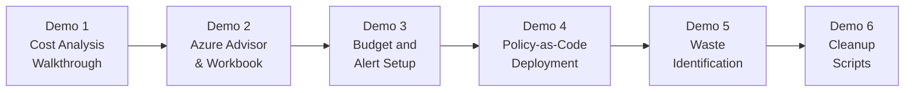
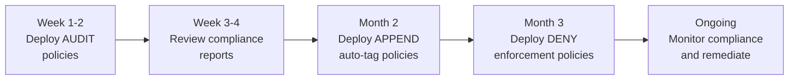

# Module 7: Demo Guide -- Hands-On Azure Cost Optimization

> **Duration:** 30 minutes | **Type:** Live Demo, Portal Walkthrough, Policy-as-Code  
> **Prerequisites:** Azure Portal access, Contributor or Owner role on target subscription, Azure CLI installed

---

## Demo Overview



---

## Demo 1: Azure Cost Analysis Walkthrough (5 min)

### Portal Steps

1. Open **Azure Portal** at [portal.azure.com](https://portal.azure.com)
2. Search bar: type **"Cost Management"** and select **Cost Management + Billing**
3. In the left menu click **Cost analysis**
4. Set the **Scope** dropdown to your target subscription
5. Set **Granularity** to **Daily** and **Time range** to **Last 30 days**
6. Click **Group by** and select **Service name** -- this shows spend per service
7. Switch **Group by** to **Tag** and select a tag like `CostCenter` or `Environment`
8. Switch **Chart type** from area to **Column (stacked)** for clearer visual
9. Click the **Forecast** tab to show projected monthly spend
10. Click **Download** icon to export as CSV for offline analysis

### What to Highlight

| View | Insight |
|------|---------|
| Group by Service | Which Azure services are the biggest cost drivers |
| Group by Resource Group | Which workloads are most expensive |
| Group by Tag: Environment | Ratio of prod vs dev/test spend |
| Daily trend | Anomalies or unexpected spikes |
| Forecast | Whether current month will exceed budget |

---

## Demo 2: Azure Advisor Cost Recommendations & Workbook (5 min)

### Portal Steps

1. Search bar: type **"Advisor"** and select **Azure Advisor**
2. Click **Cost** in the left panel
3. Walk through each recommendation category:
   - **Right-size or shutdown underutilized VMs** -- shows CPU/memory utilization
   - **Buy reserved instances** -- shows potential reservation savings
   - **Delete idle resources** -- disks, IPs, gateways
   - **Use Azure Hybrid Benefit** -- VMs missing AHB
4. Click **See details** on any recommendation for resource-specific data
5. Navigate to **Workbooks** in the left menu
6. Open **Cost Optimization (Preview)** workbook
7. Walk through tabs:

| Tab | Sub-Tab | What to Show |
|-----|---------|-------------|
| Overview | Resource overview | Resource distribution per region |
| Rate Optimization | Azure Hybrid Benefit | Windows/Linux/SQL VMs not using AHB |
| Rate Optimization | Reservations | Reservation purchase recommendations with savings estimate |
| Rate Optimization | Savings Plans | Savings Plan opportunities |
| Usage Optimization | Compute | Stopped (not deallocated) VMs |
| Usage Optimization | Storage | Unattached disks, old snapshots, v1 storage accounts |
| Usage Optimization | Networking | Idle LBs, orphan PIPs, idle App Gateways |
| Usage Optimization | Top 10 Services | AKS, Web Apps, Synapse, Monitoring costs |

---

## Demo 3: Create a Budget with Multi-Threshold Alerts (5 min)

### Portal Steps

1. Go to **Cost Management** > **Budgets** in left menu
2. Click **+ Add**
3. Fill in:
   - **Name:** `Production-Monthly-Budget`
   - **Reset period:** Monthly
   - **Creation date:** (auto)
   - **Expiration date:** End of fiscal year
   - **Amount:** Enter your target monthly spend
4. Click **Next** to configure alerts:

| Threshold | Alert Type | Notification |
|-----------|-----------|-------------|
| 50% of budget | Actual | Email to FinOps team (awareness) |
| 75% of budget | Actual | Email to FinOps team + workload owners (review) |
| 90% of budget | Actual | Email + Action Group trigger (investigate) |
| 100% of budget | Actual | Email + Action Group (action required) |
| 110% of budget | Forecasted | Email + Action Group (escalation) |

5. Add email recipients and optionally select an **Action Group**
6. Click **Create**

### Azure CLI Equivalent

```powershell
# Create a subscription-level monthly budget
az consumption budget create `
  --budget-name "Production-Monthly" `
  --amount 10000 `
  --time-grain Monthly `
  --start-date "2026-03-01" `
  --end-date "2026-12-31" `
  --category Cost

# List existing budgets
az consumption budget list --output table
```

### ARM Template Deployment

The knowledge base includes ARM templates for all three scopes:

```powershell
# Deploy budget at subscription scope
az deployment sub create `
  --location eastus `
  --template-file "knowledge_base/Module Financial Controls/Budgets/budget-subscription-deployment.json" `
  --parameters budgetName="Prod-Monthly" `
               amount="10000" `
               startDate="2026-03-01" `
               endDate="2026-12-31" `
               firstThreshold="90" `
               secondThreshold="110"

# Deploy budget at resource group scope
az deployment group create `
  --resource-group "production-rg" `
  --template-file "knowledge_base/Module Financial Controls/Budgets/budget-resourcegroup-deployment.json" `
  --parameters budgetName="WorkloadA-Monthly" amount="3000"

# Deploy budget at management group scope
az deployment mg create `
  --management-group-id "myMG" `
  --location eastus `
  --template-file "knowledge_base/Module Financial Controls/Budgets/budget-mg-deployment.json" `
  --parameters budgetName="Enterprise-Monthly" amount="100000"
```

---

## Demo 4: Policy-as-Code -- Azure Policy Deployment (5 min)

### What is Policy-as-Code?

Policy-as-Code means defining governance rules (tag requirements, SKU restrictions, AHB enforcement) as **JSON policy definitions** stored in source control and deployed programmatically. This ensures:
- Consistency across all subscriptions
- Version control and audit trail
- Automated deployment via CI/CD pipelines
- Reproducible governance across environments

### 4A. Deploy Tag Enforcement Policy via Portal

**Step-by-step portal walkthrough:**

1. Go to **Azure Portal** > search **"Policy"** > select **Azure Policy**
2. In left menu, click **Definitions**
3. Click **+ Policy definition**
4. Fill in:
   - **Definition location:** Select your subscription or management group
   - **Name:** `Enforce-Cost-Tags`
   - **Description:** `Deny resource creation without required cost transparency tags`
   - **Category:** Click **Use existing** and select **Tags**
5. In the **Policy rule** box, paste this JSON:

```json
{
  "if": {
    "anyOf": [
      {
        "field": "[concat('tags[', parameters('tagName1'), ']')]",
        "exists": "false"
      },
      {
        "field": "[concat('tags[', parameters('tagName2'), ']')]",
        "exists": "false"
      },
      {
        "field": "[concat('tags[', parameters('tagName3'), ']')]",
        "exists": "false"
      }
    ]
  },
  "then": {
    "effect": "deny"
  }
}
```

6. Define **Parameters** for `tagName1`, `tagName2`, `tagName3` as String type
7. Click **Save**

**Now assign the policy:**

8. Go to **Assignments** in left menu
9. Click **Assign policy**
10. Select your new policy definition
11. Set **Scope** to subscription or management group
12. Set parameters: `tagName1` = `CostCenter`, `tagName2` = `BusinessUnit`, `tagName3` = `Environment`
13. Click **Review + create**

### 4B. Deploy via Azure CLI (Policy-as-Code)

```powershell
# Step 1: Create the tag enforcement policy definition
az policy definition create `
  --name "enforce-cost-tags" `
  --display-name "Enforce Cost Transparency Tags" `
  --description "Deny resource creation without CostCenter, BusinessUnit, and Environment tags" `
  --rules '@knowledge_base/Module Cost Transparency/Policy-Enforce-Cost-Tags.json' `
  --mode Indexed

# Step 2: Assign the policy to a subscription
az policy assignment create `
  --name "enforce-cost-tags-assignment" `
  --display-name "Enforce Cost Tags on Production" `
  --policy "enforce-cost-tags" `
  --scope "/subscriptions/<subscription-id>" `
  --params '{
    "tagName1": {"value": "CostCenter"},
    "tagName2": {"value": "BusinessUnit"},
    "tagName3": {"value": "Environment"},
    "tagName4": {"value": "WorkloadName"},
    "tagName5": {"value": "BudgetApproved"}
  }'

# Step 3: Check compliance state
az policy state list `
  --policy-assignment "enforce-cost-tags-assignment" `
  --query "[?complianceState=='NonCompliant'].{Resource:resourceId}" `
  --output table
```

### 4C. Deploy AHB Enforcement Policies

```powershell
# Enforce Azure Hybrid Benefit for Windows VMs
az policy definition create `
  --name "enforce-ahb-windows" `
  --display-name "Enforce AHB for Windows VMs" `
  --description "Deny Windows VMs without Azure Hybrid Benefit enabled" `
  --rules '@knowledge_base/Module Rate Optimization/Policy-Enforce-AHB-Windows.json' `
  --mode All

az policy assignment create `
  --name "enforce-ahb-windows-prod" `
  --policy "enforce-ahb-windows" `
  --scope "/subscriptions/<subscription-id>"

# Enforce Azure Hybrid Benefit for SQL VMs
az policy definition create `
  --name "enforce-ahb-sql" `
  --display-name "Enforce AHB for SQL VMs" `
  --description "Deny SQL VMs without Azure Hybrid Benefit enabled" `
  --rules '@knowledge_base/Module Rate Optimization/Policy-Enforce-AHB-SQLVMs.json' `
  --mode All

az policy assignment create `
  --name "enforce-ahb-sql-prod" `
  --policy "enforce-ahb-sql" `
  --scope "/subscriptions/<subscription-id>"
```

### 4D. View Compliance in Portal

1. Go to **Azure Policy** > **Compliance** in left menu
2. Filter by **Scope** (your subscription)
3. See overall compliance percentage
4. Click into a specific policy to view non-compliant resources
5. Click **Create remediation task** to auto-fix (for modify/append effects)

### Available Policies in Knowledge Base

| Policy File | Effect | Purpose |
|------------|--------|---------|
| `Policy-Audit-Tags.json` | Audit | Report resources missing cost tags (visibility only) |
| `Policy-Append-Cost-Tags.json` | Append | Auto-add cost tags with default values |
| `Policy-Enforce-Cost-Tags.json` | Deny | Block resource creation without required tags |
| `Policy-Enforce-AHB-Windows.json` | Deny | Block Windows VMs without AHB enabled |
| `Policy-Enforce-AHB-SQLVMs.json` | Deny | Block SQL VMs without AHB enabled |

### Recommended Deployment Order



---

## Demo 5: Identify Waste with Azure Resource Graph (5 min)

### Resource Graph Queries for Waste Detection

Open Azure Portal > search **"Resource Graph Explorer"** and paste these queries:

#### Find Unattached Managed Disks

```kusto
Resources
| where type =~ 'microsoft.compute/disks'
| where managedBy == ''
| project name, resourceGroup, 
          diskSizeGb=properties.diskSizeGB,
          sku=sku.name, location
| order by diskSizeGb desc
```

#### Find Stopped (Not Deallocated) VMs

```kusto
Resources
| where type =~ 'microsoft.compute/virtualMachines'
| extend powerState = properties.extended.instanceView.powerState.code
| where powerState == 'PowerState/stopped'
| project name, resourceGroup, 
          vmSize=properties.hardwareProfile.vmSize, location
```

#### Find Orphaned Public IPs

```kusto
Resources
| where type =~ 'microsoft.network/publicIPAddresses'
| where isnull(properties.ipConfiguration)
| project name, resourceGroup, sku=sku.name, location
```

#### Find Idle Load Balancers

```kusto
Resources
| where type =~ 'microsoft.network/loadbalancers'
| where array_length(properties.backendAddressPools) == 0
| project name, resourceGroup, sku=sku.name, location
```

#### Find Windows VMs Without Azure Hybrid Benefit

```kusto
Resources
| where type =~ 'microsoft.compute/virtualMachines'
| where properties.storageProfile.imageReference.publisher == 'MicrosoftWindowsServer'
| where properties.licenseType != 'Windows_Server'
| project name, resourceGroup, 
          vmSize=properties.hardwareProfile.vmSize, location
```

#### Find Application Gateways with Empty Backend Pools

```kusto
Resources
| where type =~ 'microsoft.network/applicationGateways'
| where array_length(properties.backendAddressPools) == 0
   or properties.backendAddressPools[0].properties.backendAddresses == '[]'
| project name, resourceGroup, location
```

---

## Demo 6: Running WACO Cleanup Scripts (5 min)

### Prerequisites

```powershell
# Install required PowerShell modules
Install-Module -Name Az.Resources -Force
Install-Module -Name Az.Compute -Force
Install-Module -Name Az.Network -Force
Install-Module -Name Az.Storage -Force
Install-Module -Name Az.Websites -Force
Install-Module -Name Az.Aks -Force

# Authenticate to Azure
Connect-AzAccount -TenantId "<YourTenantID>"
```

### Available WACO Cleanup Scripts

| Script | Target Resource | What It Does |
|--------|----------------|-------------|
| `DeleteIdleAppGW_v2.ps1` | Application Gateways | Removes idle App Gateways with no backend targets |
| `DeleteIdleDisk_v2.ps1` | Managed Disks | Finds and deletes unattached managed disks |
| `DeleteIdleLB_v2.ps1` | Load Balancers | Removes Standard LBs with empty backend pools |
| `DeleteIdlePIP_v2.ps1` | Public IPs | Cleans up orphaned Public IP addresses |
| `DeleteIdleWebApp_v2.ps1` | App Services | Removes idle/stopped Web Applications |
| `DeprovisionStoppedVM_v2.ps1` | Virtual Machines | Deallocates stopped (not deallocated) VMs |
| `StopAksCluster.ps1` | AKS Clusters | Stops non-production AKS clusters |
| `IdentifyingNotModifiedBlobs.ps1` | Blob Storage | Identifies blobs for cool/archive tier migration |

### How to Use

```powershell
# Step 1: Export idle resources from Advisor Workbook to CSV
# (In the Workbook, click Export on any tab)

# Step 2: Run the script with the CSV path
$CsvFilePath = "C:\Temp\UnattachedDisks.csv"
$tenantID = "<YourTenantID>"
& ".\knowledge_base\Module Usage Optimization\Usage Optimization PowerShell Scripts\DeleteIdleDisk_v2.ps1"
```

### Quick Cleanup Without CSV

```powershell
# Report all unattached disks (no deletion -- safe to run)
Get-AzDisk | Where-Object { $_.ManagedBy -eq $null } |
  Select-Object Name, ResourceGroupName, DiskSizeGB, Sku |
  Format-Table -AutoSize

# Report orphaned Public IPs
Get-AzPublicIpAddress | Where-Object { $_.IpConfiguration -eq $null } |
  Select-Object Name, ResourceGroupName, Sku, Location |
  Format-Table -AutoSize

# Enable AHB on all eligible Windows VMs
Get-AzVM | Where-Object {
  $_.StorageProfile.ImageReference.Publisher -eq 'MicrosoftWindowsServer' -and
  $_.LicenseType -ne 'Windows_Server'
} | ForEach-Object {
  Write-Host "Enabling AHB on: $($_.Name)" -ForegroundColor Green
  $_.LicenseType = "Windows_Server"
  Update-AzVM -ResourceGroupName $_.ResourceGroupName -VM $_
}
```

---

## Demo Summary Checklist

| # | Demo | Tool Used | Duration | Key Deliverable |
|---|------|-----------|----------|-----------------|
| 1 | Cost Analysis | Azure Portal | 5 min | Understand spend breakdown |
| 2 | Advisor + Workbook | Azure Portal | 5 min | Identify optimization opportunities |
| 3 | Budget Setup | Portal + CLI | 5 min | Financial guardrails in place |
| 4 | Policy-as-Code | Portal + CLI | 5 min | Tag and AHB governance deployed |
| 5 | Waste Detection | Resource Graph | 5 min | List of idle resources |
| 6 | Cleanup Scripts | PowerShell | 5 min | Automated waste removal |

---

## References

- [Azure Cost Analysis Quick Start](https://learn.microsoft.com/en-us/azure/cost-management-billing/costs/quick-acm-cost-analysis)
- [Azure Resource Graph Queries](https://learn.microsoft.com/en-us/azure/governance/resource-graph/samples/starter)
- [Azure Policy Quick Start](https://learn.microsoft.com/en-us/azure/governance/policy/assign-policy-portal)
- [Azure Advisor Workbooks](https://aka.ms/advisorworkbooks)
- Knowledge Base: all PowerShell scripts in `Module Usage Optimization/` and ARM templates in `Module Financial Controls/Budgets/`

---

> **Previous Module:** [Module 7 — AI Workload Cost Optimization](./07-Module-AI-Cost-Optimization.md)  
> **Next Module:** [Module 9 — Quiz & Assessment](./09-Quiz-Assessment.md)  
> **Back to Overview:** [README — Cost Optimization](./README.md)
