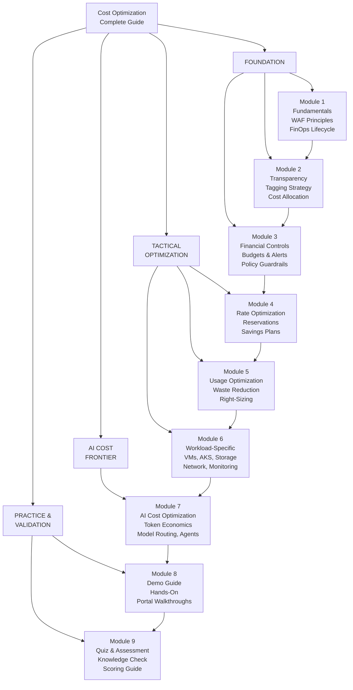
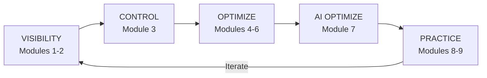

# Azure Cost Optimization — Complete Training & Reference Guide

> **Modules:** 9 | **Total Duration:** 8–10 hours | **Level:** Beginner → Expert  
> **Framework:** [Microsoft Azure Well-Architected Framework — Cost Optimization Pillar](https://learn.microsoft.com/en-us/azure/well-architected/cost-optimization/)  
> **Audience:** Cloud Architects, FinOps Practitioners, Platform Engineers, AI Engineers, IT Leadership  
> **Last Updated:** March 2026

---

## Overview

This guide is a comprehensive, modular training program for **Azure Cost Optimization** — from foundational FinOps principles through workload-specific tactics to the emerging discipline of **AI cost management**. Each module is self-contained and can be delivered independently, but together they form a complete FinOps curriculum aligned with the Microsoft Well-Architected Framework (WAF) Cost Optimization pillar and FinOps Foundation best practices.

Whether you are a technical leader building a FinOps practice from scratch, a platform engineer hunting for immediate savings, or an AI engineer optimizing token spend — there is a module here for you.

---

## Module Index

| # | Module | Duration | Level | Description |
|---|--------|----------|-------|-------------|
| 01 | [Cost Optimization Fundamentals](./01-Module-Cost-Optimization-Fundamentals.md) | 60–90 min | Strategic | WAF design principles, cost drivers, FinOps lifecycle, Azure Cost Management capabilities, maturity model |
| 02 | [Cost Transparency & Tagging](./02-Module-Cost-Transparency.md) | 45 min | Tactical | Tagging strategy, cost allocation, showback/chargeback, Azure Resource Graph queries, FOCUS dataset |
| 03 | [Financial Controls & Budgets](./03-Module-Financial-Controls.md) | 45 min | Tactical | Budgets, alerts, Azure Policy guardrails, management group hierarchy, spending governance |
| 04 | [Rate Optimization](./04-Module-Rate-Optimization.md) | 60 min | Strategic | Reservations, Savings Plans, Azure Hybrid Benefit, Spot VMs, Dev/Test pricing, commitment planning |
| 05 | [Usage Optimization & Waste Reduction](./05-Module-Usage-Optimization.md) | 60 min | Hands-on | Azure Advisor, orphaned resources, right-sizing, autoscaling, storage lifecycle, waste detection |
| 06 | [Workload-Specific Optimization](./06-Module-Workload-Optimization.md) | 60 min | Deep-Dive | VMs, AKS, Storage, Databases, Networking, Monitoring, App Service — per-service cost levers |
| 07 | [AI Workload Cost Optimization](./07-Module-AI-Cost-Optimization.md) | 90–120 min | Deep-Dive | Token economics, model routing, prompt efficiency, AI Foundry, M365 Copilot, agents, MCP, unit economics |
| 08 | [Demo Guide](./08-Demo-Guide.md) | 30 min | Hands-on | Live portal walkthroughs — Cost Analysis, Advisor, Budgets, Policy-as-Code, waste detection scripts |
| 09 | [Quiz & Assessment](./09-Quiz-Assessment.md) | 20 min | Assessment | 20 discussion-based questions covering all modules, with expandable answers and scoring guide |

---

## How the Modules Connect

The diagram below shows the learning path and how each module builds upon the previous ones. Modules 1–3 establish the foundation (strategy, visibility, controls). Modules 4–6 dive into tactical optimization levers. Module 7 extends into the AI-specific cost frontier. Modules 8–9 provide practical application and validation.

---

## Quick-Start Guide

| Your Role | Start Here | Then Go To |
|-----------|-----------|------------|
| **Executive / IT Leader** | Module 1 (Fundamentals) | Module 3 (Financial Controls) → Module 4 (Rate Optimization) |
| **Cloud Architect** | Module 1 (Fundamentals) | Module 4 → Module 5 → Module 6 → Module 7 |
| **FinOps Practitioner** | Module 2 (Transparency) | Module 3 → Module 4 → Module 5 |
| **Platform Engineer** | Module 5 (Usage Optimization) | Module 6 (Workload-Specific) → Module 8 (Demos) |
| **AI Engineer** | Module 7 (AI Cost Optimization) | Module 4 (Rate Optimization for PTU) → Module 8 (Demos) |
| **New to Cloud Cost** | Module 1 (Fundamentals) | Follow modules 1 → 2 → 3 → ... → 9 sequentially |

---

## Key Themes Across Modules

| Theme | Modules | Core Principle |
|-------|---------|---------------|
| **Visibility** | 1, 2 | You cannot optimize what you cannot see — establish cost transparency first |
| **Control** | 3 | Set guardrails before optimizing — budgets, alerts, and policies prevent overruns |
| **Rate Optimization** | 4 | Pay less per unit — Reservations, Savings Plans, Hybrid Benefit, Spot VMs |
| **Usage Optimization** | 5, 6 | Use less — eliminate waste, right-size, autoscale, lifecycle policies |
| **AI Optimization** | 7 | The new frontier — token economics, model routing, prompt efficiency, agent guardrails |
| **Practice** | 8, 9 | Hands-on validation — demos, scripts, quizzes, and knowledge checks |

---

## Prerequisites

- Azure subscription with at least **Reader** access (Contributor/Owner for hands-on demos)
- Azure CLI installed ([Install Azure CLI](https://learn.microsoft.com/en-us/cli/azure/install-azure-cli))
- Familiarity with Azure Portal
- For Module 7 (AI): Basic understanding of LLMs and Azure OpenAI Service

---

## References & Frameworks

| Resource | Link |
|----------|------|
| WAF Cost Optimization Pillar | [learn.microsoft.com](https://learn.microsoft.com/en-us/azure/well-architected/cost-optimization/) |
| WAF Cost Optimization Checklist | [learn.microsoft.com](https://learn.microsoft.com/en-us/azure/well-architected/cost-optimization/checklist) |
| Azure Cost Management | [learn.microsoft.com](https://learn.microsoft.com/en-us/azure/cost-management-billing/) |
| FinOps Foundation | [finops.org](https://www.finops.org/) |
| Azure Pricing Calculator | [azure.microsoft.com](https://azure.microsoft.com/pricing/calculator/) |
| Azure FinOps Guide (Community) | [github.com/dolevshor](https://github.com/dolevshor/azure-finops-guide) |

---

> **Start Learning:** [Module 1 — Cost Optimization Fundamentals →](./01-Module-Cost-Optimization-Fundamentals.md)
