# DevSecOps Best Practices Guide - Enterprise Azure Infrastructure

## 🎯 Executive Summary

This guide documents **enterprise-grade DevSecOps practices** implementing **7 security layers** for a **Zero Trust Azure Architecture**. Every aspect from code to runtime is secured with automated governance, encryption, and continuous compliance validation.

**Key Principles:**
- ✅ **100% Managed Identity** - Zero credentials in code
- ✅ **100% Private Networking** - No public internet exposure
- ✅ **100% Customer-Managed Encryption** - Full data sovereignty
- ✅ **Custom Azure Policies** - Automated governance enforcement
- ✅ **Multi-Layer Security Scanning** - SAST + Dependency Check + IaC Scanning
- ✅ **Resource Locks** - Prevent accidental deletion
- ✅ **Multi-stage Approvals** - Manual gates for production

---

## 📊 DevSecOps Security Architecture

The following diagram illustrates how multiple security layers integrate to create a comprehensive defense-in-depth strategy:


---

## 🔐 Security Layer Detailed Flow

This diagram shows how a deployment flows through all security controls:


---

## 🛡️ Azure Policies - Automated Governance

```mermaid
flowchart TB
    subgraph "Policy Definitions (Subscription Level)"
        P1["Policy 1:<br/>Deny Direct User<br/>Role Assignment"]:::policy
        P2["Policy 2:<br/>Disable Storage<br/>Public Network"]:::policy
        P3["Policy 3:<br/>Block Data<br/>Exfiltration"]:::policy
        P4["Policy 4:<br/>Audit Required Tags"]:::policy
        P5["Policy 5:<br/>Inherit Tags from RG"]:::policy
    end
    
    subgraph "Enforcement Actions"
        A1["❌ Deny: User gets direct role"]:::deny
        A2["🔧 Modify: Set publicNetworkAccess=Disabled"]:::modify
        A3["❌ Deny: Cross-boundary data transfer"]:::deny
        A4["⚠️ Audit: Missing required tags"]:::audit
        A5["🔧 Modify: Copy tags from RG"]:::modify
    end
    
    subgraph "Compliance Results"
        R1["✅ Only group-based<br/>RBAC allowed"]:::result
        R2["✅ Zero public<br/>storage accounts"]:::result
        R3["✅ Data isolation<br/>enforced"]:::result
        R4["✅ Cost allocation<br/>& governance"]:::result
        R5["✅ Consistent<br/>tagging strategy"]:::result
    end
    
    P1 -->|Triggers| A1 --> R1
    P2 -->|Triggers| A2 --> R2
    P3 -->|Triggers| A3 --> R3
    P4 -->|Triggers| A4 --> R4
    P5 -->|Triggers| A5 --> R5
    
    classDef policy fill:#f3e5f5,stroke:#6a1b9a,stroke-width:2px,color:#000
    classDef deny fill:#ffebee,stroke:#c62828,stroke-width:2px,color:#000
    classDef modify fill:#fff9c4,stroke:#f57f17,stroke-width:2px,color:#000
    classDef audit fill:#e0f7fa,stroke:#00838f,stroke-width:2px,color:#000
    classDef result fill:#c8e6c9,stroke:#2e7d32,stroke-width:3px,color:#000
```



---

## 📋 Complete Security Controls Inventory

### **Recommended Azure Policies**

| Policy Name | Effect | Purpose |
|-------------|--------|---------|
| **Restrict Direct User Role Assignment** | Deny | Blocks RBAC assignments to users (groups only) |
| **Disable Storage Public Network** | Modify | Auto-disables public network access on storage |
| **Block Cross-Boundary Data Transfer** | Deny | Prevents data exfiltration between boundaries |
| **Audit Required Tags** | Audit | Ensures cost allocation tags exist |
| **Inherit Tags from Resource Group** | Modify | Auto-applies tags from parent RG |

### **Resource Lock Implementation**

Every critical resource should have `CanNotDelete` locks:
- ✅ Key Vaults
- ✅ Storage Accounts
- ✅ Event Hubs / Service Bus Namespaces
- ✅ Databases (Cosmos DB, SQL)
- ✅ Virtual Networks

### **RBAC Best Practices**

Implement granular permission assignments:
- Storage Blob Data Owner / Reader
- Key Vault Secrets User / Officer
- Event Hub Data Sender / Receiver
- Policy Contributor for governance
- Custom roles for specific workloads

---

## 1. 🔐 **Network Security - Private Endpoints**

### **What it demonstrates:**
- Zero trust networking with private endpoints
- Isolation of Azure resources from public internet
- Secure data transfer within Azure backbone

### **Implementation Pattern:**

```bicep
// Private Endpoint for Storage/Key Vault/etc.
resource privateEndpoint 'Microsoft.Network/privateEndpoints@2023-04-01' = {
  name: 'pe-${resourceName}'
  location: location
  properties: {
    privateLinkServiceConnections: [
      {
        name: 'pl-${resourceName}'
        properties: {
          privateLinkServiceId: targetResourceId
          groupIds: [ 'blob' ]  // blob, dfs, vault, namespace, etc.
          privateLinkServiceConnectionState: {
            status: 'Approved'
            description: 'Auto-Approved'
          }
        }
      }
    ]
    subnet: {
      id: subnetId
    }
  }
}
```

### **Key Security Features:**
- `privateLinkServiceConnections`: Auto-approved connections
- `groupIds`: Controls which sub-resource to connect (blob, dfs, table, queue)
- Network isolation: Resources only accessible via private network
- No public internet exposure

---

## 2. 🔑 **Identity & Access Management (IAM)**

### **What it demonstrates:**
- Managed Identity usage (no credentials in code)
- RBAC role assignments
- Azure Policy enforcement to prevent security misconfigurations

### **Managed Identity Pattern:**

```bicep
// System-Assigned Managed Identity for all resources
resource storageAccount 'Microsoft.Storage/storageAccounts@2023-01-01' = {
  name: storageAccountName
  location: location
  identity: {
    type: 'SystemAssigned'  // No credentials needed, Azure manages identity
  }
  // ... other properties
}
```

**Resources that should use Managed Identity:**
- ✅ Storage Accounts
- ✅ Event Hub / Service Bus Namespaces
- ✅ Function Apps / App Services
- ✅ Cosmos DB
- ✅ API Management
- ✅ Virtual Machines / VMSS

### **RBAC Assignment Pattern:**

```bicep
var builtinRole = 'b7e6dc6d-f1e8-4753-8033-0f276bb0955b'  // Storage Blob Data Owner

resource roleAssignment 'Microsoft.Authorization/roleAssignments@2022-04-01' = {
  name: guid('role-assignment', principalId, resourceGroup().name)
  properties: {
    roleDefinitionId: subscriptionResourceId('Microsoft.Authorization/roleDefinitions', builtinRole)
    principalId: principalId
    principalType: 'Group'  // Always use groups, not users
  }
}
```

### **Policy: Deny Direct User Role Assignments**

```json
{
  "displayName": "Restrict Direct Role Assignments To User",
  "policyRule": {
    "if": {
      "allOf": [
        {
          "field": "type",
          "equals": "Microsoft.Authorization/roleAssignments"
        },
        {
          "field": "Microsoft.Authorization/roleAssignments/principalType",
          "equals": "User"
        }
      ]
    },
    "then": {
      "effect": "deny"
    }
  }
}
```

---

## 3. 🔒 **Encryption & Data Protection**

### **What it demonstrates:**
- Customer-Managed Keys (CMK) for encryption at rest
- Key Vault integration
- TLS enforcement
- Soft delete and purge protection

### **Key Vault Security Hardening:**

```bicep
resource keyVault 'Microsoft.KeyVault/vaults@2023-02-01' = {
  name: keyVaultName
  location: location
  properties: {
    enabledForDiskEncryption: true
    enableSoftDelete: true
    softDeleteRetentionInDays: 90          // Recoverable for 90 days
    enablePurgeProtection: true            // Cannot permanently delete
    enableRbacAuthorization: true          // Use RBAC, not access policies
    publicNetworkAccess: 'Disabled'        // No public access
    networkAcls: {
      defaultAction: 'Deny'                // Deny all by default
      bypass: 'AzureServices'              // Allow Azure services only
    }
  }
}

// Resource lock to prevent accidental deletion
resource vaultLock 'Microsoft.Authorization/locks@2020-05-01' = {
  name: 'lock-${keyVaultName}'
  scope: keyVault
  properties: {
    level: 'CanNotDelete'
    notes: 'Prevent deletion of critical Key Vault'
  }
}
```

### **Storage Account with CMK Encryption:**

```bicep
resource storageAccount 'Microsoft.Storage/storageAccounts@2023-01-01' = {
  name: storageAccountName
  location: location
  identity: {
    type: 'SystemAssigned'
  }
  properties: {
    publicNetworkAccess: 'Disabled'        // No public access
    minimumTlsVersion: 'TLS1_2'            // Enforce TLS 1.2+
    allowBlobPublicAccess: false           // No anonymous access
    allowSharedKeyAccess: false            // Disable access keys, use AAD only
    networkAcls: {
      defaultAction: 'Deny'                // Deny all by default
      bypass: 'AzureServices'
    }
    supportsHttpsTrafficOnly: true         // HTTPS only
    encryption: {
      keySource: 'Microsoft.Keyvault'      // CMK from Key Vault
      keyvaultproperties: {
        keyname: keyName
        keyvaulturi: keyVaultUri
      }
    }
  }
}
```

### **Data Retention & Lifecycle Management:**

```bicep
// Soft delete with configurable retention
resource blobService 'Microsoft.Storage/storageAccounts/blobServices@2023-01-01' = {
  parent: storageAccount
  name: 'default'
  properties: {
    containerDeleteRetentionPolicy: {
      enabled: true
      days: 30
    }
    deleteRetentionPolicy: {
      enabled: true
      days: 30
    }
  }
}

// Automated lifecycle management
resource lifecyclePolicy 'Microsoft.Storage/storageAccounts/managementPolicies@2023-01-01' = {
  parent: storageAccount
  name: 'default'
  properties: {
    policy: {
      rules: [
        {
          enabled: true
          name: 'auto-purge-rule'
          type: 'Lifecycle'
          definition: {
            actions: {
              baseBlob: {
                delete: {
                  daysAfterCreationGreaterThan: 365  // Auto-delete after 1 year
                }
              }
              snapshot: {
                delete: {
                  daysAfterCreationGreaterThan: 90
                }
              }
            }
            filters: {
              blobTypes: ['blockBlob', 'appendBlob']
            }
          }
        }
      ]
    }
  }
}
```

---

## 4. 🛡️ **Pipeline Security - Automated Scanning**

### **What it demonstrates:**
- Infrastructure-as-Code (IaC) security scanning
- Application security testing (SAST)
- Dependency vulnerability detection
- Shift-left security approach

### **Security Scanning Tools:**

| Tool | Type | Purpose |
|------|------|---------|
| **Fortify / SonarQube / Checkmarx** | SAST | Static code analysis for security vulnerabilities |
| **OWASP Dependency Check** | SCA | CVE detection in third-party libraries |
| **Checkov / tfsec / Trivy** | IaC Scan | Infrastructure-as-Code security validation |
| **Bicep Linter** | Linting | Syntax and best practice validation |

### **Azure DevOps Pipeline Example:**

```yaml
stages:
  - stage: SecurityScan
    displayName: 'Security Scanning'
    jobs:
      - job: SAST
        displayName: 'Static Application Security Testing'
        steps:
          # SAST Scan (Fortify, SonarQube, etc.)
          - task: FortifySCA@1
            inputs:
              buildId: '$(Build.BuildId)'
              
      - job: DependencyCheck
        displayName: 'OWASP Dependency Check'
        steps:
          - script: |
              dependency-check.sh --project "$(Build.Repository.Name)" \
                --scan "$(Build.SourcesDirectory)" \
                --format HTML --format JSON
            displayName: 'Run Dependency Check'
            
      - job: IaCScan
        displayName: 'Infrastructure as Code Scan'
        steps:
          - script: |
              pip install checkov
              checkov -d $(Build.SourcesDirectory) --soft-fail
            displayName: 'Run Checkov IaC Scan'
            
      - job: BicepLint
        displayName: 'Bicep Linting'
        steps:
          - script: |
              az bicep build --file main.bicep
            displayName: 'Validate Bicep Templates'

  - stage: Deploy
    displayName: 'Deploy Infrastructure'
    dependsOn: SecurityScan
    condition: succeeded()
    jobs:
      - deployment: DeployInfra
        environment: 'production'  # Requires manual approval
        strategy:
          runOnce:
            deploy:
              steps:
                - task: AzureCLI@2
                  inputs:
                    azureSubscription: '$(serviceConnection)'
                    scriptType: 'bash'
                    scriptLocation: 'inlineScript'
                    inlineScript: |
                      az deployment group create \
                        --resource-group $(resourceGroup) \
                        --template-file main.bicep
```

### **What Security Scanners Detect:**

**SAST (Static Application Security Testing):**
- ✅ Code injection vulnerabilities
- ✅ Insecure data handling
- ✅ Weak cryptography implementations
- ✅ Authentication bypass risks
- ✅ Sensitive data exposure

**Dependency Check (OWASP):**
- ✅ Known CVEs in packages
- ✅ Outdated libraries with exploits
- ✅ Supply chain vulnerabilities
- ✅ License compliance issues

**IaC Scanning (Checkov):**
- ✅ Storage accounts have encryption
- ✅ Key Vaults have purge protection
- ✅ Network access is restricted
- ✅ TLS versions are current
- ✅ Logging/monitoring configured
- ✅ No hard-coded secrets

---

## 5. 📋 **Additional Pipeline Security Controls**

### **Multi-Environment Approval Gates:**

```yaml
# Azure DevOps environment with approval gates
- deployment: DeployProduction
  environment: 'production'  # Configured with approvers in Azure DevOps
  strategy:
    runOnce:
      deploy:
        steps:
          - script: echo "Deploying to production"
```

**Configure in Azure DevOps:**
1. Go to Pipelines → Environments
2. Select or create "production" environment
3. Add Approvals and Checks
4. Configure required approvers

### **Multi-Stage Deployment Process:**

| Stage | Purpose |
|-------|---------|
| **Stage 1: Security Scan** | SAST, Dependency Check, IaC Scan |
| **Stage 2: Validation** | Bicep lint, Schema validation |
| **Stage 3: DEV Deploy** | Auto-deploy to development |
| **Stage 4: TEST Deploy** | Auto-deploy to test |
| **Stage 5: PROD Deploy** | Manual approval required |
| **Stage 6: Verification** | Health checks, smoke tests |

---

## 6. 🔍 **Monitoring & Observability**

### **What it demonstrates:**
- Comprehensive diagnostic settings
- Log Analytics integration
- Metric-based alerting
- Audit trail for compliance

### **Diagnostic Settings Pattern:**

```bicep
resource diagnosticSettings 'Microsoft.Insights/diagnosticSettings@2021-05-01-preview' = {
  name: '${resourceName}-diagnostic-settings'
  scope: targetResource
  properties: {
    workspaceId: logAnalyticsWorkspaceId
    logs: [
      {
        categoryGroup: 'allLogs'
        enabled: true
      }
    ]
    metrics: [
      {
        category: 'AllMetrics'
        enabled: true
      }
    ]
  }
}
```

### **Metric Alert Pattern:**

```bicep
resource metricAlert 'Microsoft.Insights/metricAlerts@2018-03-01' = {
  name: 'alert-${resourceName}'
  location: 'global'
  properties: {
    severity: 2
    enabled: true
    scopes: [targetResourceId]
    evaluationFrequency: 'PT5M'
    windowSize: 'PT15M'
    criteria: {
      'odata.type': 'Microsoft.Azure.Monitor.SingleResourceMultipleMetricCriteria'
      allOf: [
        {
          name: 'HighLatency'
          metricName: 'SuccessE2ELatency'
          operator: 'GreaterThan'
          threshold: 1000
          timeAggregation: 'Average'
        }
      ]
    }
    actions: [
      {
        actionGroupId: actionGroupId
      }
    ]
  }
}
```

---

## 7. 🏗️ **Defense in Depth - Summary**

### **7 Comprehensive Security Layers:**

| Layer | Implementation |
|-------|---------------|
| **Layer 7: Pipeline Security** | SAST, Dependency Check, IaC Scanning, Linting, Approval Gates |
| **Layer 6: Policy Enforcement** | Custom Azure Policies (Deny, Modify, Audit effects) |
| **Layer 5: Identity & Access** | 100% Managed Identity, Group-based RBAC only |
| **Layer 4: Encryption** | CMK for all storage, TLS 1.2+, Key Vault purge protection |
| **Layer 3: Network Security** | Private endpoints, deny-by-default ACLs, no public access |
| **Layer 2: Data Protection** | Soft delete, lifecycle management, resource locks, versioning |
| **Layer 1: Monitoring** | Diagnostic settings, Log Analytics, metric alerts, audit logs |

### **Security Metrics to Track:**

| Metric | Target |
|--------|--------|
| **Managed Identity Adoption** | 100% |
| **Private Network Coverage** | 100% |
| **Encryption at Rest (CMK)** | 100% |
| **Encryption in Transit (TLS 1.2+)** | 100% |
| **Resource Lock Coverage** | 100% Critical Resources |
| **Policy Compliance** | 100% |
| **Security Scan Pass Rate** | 100% |
| **Credentials in Code** | 0 |

---

## 8. 🎯 **Implementation Checklist**

### **Phase 1: Foundation**
- [ ] Enable Azure Policy at subscription level
- [ ] Create Log Analytics workspace
- [ ] Deploy Key Vault with purge protection
- [ ] Configure private DNS zones

### **Phase 2: Network Security**
- [ ] Create VNet with appropriate subnets
- [ ] Deploy private endpoints for all services
- [ ] Configure network ACLs (deny by default)
- [ ] Disable public access on all resources

### **Phase 3: Identity & Access**
- [ ] Enable Managed Identity on all resources
- [ ] Implement group-based RBAC
- [ ] Deploy "Deny User Role Assignment" policy
- [ ] Audit and remove direct user assignments

### **Phase 4: Encryption**
- [ ] Generate CMK keys in Key Vault
- [ ] Enable CMK encryption on storage accounts
- [ ] Enable CMK encryption on event services
- [ ] Enforce TLS 1.2+ minimum

### **Phase 5: Data Protection**
- [ ] Enable soft delete (90 days recommended)
- [ ] Configure lifecycle management policies
- [ ] Apply CanNotDelete locks on critical resources
- [ ] Enable blob versioning where needed

### **Phase 6: Monitoring**
- [ ] Configure diagnostic settings on all resources
- [ ] Create metric alerts for critical thresholds
- [ ] Set up action groups for incident response
- [ ] Create dedicated audit log storage

### **Phase 7: Pipeline Security**
- [ ] Integrate SAST scanning
- [ ] Add dependency vulnerability scanning
- [ ] Add IaC security scanning
- [ ] Configure approval gates for production

---

## 9. 💡 **Value Proposition**

### **Risk Reduction:**

| Risk | Mitigation | Implementation |
|------|------------|----------------|
| **Data Breach** | Network isolation + encryption | Private endpoints + CMK |
| **Insider Threat** | RBAC + audit logging | Group-based roles + Log Analytics |
| **Misconfiguration** | Policy enforcement + scanning | Azure Policies + Checkov |
| **Compliance Violation** | Automated governance | Policy-as-Code + audit trails |
| **Accidental Deletion** | Resource locks | CanNotDelete on critical resources |

### **Compliance Readiness:**

- ✅ **SOC 2 Type II** - Audit logging, access controls, encryption
- ✅ **ISO 27001** - Information security management
- ✅ **GDPR** - Data protection, encryption, right to delete
- ✅ **PCI DSS** - Network isolation, encryption, access control
- ✅ **HIPAA** - Audit trails, encryption, access controls

### **Business Value:**

| Benefit | Impact |
|---------|--------|
| **Prevent Breaches** | Avg breach cost $4.45M (IBM 2023) |
| **Reduce Audit Time** | 80% faster with IaC |
| **Lower Operational Overhead** | Automated vs manual reviews |
| **Avoid Penalties** | GDPR fines up to €20M or 4% revenue |

---

## 10. 📚 **Quick Reference**

### **Essential Azure CLI Commands:**

```bash
# Check policy compliance
az policy state list --resource-group <rg-name> --query "[?complianceState=='NonCompliant']"

# List resource locks
az lock list --resource-group <rg-name> -o table

# Check private endpoints
az network private-endpoint list --resource-group <rg-name> -o table

# Verify Key Vault settings
az keyvault show --name <kv-name> --query "{purgeProtection:properties.enablePurgeProtection, softDelete:properties.enableSoftDelete, rbac:properties.enableRbacAuthorization}"

# Check storage account public access
az storage account show --name <sa-name> --query "{publicAccess:publicNetworkAccess, allowBlobPublicAccess:allowBlobPublicAccess}"
```

### **Key Azure Built-in Roles:**

| Role | GUID | Purpose |
|------|------|---------|
| Storage Blob Data Owner | `b7e6dc6d-f1e8-4753-8033-0f276bb0955b` | Full blob access |
| Storage Blob Data Reader | `2a2b9908-6ea1-4ae2-8e65-a410df84e7d1` | Read-only blob access |
| Key Vault Secrets User | `4633458b-17de-408a-b874-0445c86b69e6` | Read secrets |
| Key Vault Crypto Officer | `14b46e9e-c2b7-41b4-b07b-48a6ebf60603` | Manage keys |
| Contributor | `b24988ac-6180-42a0-ab88-20f7382dd24c` | Full resource management |

---

## 🎯 **Summary**

This guide demonstrates **enterprise-grade DevSecOps** with:

1. ✅ **Complete Automation** - Zero manual security configuration
2. ✅ **Defense in Depth** - 7 comprehensive security layers
3. ✅ **Zero Trust** - Private networking, managed identity, least privilege
4. ✅ **Shift Left** - Security validated before deployment
5. ✅ **Compliance Ready** - SOC2, ISO 27001, GDPR, HIPAA aligned
6. ✅ **Measurable** - Clear metrics and KPIs
7. ✅ **Governed** - Azure Policies enforced automatically

---

*This guide provides foundational DevSecOps practices for secure Azure infrastructure deployments.*

**Author:** Azure Infrastructure Security Team  
**Last Updated:** December 2024
