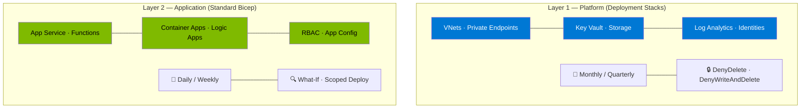

# Infrastructure as Code — Azure Deployment Stacks

> **Workshop Edition** — Enterprise IaC Strategy  
> **Purpose**: Architectural guidance for Bicep, Deployment Stacks, and layered deployment patterns

---

## 📚 Solution Documents

| # | Document | Description | Audience |
|---|----------|-------------|----------|
| 1 | [Deployment Stacks Guidance](./deployment-stacks-guidance.md) | Complete architectural guidance — Stacks vs Standard deployments, layered model, What-If, CI/CD patterns, decision matrices | Platform Engineering, Cloud Architecture, DevOps |

---

## 🎯 Key Concepts

### The Layered Deployment Model



### Core Decision

| Question | Answer |
|----------|--------|
| Are Deployment Stacks right for frequent app releases? | **No** — use standard Bicep incremental deployments |
| When should I use Deployment Stacks? | For long-lived platform infrastructure needing lifecycle protection |
| How do I get predictable change planning? | Bicep What-If + scoped deployments + modular templates |
| Bicep or Terraform? | Bicep for Azure-centric; Terraform for multi-cloud |

---

## 🚀 Quick Start

### Deploy Platform Infrastructure (Stack)
```bash
az stack sub create \
  --name "platform-stack-prod" \
  --location "westeurope" \
  --template-file "./infra/platform/main.bicep" \
  --parameters "./infra/platform/parameters/prod.bicepparam" \
  --deployment-resource-group "rg-platform-prod" \
  --action-on-unmanage deleteResources \
  --deny-settings-mode denyDelete
```

### Deploy Application Resources (Standard)
```bash
# Preview changes
az deployment group what-if \
  --resource-group "rg-app-prod" \
  --template-file "./infra/application/main.bicep" \
  --parameters "./infra/application/parameters/prod.bicepparam"

# Deploy
az deployment group create \
  --resource-group "rg-app-prod" \
  --template-file "./infra/application/main.bicep" \
  --parameters "./infra/application/parameters/prod.bicepparam" \
  --mode Incremental
```

---

## 📚 Microsoft Official Documentation References

| Topic | Official URL |
|-------|--------------|
| **Deployment Stacks** | https://learn.microsoft.com/azure/azure-resource-manager/bicep/deployment-stacks |
| **Bicep What-If** | https://learn.microsoft.com/azure/azure-resource-manager/bicep/deploy-what-if |
| **Deployment Modes** | https://learn.microsoft.com/azure/azure-resource-manager/templates/deployment-modes |
| **Azure Verified Modules** | https://aka.ms/avm |
| **IaC Best Practices (CAF)** | https://learn.microsoft.com/azure/cloud-adoption-framework/ready/considerations/infrastructure-as-code |
| **Terraform vs Bicep** | https://learn.microsoft.com/azure/developer/terraform/comparing-terraform-and-bicep |
