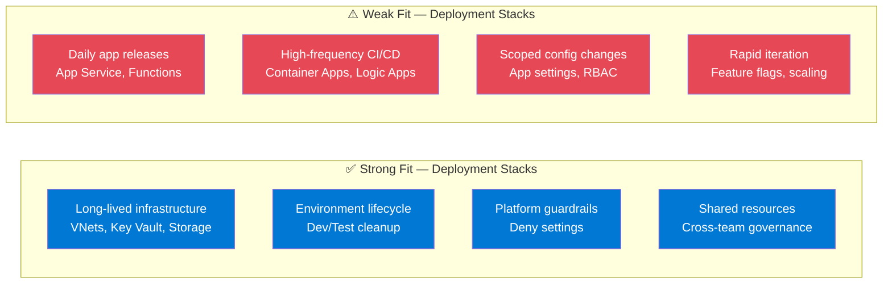
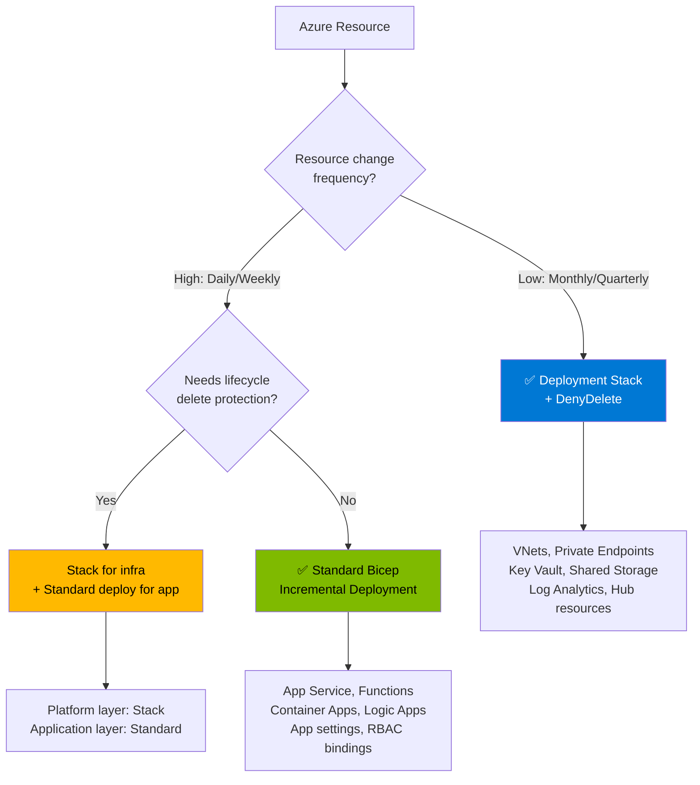
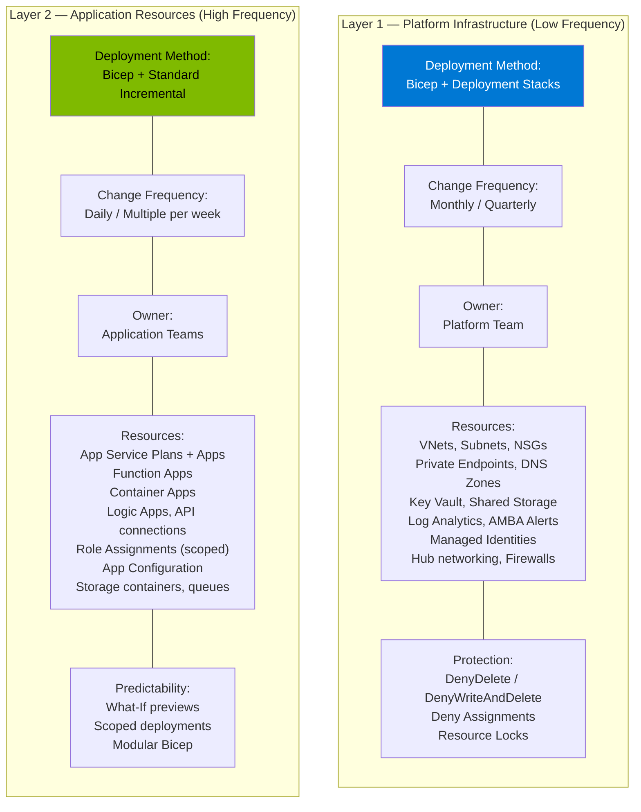
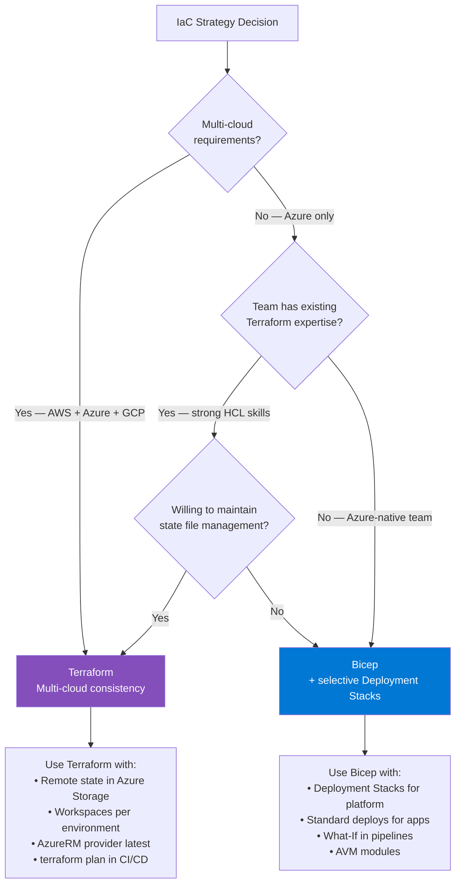
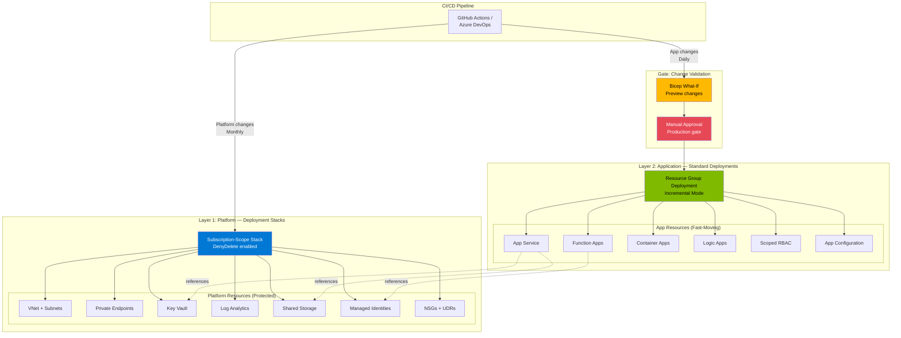
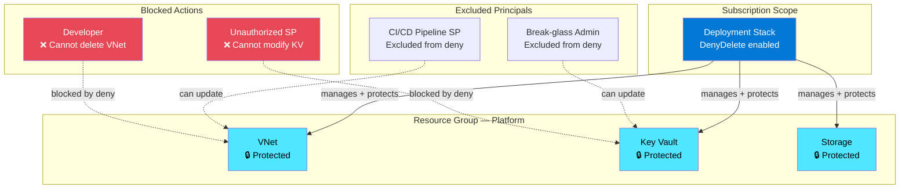
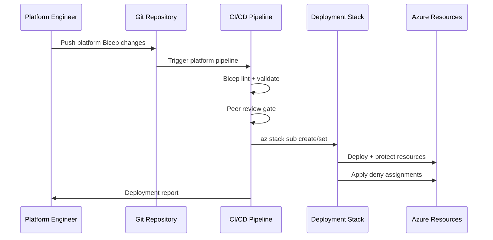
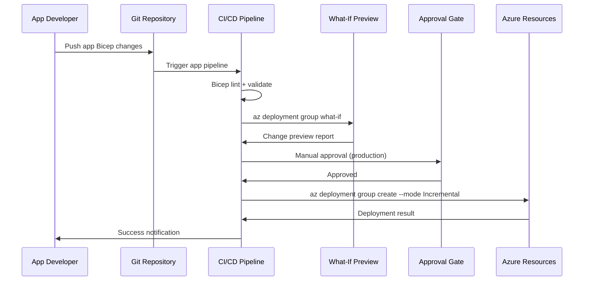
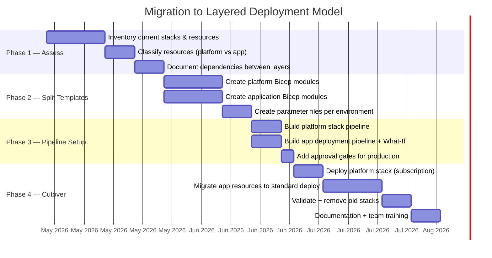

# Azure Bicep & Deployment Stacks — Enterprise Architectural Guidance

**Prepared by:** Microsoft Cloud Solution Architecture  
**Date:** April 2026  
**Audience:** Enterprise Platform Engineering, Cloud Architecture & DevOps Teams  
**Context:** Enterprise Scale Landing Zone, Frequent Application Deployments, IaC Strategy  
**Classification:** Customer-Facing Advisory

---

## Table of Contents

1. [Executive Summary](#1-executive-summary)
2. [Customer Question 1 — Are Deployment Stacks Recommended for Frequent Application Deployments?](#2-customer-question-1--are-deployment-stacks-recommended-for-frequent-application-deployments)
3. [Customer Question 2 — Microsoft-Recommended Pattern for Predictable Change Planning](#3-customer-question-2--microsoft-recommended-pattern-for-predictable-change-planning)
4. [Customer Question 3 — Bicep + Deployment Stacks vs Terraform](#4-customer-question-3--bicep--deployment-stacks-vs-terraform)
5. [Architecture — Layered IaC Deployment Model](#5-architecture--layered-iac-deployment-model)
6. [Deployment Stacks Deep-Dive — Capabilities, Scopes & Deny Settings](#6-deployment-stacks-deep-dive--capabilities-scopes--deny-settings)
7. [Bicep What-If — Predictable Change Planning](#7-bicep-what-if--predictable-change-planning)
8. [Decision Matrix — When to Use What](#8-decision-matrix--when-to-use-what)
9. [Implementation Patterns — CI/CD Pipeline Integration](#9-implementation-patterns--cicd-pipeline-integration)
10. [Known Limitations & Gaps](#10-known-limitations--gaps)
11. [Migration Roadmap — Moving to the Layered Model](#11-migration-roadmap--moving-to-the-layered-model)
12. [Recommended Next Steps](#12-recommended-next-steps)
13. [Microsoft Learn Reference Links](#13-microsoft-learn-reference-links)

---

## 1. Executive Summary

Azure Deployment Stacks are a powerful resource lifecycle management capability, but they are **not designed to be the primary deployment mechanism for high-frequency application releases**. This document provides the Microsoft-recommended architectural pattern for enterprises that need both **safe infrastructure lifecycle management** and **fast, predictable application deployment**.

### The Core Recommendation

| Concern | Recommended Approach |
|---------|---------------------|
| **Infrastructure lifecycle (create, protect, delete)** | Bicep + Deployment Stacks |
| **Frequent application deployments** | Bicep + Incremental ARM deployments |
| **Change planning & impact analysis** | Bicep What-If + scoped deployments |
| **Avoiding broad resource reapplication** | Template splitting + modular Bicep |

> **Key Insight:** The Microsoft-recommended target state is a **layered deployment model** that separates long-lived foundational infrastructure (managed by Deployment Stacks) from fast-moving application resources (deployed via standard Bicep incremental deployments). This approach maximizes predictability, speed, and minimizes deployment blast radius.

### Why This Matters

When Deployment Stacks are used for **every deployment**, including frequent application releases, enterprises commonly experience:

| Symptom | Root Cause |
|---------|-----------|
| Longer deployment times | Stack evaluates managed state for all resources on every update |
| Unexpected resource modifications | Stack-wide evaluation may touch resources outside the change scope |
| Delete/detach risk | Removing a resource from template triggers `ActionOnUnmanage` behavior |
| CI/CD pipeline complexity | Stack operations require additional permissions and error handling |
| Difficult change impact analysis | What-If is **not yet supported** within Deployment Stacks |

---

## 2. Customer Question 1 — Are Deployment Stacks Recommended for Frequent Application Deployments?

### Customer Question
> *"Is Deployment Stacks the recommended approach for frequent application deployments where we need safe delete behavior?"*

### Answer: Usually No — Not as the Primary Model for High-Frequency Application Releases

Azure Deployment Stacks (`Microsoft.Resources/deploymentStacks`) are designed for **resource lifecycle management** — specifically for scenarios where you need:

| Capability | Description |
|-----------|-------------|
| **Managed resource ownership** | Track which resources belong to a deployment unit |
| **Controlled delete / detach behavior** | Decide what happens when resources are removed from templates |
| **Deny settings (DenyDelete / DenyWriteAndDelete)** | Prevent unauthorized modification or deletion of managed resources |
| **Environment cleanup** | Clean up entire environments by deleting the stack |
| **Platform guardrails** | Protect shared infrastructure from accidental changes |

### Where Deployment Stacks Excel



### Why Deployment Stacks Are Not Ideal for Frequent Releases

| Issue | Explanation |
|-------|-------------|
| **Full managed-state evaluation** | Every stack update evaluates **all** managed resources, not just the changed ones. For a stack with 50+ resources, this adds latency and risk even when only one resource changes. |
| **ActionOnUnmanage side effects** | If a resource is temporarily removed from a template (e.g., during a refactor), the stack may **delete or detach** it depending on the `ActionOnUnmanage` setting. |
| **No What-If support** | Deployment Stacks **do not currently support the What-If operation**. You cannot preview changes before applying them — a significant gap for production CI/CD. |
| **Deny assignment complexity** | Deny settings can block legitimate application team operations if not carefully scoped. Maximum 2,000 deny assignments per scope. |
| **Stack-out-of-sync errors** | If resources are modified outside the stack (e.g., by a developer or automation), subsequent stack operations may produce out-of-sync errors requiring manual intervention. |
| **Permission overhead** | Stack operations require `Microsoft.Resources/deploymentStacks/*` permissions and potentially `manageDenySetting/action`, adding RBAC complexity. |

### Recommended Usage Pattern



---

## 3. Customer Question 2 — Microsoft-Recommended Pattern for Predictable Change Planning

### Customer Question
> *"What is the Microsoft-recommended pattern to get predictable change planning and avoid broad resource reapplication side effects?"*

### Answer: The Layered Deployment Model

Microsoft recommends **separating infrastructure into layers** based on change frequency and ownership, then using the appropriate deployment mechanism for each layer.

### The Two-Layer Model



### How This Reduces Side Effects

| Problem | How the Layered Model Solves It |
|---------|-------------------------------|
| **Reprocessing unrelated resources** | Each layer deploys only its own resources. An app deployment never touches VNets or Key Vaults. |
| **Accidental replacement risk** | Platform resources are protected by Deny settings. App resources use scoped incremental deployments. |
| **Longer deployment times** | App deployments target a small, focused set of resources — typically completing in 2-5 minutes. |
| **Stack-wide evaluation noise** | App layer doesn't use stacks — no managed-state evaluation overhead. |
| **Change impact visibility** | App deployments use **What-If** to preview every change before applying. |

### Achieving Predictable Change Planning

#### Step 1 — Split Templates by Scope

```
infra/
├── platform/                    # Layer 1 — Deployment Stacks
│   ├── main.bicep               # Networking, shared services
│   ├── networking.bicep          # VNets, subnets, NSGs, PEs
│   ├── shared-services.bicep     # Key Vault, Storage, LAW
│   ├── identities.bicep          # Managed identities, RBAC
│   └── parameters/
│       ├── dev.bicepparam
│       ├── staging.bicepparam
│       └── prod.bicepparam
│
├── application/                 # Layer 2 — Standard deployments
│   ├── main.bicep               # App-specific resources
│   ├── app-service.bicep         # App Service Plan + Apps
│   ├── functions.bicep           # Function Apps
│   ├── container-apps.bicep      # Container Apps
│   ├── app-config.bicep          # App Configuration, settings
│   └── parameters/
│       ├── dev.bicepparam
│       ├── staging.bicepparam
│       └── prod.bicepparam
│
└── modules/                     # Shared Bicep modules
    ├── private-endpoint.bicep
    ├── diagnostic-settings.bicep
    ├── role-assignment.bicep
    └── tags.bicep
```

#### Step 2 — Use What-If in Every Pipeline

```bash
# Preview changes BEFORE deploying application resources
az deployment group what-if \
  --resource-group "rg-app-prod" \
  --template-file "./infra/application/main.bicep" \
  --parameters "./infra/application/parameters/prod.bicepparam" \
  --result-format FullResourcePayloads

# Only proceed if What-If output is acceptable
az deployment group create \
  --resource-group "rg-app-prod" \
  --template-file "./infra/application/main.bicep" \
  --parameters "./infra/application/parameters/prod.bicepparam" \
  --mode Incremental
```

#### Step 3 — Use Deployment Stacks Only for Platform Layer

```bash
# Deploy platform infrastructure with lifecycle protection
az stack group create \
  --name "platform-stack-prod" \
  --resource-group "rg-platform-prod" \
  --template-file "./infra/platform/main.bicep" \
  --parameters "./infra/platform/parameters/prod.bicepparam" \
  --action-on-unmanage deleteResources \
  --deny-settings-mode denyDelete
```

---

## 4. Customer Question 3 — Bicep + Deployment Stacks vs Terraform

### Customer Question
> *"Should we continue with Bicep plus Deployment Stacks or consider a different target model (other ARM/Bicep deployment patterns or Terraform)?"*

### Answer: It Depends on Your Cloud Footprint and Team Maturity

### Comparison Table — Bicep vs Terraform for Azure Deployments

| Capability | Bicep + Deployment Stacks | HashiCorp Terraform |
|-----------|--------------------------|---------------------|
| **Azure feature parity** | First-class — same day as ARM API | Days to weeks lag behind ARM |
| **State management** | Deployment Stacks (managed by Azure) | Terraform state file (self-managed or Terraform Cloud) |
| **Change planning** | What-If (standard deployments only — **not Stacks**) | `terraform plan` (mature, comprehensive) |
| **Delete behavior** | `ActionOnUnmanage` (deleteAll / deleteResources / detachAll) | Resources removed from config are destroyed by default |
| **Deny settings / protection** | Native deny assignments (DenyDelete, DenyWriteAndDelete) | No equivalent — use Azure resource locks separately |
| **Multi-cloud** | Azure only | AWS, Azure, GCP, 3,000+ providers |
| **RBAC integration** | Native Azure RBAC | Service principal / managed identity required |
| **Module ecosystem** | Azure Verified Modules (AVM) | Terraform Registry (massive) |
| **Learning curve** | Low for Azure teams | Moderate — HCL syntax, state concepts |
| **CI/CD integration** | Azure DevOps / GitHub Actions native | Terraform Cloud, Spacelift, or self-hosted |
| **Drift detection** | Deployment Stacks evaluate on update | `terraform plan` detects drift |
| **Cost** | Free | Terraform Cloud paid for teams; open-source is free |
| **Graph provider (Entra ID)** | ⚠️ Deployment Stacks do **not** support Microsoft Graph provider | ✅ AzureAD provider supported |

### Decision Framework



### Microsoft's Practical Recommendation for Azure-Centric Enterprises

| Aspect | Recommendation |
|--------|----------------|
| **Strategic IaC language** | **Bicep** — first-class Azure support, no state file management, ARM What-If |
| **Platform infrastructure** | **Deployment Stacks** — lifecycle ownership, safe deletion, deny settings |
| **Application deployments** | **Standard Bicep incremental** — fast, predictable, What-If supported |
| **CI/CD integration** | What-If as mandatory gate before production deployments |
| **Template organization** | Modular Bicep with AVM (Azure Verified Modules) |
| **Drift detection** | Deployment Stacks for platform; periodic reconciliation for app layer |

---

## 5. Architecture — Layered IaC Deployment Model

### Enterprise Reference Architecture



### Why Subscription-Scope Stacks for Platform

Microsoft recommends creating platform Deployment Stacks at **subscription scope** (deploying to resource group scope) rather than at resource group scope, because:

1. **Deny assignments are isolated** — Developers in the resource group cannot see or modify the stack
2. **Reduced blast radius** — Stack management is separated from day-to-day resource group operations  
3. **Better RBAC isolation** — Only platform team members need stack management permissions at subscription level
4. **Centralized governance** — Platform team manages all stacks from a single scope

> **Reference:** [Create deployment stacks at subscription scope](https://learn.microsoft.com/azure/azure-resource-manager/bicep/deployment-stacks#create-deployment-stacks)

---

## 6. Deployment Stacks Deep-Dive — Capabilities, Scopes & Deny Settings

### Deployment Scope Options

| Stack Scope | Deploys To | Best For | Command |
|-------------|-----------|----------|---------|
| **Resource Group** | Same resource group | Simple single-RG workloads | `az stack group create` |
| **Subscription** | Resource group(s) within subscription | ✅ **Recommended** — platform resources with RG isolation | `az stack sub create` |
| **Management Group** | Subscription(s) within MG | Landing zone-level governance, policy-driven deployments | `az stack mg create` |

### ActionOnUnmanage Behavior

When a resource is **removed from the Bicep template** and the stack is updated, the `ActionOnUnmanage` setting determines what happens:

| Setting | Resources | Resource Groups | Use Case |
|---------|-----------|-----------------|----------|
| `detachAll` | Detached (orphaned) | Detached | ✅ **Safest default** — resources remain but are no longer tracked |
| `deleteResources` | **Deleted** | Detached | Platform cleanup — delete resources but keep RGs |
| `deleteAll` | **Deleted** | **Deleted** | Full environment teardown (dev/test cleanup) |

> **⚠️ Warning:** `deleteAll` will delete managed resource groups **and all resources within them**, including resources not managed by the stack. Use with extreme caution in production.

### Deny Settings Configuration

| Deny Mode | Effect | When to Use |
|-----------|--------|-------------|
| `none` | No protection | Dev/test environments |
| `denyDelete` | Prevents deletion of managed resources | ✅ **Recommended for production platform resources** |
| `denyWriteAndDelete` | Prevents modification AND deletion | Critical shared infrastructure (hub VNets, firewalls) |

#### Advanced Deny Settings

| Parameter | Purpose | Example |
|-----------|---------|---------|
| `DenySettingsExcludedAction` | Allow specific operations through deny | `Microsoft.Compute/virtualMachines/write` (allow VM scaling) |
| `DenySettingsExcludedPrincipal` | Allow specific users/SPs through deny | Pipeline service principal, break-glass admin |
| `DenySettingsApplyToChildScopes` | Extend deny to child resources | Protect SQL databases under SQL Server |

### Deny Settings Architecture



### Built-in RBAC Roles for Deployment Stacks

| Role | Permissions | Assign To |
|------|------------|-----------|
| **Azure Deployment Stack Contributor** | Manage stacks, but **cannot** create/delete deny assignments | DevOps engineers managing non-protected stacks |
| **Azure Deployment Stack Owner** | Full stack management **including** deny assignments | Platform team leads, infrastructure owners |

---

## 7. Bicep What-If — Predictable Change Planning

### What-If as a CI/CD Gate

The `What-If` operation is the **primary mechanism** for predictable change planning in Azure. It shows you exactly what will be created, modified, or deleted **before** any changes are applied.

> **Critical Limitation:** What-If is **not supported** within Deployment Stacks. This is one of the key reasons application deployments should use standard Bicep deployments rather than stacks.

### Change Types Returned by What-If

| Symbol | Change Type | Description |
|--------|-------------|-------------|
| `+` | **Create** | Resource will be created |
| `-` | **Delete** | Resource will be deleted (complete mode only) |
| `~` | **Modify** | Resource will be updated with new property values |
| `=` | **NoChange** | Resource exists and won't change |
| `!` | **Deploy** | Resource will be redeployed (properties may or may not change) |
| `*` | **Ignore** | Resource exists but isn't in template (incremental mode — left unchanged) |
| `x` | **NoEffect** | Read-only property ignored by service |

### What-If in Azure DevOps Pipeline

```yaml
# Azure DevOps Pipeline — Application Layer Deployment
trigger:
  branches:
    include: [main]
  paths:
    include: [infra/application/**]

stages:
  - stage: Validate
    jobs:
      - job: WhatIf
        steps:
          - task: AzureCLI@2
            displayName: 'What-If Preview'
            inputs:
              azureSubscription: 'prod-service-connection'
              scriptType: 'bash'
              scriptLocation: 'inlineScript'
              inlineScript: |
                az deployment group what-if \
                  --resource-group "rg-app-prod" \
                  --template-file "./infra/application/main.bicep" \
                  --parameters "./infra/application/parameters/prod.bicepparam" \
                  --result-format FullResourcePayloads

  - stage: Deploy
    dependsOn: Validate
    condition: succeeded()
    jobs:
      - deployment: DeployApp
        environment: 'production'  # Manual approval gate
        strategy:
          runOnce:
            deploy:
              steps:
                - task: AzureCLI@2
                  displayName: 'Deploy Application Resources'
                  inputs:
                    azureSubscription: 'prod-service-connection'
                    scriptType: 'bash'
                    scriptLocation: 'inlineScript'
                    inlineScript: |
                      az deployment group create \
                        --resource-group "rg-app-prod" \
                        --template-file "./infra/application/main.bicep" \
                        --parameters "./infra/application/parameters/prod.bicepparam" \
                        --mode Incremental
```

### What-If in GitHub Actions

```yaml
name: Deploy Application Infrastructure
on:
  push:
    branches: [main]
    paths: ['infra/application/**']

permissions:
  id-token: write
  contents: read

jobs:
  what-if:
    runs-on: ubuntu-latest
    steps:
      - uses: actions/checkout@v4
      
      - uses: azure/login@v2
        with:
          client-id: ${{ secrets.AZURE_CLIENT_ID }}
          tenant-id: ${{ secrets.AZURE_TENANT_ID }}
          subscription-id: ${{ secrets.AZURE_SUBSCRIPTION_ID }}
      
      - name: What-If Preview
        run: |
          az deployment group what-if \
            --resource-group "rg-app-prod" \
            --template-file "./infra/application/main.bicep" \
            --parameters "./infra/application/parameters/prod.bicepparam" \
            --result-format FullResourcePayloads

  deploy:
    needs: what-if
    runs-on: ubuntu-latest
    environment: production  # Requires manual approval
    steps:
      - uses: actions/checkout@v4
      
      - uses: azure/login@v2
        with:
          client-id: ${{ secrets.AZURE_CLIENT_ID }}
          tenant-id: ${{ secrets.AZURE_TENANT_ID }}
          subscription-id: ${{ secrets.AZURE_SUBSCRIPTION_ID }}
      
      - name: Deploy Application Resources
        run: |
          az deployment group create \
            --resource-group "rg-app-prod" \
            --template-file "./infra/application/main.bicep" \
            --parameters "./infra/application/parameters/prod.bicepparam" \
            --mode Incremental
```

---

## 8. Decision Matrix — When to Use What

### Resource-Level Decision Matrix

| Resource Type | Deployment Method | Deny Settings | Change Frequency | Rationale |
|--------------|-------------------|---------------|------------------|-----------|
| **VNet / Subnets / NSGs** | Deployment Stack | DenyDelete | Low — quarterly | Core networking must be protected from accidental deletion |
| **Private Endpoints** | Deployment Stack | DenyDelete | Low — as services are added | Connectivity to PaaS services is critical |
| **Key Vault** | Deployment Stack | DenyWriteAndDelete | Very Low | Secrets, keys, certificates must be strongly protected |
| **Log Analytics Workspace** | Deployment Stack | DenyDelete | Very Low | Central monitoring data must be preserved |
| **Shared Storage Accounts** | Deployment Stack | DenyDelete | Low | Platform data stores |
| **Managed Identities** | Deployment Stack | DenyDelete | Low | Identity lifecycle is critical |
| **Azure Firewall / WAF** | Deployment Stack | DenyWriteAndDelete | Very Low | Security infrastructure |
| **DNS Private Zones** | Deployment Stack | DenyDelete | Low | Name resolution infrastructure |
| **App Service Plan** | Standard Bicep | None | Medium | Scaling and SKU changes are frequent |
| **App Service / Web App** | Standard Bicep | None | High — daily | Application deployments |
| **Function App** | Standard Bicep | None | High — daily | Serverless application code |
| **Container App** | Standard Bicep | None | High — daily | Container workloads |
| **Logic App** | Standard Bicep | None | Medium — weekly | Integration workflows |
| **API Management** | Hybrid | DenyDelete (instance) / None (APIs) | Medium | Instance is platform; APIs are application |
| **Role Assignments** | Standard Bicep | None | Medium | RBAC bindings for applications |
| **App Configuration** | Standard Bicep | None | High | Feature flags, settings |
| **Cosmos DB / SQL DB** | Deployment Stack (server) + Standard (databases) | DenyDelete (server) | Medium | Server is platform; databases are application |

### Scenario-Based Recommendations

| Scenario | Recommended Approach |
|----------|---------------------|
| Azure-only enterprise, single team | Bicep + selective Deployment Stacks |
| Frequent application releases (daily/weekly) | Standard Bicep incremental deployments + What-If |
| Shared platform infrastructure governance | Deployment Stacks at subscription scope with DenyDelete |
| Multi-cloud organization | Terraform for consistency; consider Bicep for Azure-specific features |
| Need safe delete of infrastructure | Deployment Stacks with `deleteResources` or `deleteAll` |
| Dev/Test environment lifecycle | Deployment Stacks with `deleteAll` for easy cleanup |
| Change impact analysis required | Standard Bicep with What-If (not Stacks — What-If not supported) |
| Enterprise landing zone baseline | Deployment Stacks at management group scope |

---

## 9. Implementation Patterns — CI/CD Pipeline Integration

### Pattern 1 — Platform Stack Deployment (Monthly)



### Pattern 2 — Application Deployment (Daily)



### Pattern 3 — Environment Cleanup with Stacks

```bash
# Create dev environment with Deployment Stack
az stack sub create \
  --name "dev-environment" \
  --location "westeurope" \
  --template-file "./infra/platform/main.bicep" \
  --parameters "./infra/platform/parameters/dev.bicepparam" \
  --deployment-resource-group "rg-dev-platform" \
  --action-on-unmanage deleteAll \
  --deny-settings-mode none

# When dev work is complete — clean up everything
az stack sub delete \
  --name "dev-environment" \
  --action-on-unmanage deleteAll
```

---

## 10. Known Limitations & Gaps

### Deployment Stacks Limitations

| Limitation | Impact | Mitigation |
|-----------|--------|------------|
| **What-If not supported** | Cannot preview stack changes before applying | Use standard deployments for change-sensitive resources |
| **800 stacks per scope** | Large enterprises may hit limits | Use management group stacks for broad governance |
| **2,000 deny assignments per scope** | Complex environments may hit limits | Consolidate stacks; use deny at higher scopes |
| **No Microsoft Graph provider support** | Cannot manage Entra ID resources (groups, apps) via stacks | Use separate Bicep/Terraform deployments for Entra ID |
| **Implicitly created resources not managed** | AKS node pools, auto-created NICs not protected by deny | Document and accept — use resource locks for implicit resources |
| **Key Vault secrets can't be deleted by stacks** | Removing secrets from template doesn't delete them | Use `detachAll` + manual cleanup for secrets |
| **Deleting RGs bypasses deny assignments** | RG-scoped stacks can be bypassed by deleting the RG | Place stacks at subscription scope; use resource locks |
| **Stack-out-of-sync errors** | Manual changes cause sync issues | Enforce "no manual changes" policy; use `BypassStackOutOfSyncError` carefully |

### Bicep What-If Limitations

| Limitation | Impact | Mitigation |
|-----------|--------|------------|
| **Noise in output** | Some properties reported as changed when they aren't | Review carefully; known issue being improved |
| **500 nested template limit** | Large deployments may not fully evaluate | Split into smaller deployments |
| **reference() not resolved** | Dynamic references show as changes | Accept as noise; validate post-deployment |
| **5-minute expansion timeout** | Very large templates may time out | Modularize templates |

---

## 11. Migration Roadmap — Moving to the Layered Model

### For Teams Currently Using Stacks for Everything



### Migration Steps

| Phase | Action | Owner | Duration |
|-------|--------|-------|----------|
| **1. Assess** | Inventory all resources managed by current stacks. Classify each as "platform" (low-change) or "application" (high-change). | Platform Team | 2-4 weeks |
| **2. Split** | Refactor Bicep templates into platform and application modules. Use shared modules for cross-cutting concerns (tags, diagnostics). | Platform + App Teams | 2-3 weeks |
| **3. Pipeline** | Build separate CI/CD pipelines for platform (stack-based) and application (standard deployment + What-If). | DevOps Team | 1-2 weeks |
| **4. Cutover** | Deploy platform stack at subscription scope. Migrate application resources to standard incremental deployments. Validate, then decommission old stacks. | All Teams | 3-4 weeks |

---

## 12. Recommended Next Steps

### Immediate Actions (Next 2 Weeks)

| # | Action | Owner | Priority |
|---|--------|-------|----------|
| 1 | **Inventory** all resources currently managed by Deployment Stacks | Platform Team | P0 |
| 2 | **Classify** each resource as platform (low-change) or application (high-change) | Platform + App Teams | P0 |
| 3 | **Enable What-If** in existing CI/CD pipelines for application deployments | DevOps Team | P0 |
| 4 | **Document** the target layered deployment model and share with stakeholders | Architecture Team | P1 |

### Short-Term (Next 4-8 Weeks)

| # | Action | Owner | Priority |
|---|--------|-------|----------|
| 5 | **Split Bicep templates** into platform and application modules | Platform Team | P1 |
| 6 | **Create subscription-scope stacks** for platform infrastructure with `DenyDelete` | Platform Team | P1 |
| 7 | **Build separate pipelines** for platform (stack) and application (standard) deployments | DevOps Team | P1 |
| 8 | **Add manual approval gates** for production deployments | DevOps Team | P1 |

### Medium-Term (Next Quarter)

| # | Action | Owner | Priority |
|---|--------|-------|----------|
| 9 | **Migrate application resources** to standard Bicep incremental deployments | App Teams | P1 |
| 10 | **Decommission legacy stacks** that were managing application resources | Platform Team | P2 |
| 11 | **Implement drift detection** — periodic stack re-evaluation for platform resources | Platform Team | P2 |
| 12 | **Evaluate Azure Verified Modules (AVM)** for standardized Bicep modules | Architecture Team | P2 |

---

## 13. Microsoft Learn Reference Links

### Deployment Stacks

| Topic | URL |
|-------|-----|
| Deployment Stacks Overview | https://learn.microsoft.com/azure/azure-resource-manager/bicep/deployment-stacks |
| Quickstart — Create Deployment Stack | https://learn.microsoft.com/azure/azure-resource-manager/bicep/quickstart-create-deployment-stacks |
| Training — Manage Resource Lifecycles with Stacks | https://learn.microsoft.com/training/modules/manage-resource-lifecycles-deployment-stacks/ |

### Bicep & ARM Deployments

| Topic | URL |
|-------|-----|
| Bicep Overview | https://learn.microsoft.com/azure/azure-resource-manager/bicep/overview |
| Bicep What-If Preview | https://learn.microsoft.com/azure/azure-resource-manager/bicep/deploy-what-if |
| ARM Deployment Modes (Incremental vs Complete) | https://learn.microsoft.com/azure/azure-resource-manager/templates/deployment-modes |
| Bicep Modules | https://learn.microsoft.com/azure/azure-resource-manager/bicep/modules |
| Bicep Parameter Files | https://learn.microsoft.com/azure/azure-resource-manager/bicep/parameter-files |
| Azure Verified Modules (AVM) | https://aka.ms/avm |

### CI/CD & DevOps

| Topic | URL |
|-------|-----|
| Deploy Bicep with Azure DevOps Pipelines | https://learn.microsoft.com/azure/azure-resource-manager/bicep/add-template-to-azure-pipelines |
| Deploy Bicep with GitHub Actions | https://learn.microsoft.com/azure/azure-resource-manager/bicep/deploy-github-actions |
| What-If in CI/CD Pipelines | https://4bes.nl/2021/03/06/test-arm-templates-with-what-if/ |
| Workload Identity Federation (OIDC) | https://learn.microsoft.com/azure/devops/pipelines/library/connect-to-azure |

### Architecture & Governance

| Topic | URL |
|-------|-----|
| Azure Landing Zone Accelerator | https://learn.microsoft.com/azure/cloud-adoption-framework/ready/landing-zone/ |
| IaC Best Practices (CAF) | https://learn.microsoft.com/azure/cloud-adoption-framework/ready/considerations/infrastructure-as-code |
| Azure RBAC Overview | https://learn.microsoft.com/azure/role-based-access-control/overview |
| Deny Assignments | https://learn.microsoft.com/azure/role-based-access-control/deny-assignments |
| Resource Locks | https://learn.microsoft.com/azure/azure-resource-manager/management/lock-resources |

### Terraform (Alternative)

| Topic | URL |
|-------|-----|
| Terraform AzureRM Provider | https://registry.terraform.io/providers/hashicorp/azurerm/latest |
| Terraform vs Bicep Comparison | https://learn.microsoft.com/azure/developer/terraform/comparing-terraform-and-bicep |
| Azure Landing Zones with Terraform | https://learn.microsoft.com/azure/cloud-adoption-framework/ready/landing-zone/deploy-landing-zones-with-terraform |

---

## Strong Customer-Facing Summary

> Our recommendation is to **separate foundational infrastructure lifecycle management from high-frequency application delivery**. Use Deployment Stacks selectively for governed platform resources requiring safe delete behavior and deny-based protection, while using modular Bicep incremental deployments with What-If previews for regular application releases. This approach maximizes predictability, deployment speed, and reduces the blast radius of every change.

> For Azure-centric organizations, **Bicep remains the strategic IaC language**. Deployment Stacks are a powerful complement for platform governance — not a replacement for standard deployment patterns. The layered model described in this document aligns with Microsoft's Cloud Adoption Framework and Well-Architected Framework guidance for enterprise-scale environments.

---

*Document prepared based on Microsoft Learn documentation as of April 2026. Azure Deployment Stacks capabilities are actively evolving — always verify against the latest [Deployment Stacks documentation](https://learn.microsoft.com/azure/azure-resource-manager/bicep/deployment-stacks) and the [Bicep documentation](https://learn.microsoft.com/azure/azure-resource-manager/bicep/overview).*
