# Platform Observability Scenarios for Large-Scale Azure Landing Zones

> **Document Purpose:** Solutions to common enterprise challenges around platform-level monitoring, visibility into landing zone application teams, and Azure Service Health notifications.

---

## Table of Contents

1. [Scenario 1: Platform Monitoring vs. Landing Zone Monitoring](#scenario-1-platform-monitoring-vs-landing-zone-monitoring)
2. [Scenario 2: Visibility into 400+ Landing Zone Application Teams](#scenario-2-visibility-into-400-landing-zone-application-teams)
   - [How It's Done: Sending Landing Zone Logs to Central Platform LAW](#how-its-done-sending-landing-zone-logs-to-central-platform-law)
3. [Scenario 3: Azure Service Health Dashboards & Notifications](#scenario-3-azure-service-health-dashboards--notifications)

---

## Scenario 1: Platform Monitoring vs. Landing Zone Monitoring

### The Challenge

> *"Monitoring for the platform itself and monitoring for the landing zone users is a separate thing. We want platform observability for our large platform - dashboards, alerting, and health monitoring."*

### Understanding the Distinction

| Aspect | Platform Monitoring | Landing Zone (Workload) Monitoring |
|--------|--------------------|------------------------------------|
| **Scope** | Central platform services (Identity, Connectivity, Management) | Individual application workloads |
| **Owner** | Central Platform Team | Landing Zone / Application Teams |
| **Focus** | Infrastructure health, shared services, governance | Application performance, business metrics |
| **Subscription** | Management, Connectivity, Identity subscriptions | Landing Zone subscriptions |
| **Examples** | ExpressRoute, Azure Firewall, Key Vault, DNS, LAW | VMs, App Services, Databases, Storage |

### Solution: Azure Monitor Baseline Alerts (AMBA)

Microsoft provides **Azure Monitor Baseline Alerts (AMBA)** - a policy-driven framework specifically designed for Azure Landing Zone platform monitoring.

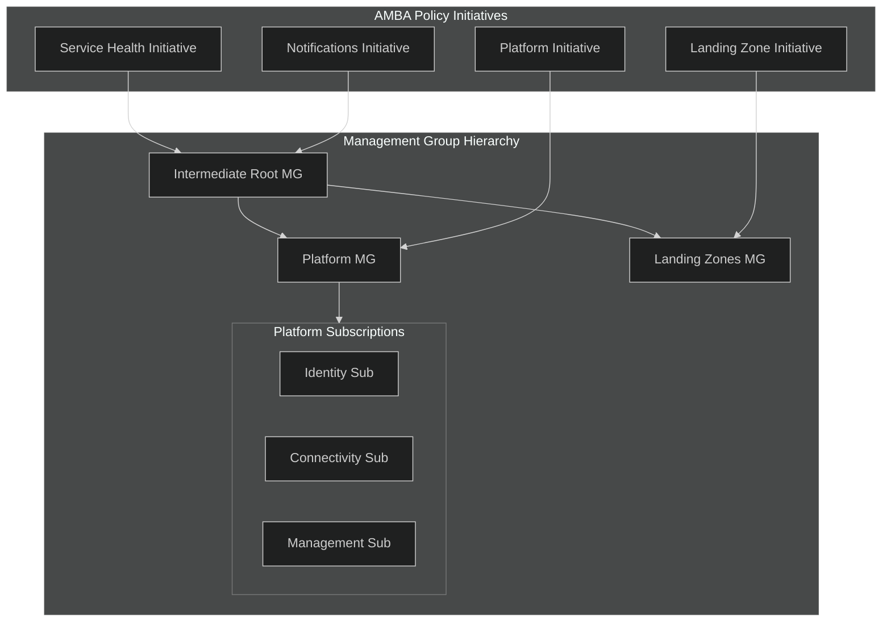

### Platform Services Covered by AMBA

| Platform Component | Alert Types | Metrics Monitored |
|-------------------|-------------|-------------------|
| **Azure ExpressRoute** | Circuit availability, BGP status | BitsInPerSecond, BitsOutPerSecond |
| **Azure Firewall** | SNAT port utilization, health | FirewallHealth, ThroughputBitsPerSecond |
| **Azure Virtual Network** | N/A (activity-based) | DDoS alerts, NSG flow |
| **Azure Virtual WAN** | Hub health, tunnel status | TunnelBandwidth, BGPPeerStatus |
| **Log Analytics Workspace** | Ingestion, latency | IngestionVolumeMB, IngestionLatencyInSeconds |
| **Azure Private DNS** | Query volume, failures | QueryVolume, RecordSetCapacityUtilization |
| **Azure Key Vault** | Availability, saturation | Availability, SaturationShoebox |
| **Azure Storage Account** | Availability, latency | Availability, SuccessE2ELatency |

### Platform Dashboards for Large Organizations

For a **large platform** with many services, implement these visualization layers:

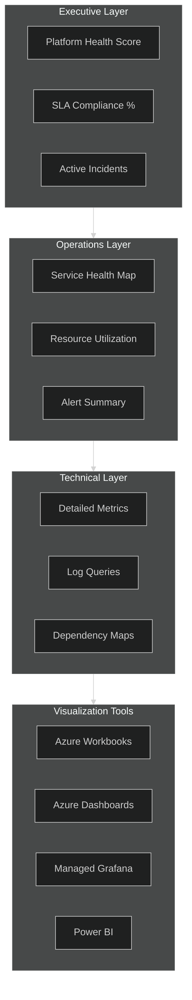

### Recommended Workbooks for Platform Monitoring

| Workbook | Purpose | Source |
|----------|---------|--------|
| **Activity Log Insights** | Platform changes, who did what, admin actions | Built-in |
| **Network Insights** | ExpressRoute, VPN, Firewall, VNet health | Azure Portal |
| **Key Vault Insights** | Vault operations, access patterns, failures | Azure Portal |
| **Storage Insights** | Storage account health across subscriptions | Azure Portal |
| **LAW Health** | Workspace ingestion, query performance, cost | Custom/AMBA |

### Implementation Steps

1. **Deploy AMBA via Policy**
   ```
   Portal → Azure Monitor → Baseline Alerts → Deploy to Management Group
   ```

2. **Configure Action Groups** (one per subscription minimum)
   - Email notification channel
   - Teams/Slack webhook for chat ops
   - Logic App for ticketing integration

3. **Create Platform Dashboard**
   - Pin critical metrics from each platform service
   - Group by: Connectivity | Identity | Management

4. **Set up Workbooks**
   - Use built-in Insights workbooks
   - Create custom workbooks for organization-specific views

> 📖 **Reference:** [Monitor Azure Platform Landing Zone Components](https://learn.microsoft.com/en-us/azure/cloud-adoption-framework/ready/landing-zone/design-area/management-monitor)

---

## Scenario 2: Visibility into 400+ Landing Zone Application Teams

### The Challenge

> *"The platform team should be aware of what's happening to application teams which they onboarded to the landing zones. With 400+ teams, how do we gain visibility without overwhelming the central infrastructure?"*

### The Challenge at Scale

| Challenge | Impact |
|-----------|--------|
| 400+ teams = 400+ subscriptions | Cannot monitor each individually |
| Each team owns their workloads | Platform team shouldn't manage app-level alerts |
| Need visibility without control | See what's happening, not micromanage |
| Different maturity levels | Some teams are advanced, some need guidance |

### Solution Architecture: Federated Visibility Model

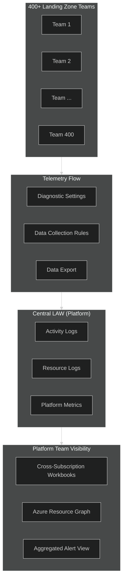

### How It's Done: Sending Landing Zone Logs to Central Platform LAW

> 💡 **Key Question:** "If dashboards filter by Landing Zone, all landing zones must send their logs to the centralized platform Log Analytics Workspace. But how is this done?"

There are **three methods** to centralize logs from 400+ Landing Zone subscriptions:

#### Method 1: Azure Policy with Diagnostic Settings (Recommended)

Use **DeployIfNotExists (DINE) policies** to automatically configure diagnostic settings on all resources:

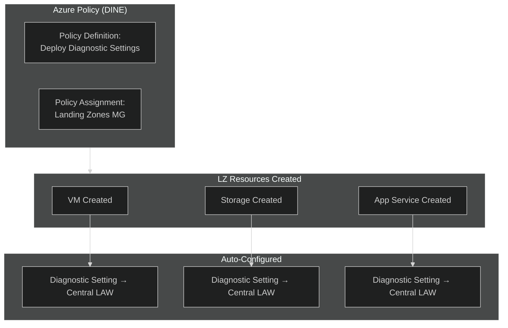

**Policy Configuration:**

```json
{
  "if": {
    "field": "type",
    "equals": "Microsoft.Compute/virtualMachines"
  },
  "then": {
    "effect": "DeployIfNotExists",
    "details": {
      "type": "Microsoft.Insights/diagnosticSettings",
      "existenceCondition": {
        "field": "Microsoft.Insights/diagnosticSettings/workspaceId",
        "equals": "[parameters('centralLogAnalyticsWorkspaceId')]"
      },
      "roleDefinitionIds": [
        "/providers/Microsoft.Authorization/roleDefinitions/..."
      ],
      "deployment": {
        "properties": {
          "template": {
            // ARM template to create diagnostic setting
          }
        }
      }
    }
  }
}
```

**Built-in Policies Available:**
| Resource Type | Policy Name |
|--------------|-------------|
| Virtual Machines | Configure Azure VMs to send logs to LAW |
| Storage Accounts | Configure Storage to send logs to LAW |
| Key Vault | Configure Key Vault to send logs to LAW |
| App Service | Configure App Service to send logs to LAW |
| SQL Database | Configure SQL to send logs to LAW |
| AKS | Configure AKS to send logs to LAW |

#### Method 2: Data Collection Rules (DCR) with Azure Monitor Agent

For **VMs and Arc-enabled servers**, use Data Collection Rules:

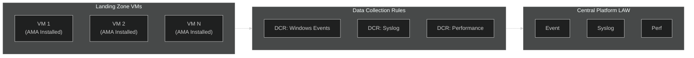

**DCR Assignment via Policy:**

```bicep
resource dcrAssignmentPolicy 'Microsoft.Authorization/policyAssignments@2022-06-01' = {
  name: 'assign-dcr-to-all-vms'
  properties: {
    policyDefinitionId: '/providers/Microsoft.Authorization/policyDefinitions/...'
    parameters: {
      dcrResourceId: {
        value: centralDCR.id
      }
    }
  }
  scope: managementGroup('LandingZones')
}
```

#### Method 3: Activity Log Export (Subscription-Level)

For **Activity Logs** (audit trail of who did what), configure at subscription level:

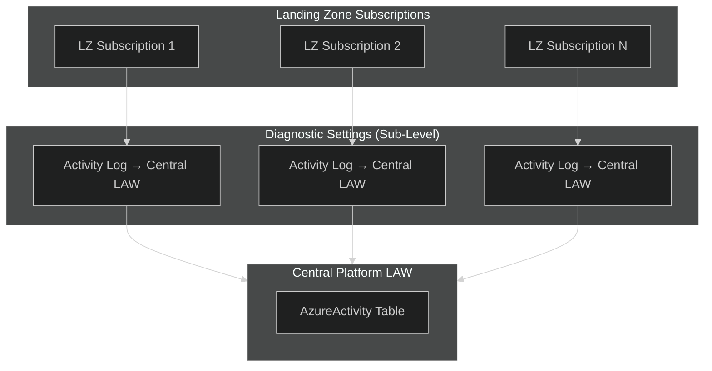

**Azure CLI to Configure Activity Log Export:**

```bash
# For each Landing Zone subscription
az monitor diagnostic-settings subscription create \
  --name "send-to-central-law" \
  --subscription "<lz-subscription-id>" \
  --workspace "<central-law-resource-id>" \
  --logs '[{"category": "Administrative", "enabled": true},
          {"category": "Security", "enabled": true},
          {"category": "ServiceHealth", "enabled": true},
          {"category": "Alert", "enabled": true},
          {"category": "Recommendation", "enabled": true},
          {"category": "Policy", "enabled": true},
          {"category": "Autoscale", "enabled": true},
          {"category": "ResourceHealth", "enabled": true}]'
```

### Implementation Architecture: Complete Flow

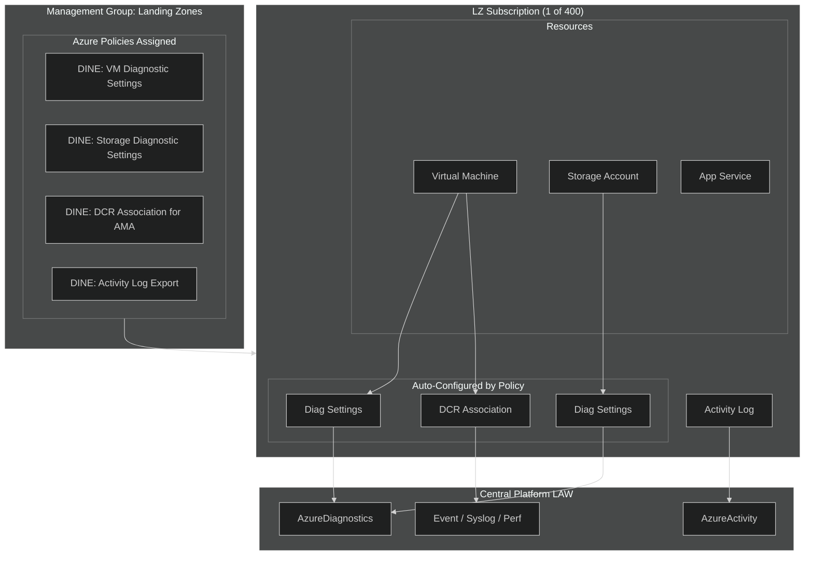

### Summary: How Landing Zone Logs Flow to Central LAW

| Log Type | Source | Method | Destination Table |
|----------|--------|--------|-------------------|
| **Activity Logs** | Subscription | Subscription Diagnostic Settings | `AzureActivity` |
| **Resource Logs** | Azure Resources | Resource Diagnostic Settings (Policy) | `AzureDiagnostics` |
| **VM/Guest Logs** | VMs, Arc Servers | DCR + Azure Monitor Agent (Policy) | `Event`, `Syslog`, `Perf` |
| **Custom App Logs** | Applications | Application Insights / Custom DCR | Custom Tables |

### Required RBAC for Central LAW

For policies to write to the Central LAW, the policy identity needs:

| Role | Scope | Purpose |
|------|-------|---------|
| `Log Analytics Contributor` | Central LAW | Write diagnostic settings |
| `Monitoring Contributor` | Landing Zones MG | Create diagnostic settings on resources |

### Strategy 1: Azure Resource Graph for Real-Time Visibility

Azure Resource Graph queries work across **all subscriptions** the platform team has access to:

```kusto
// Count resources by Landing Zone (Resource Group)
resources
| summarize ResourceCount = count() by subscriptionId, resourceGroup, type
| order by ResourceCount desc

// Find VMs not sending heartbeat (unhealthy)
resources
| where type == "microsoft.compute/virtualmachines"
| join kind=leftouter (
    Heartbeat
    | where TimeGenerated > ago(5m)
    | summarize LastHeartbeat = max(TimeGenerated) by ResourceId = tolower(_ResourceId)
) on $left.id == $right.ResourceId
| where isempty(LastHeartbeat)
| project subscriptionId, resourceGroup, name, LastHeartbeat
```

### Strategy 2: Cross-Subscription Workbooks

Create workbooks that query across **all Landing Zone subscriptions**:

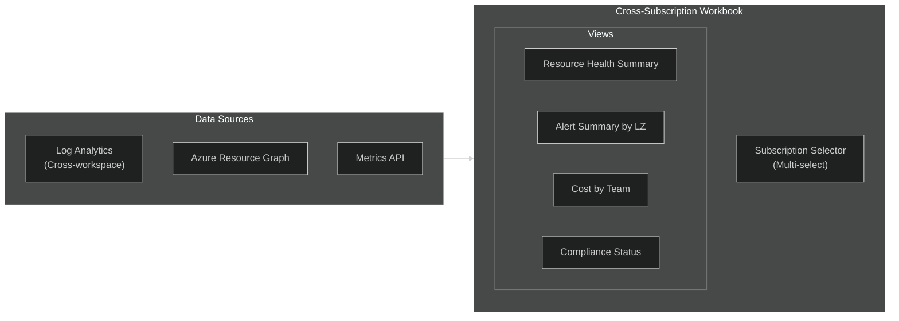

**Key Workbook Features:**

| Feature | How It Helps with 400 Teams |
|---------|---------------------------|
| **Subscription Parameter** | Multi-select dropdown to filter views |
| **Resource Graph Tiles** | Query all resources without Log Analytics |
| **Cross-Workspace Queries** | Union data from multiple LAWs |
| **Grouping by Tags** | Filter by `CostCenter`, `Owner`, `Application` |

### Strategy 3: Centralized Alert View (Without Ownership)

The platform team can **view** alerts across all subscriptions without taking ownership:

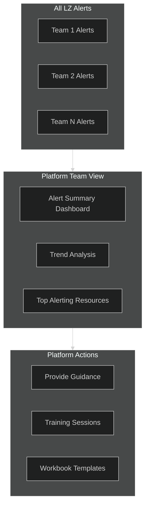

**Portal Location:** Azure Monitor → Alerts → "All Alerts" (filter by subscription scope)

### Strategy 4: Activity Log Insights Workbook

Track **what teams are doing** in their subscriptions:

| Activity Category | What It Shows |
|-------------------|---------------|
| **Administrative** | Resource create/delete/modify |
| **Security** | RBAC changes, Key Vault access |
| **Policy** | Compliance evaluations, remediation |
| **Alert** | Alert rule modifications |

### Implementation: Cross-Subscription Visibility Dashboard

```yaml
Dashboard Components:
  Row 1 - Overview:
    - Total Subscriptions: 400
    - Total Resources: ARG count
    - Active Alerts: Count by severity
    - Unhealthy Resources: Resource Health API
    
  Row 2 - By Team:
    - Table: Subscription | Owner | Resources | Alerts | Health %
    - Filter: Search by team name or tag
    
  Row 3 - Trends:
    - Alert trend (7 days)
    - Resource growth trend
    - Cost trend by team
    
  Row 4 - Action Items:
    - Non-compliant resources
    - Resources without diagnostics
    - VMs without Azure Monitor Agent
```

### KQL: Cross-Workspace Query Pattern

```kusto
// Query alerts across all Landing Zone workspaces
let workspaces = dynamic([
    "workspace('LZ-Team1-LAW').AlertsManagementResources",
    "workspace('LZ-Team2-LAW').AlertsManagementResources"
]);
union withsource=SourceWorkspace *
| where SourceWorkspace in (workspaces)
| summarize AlertCount = count() by SourceWorkspace, Severity
| order by AlertCount desc
```

### Governance: What Platform Team Should Track (Not Own)

| Metric | Why Track | Action if Threshold Breached |
|--------|-----------|------------------------------|
| **AMA Adoption** | Ensure all VMs have agent | Remind teams, provide docs |
| **Diagnostics Enabled** | All resources sending logs | Policy remediation |
| **Alert Coverage** | Teams have alerts configured | Training session |
| **Cost Anomalies** | Unexpected spikes | Notify team owner |

> 📖 **Reference:** [Azure Monitor Enterprise Monitoring Architecture](https://learn.microsoft.com/en-us/azure/azure-monitor/fundamentals/enterprise-monitoring-architecture)

---

## Scenario 3: Azure Service Health Dashboards & Notifications

### The Challenge

> *\"How can the platform team get notified quickly when something happens on the Azure side - like Azure AD outages or Azure Front Door problems? We need service health dashboards and proactive notifications.\"*

### Understanding Azure Service Health

Azure Service Health provides **three types of health information**:

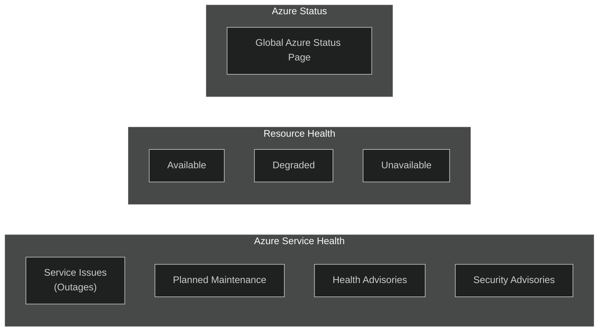

| Health Type | What It Covers | Example |
|-------------|---------------|---------|
| **Service Issues** | Active incidents affecting Azure services | "Azure Front Door - Increased latency in West Europe" |
| **Planned Maintenance** | Scheduled updates that may impact services | "Azure AD - Authentication upgrade on Jan 15" |
| **Health Advisories** | Issues requiring action but not outages | "Deprecation of TLS 1.0 for Storage" |
| **Security Advisories** | Security-related events | "Critical vulnerability in Azure Service X" |
| **Resource Health** | Health of YOUR specific resources | "Your VM vm-prod-001 is Unavailable" |

### Solution 1: Create Service Health Alerts

**Step-by-step in Azure Portal:**

1. **Navigate to Service Health**
   ```
   Azure Portal → Service Health → Health Alerts → Add Service Health Alert
   ```

2. **Configure Scope**
   - Select subscription(s)
   - Select affected services (e.g., Azure Front Door, Azure AD, Azure Firewall)
   - Select regions

3. **Configure Conditions**
   | Event Type | Recommended |
   |------------|-------------|
   | Service Issue | ✅ Enable |
   | Planned Maintenance | ✅ Enable |
   | Health Advisory | ✅ Enable |
   | Security Advisory | ✅ Enable |

4. **Configure Action Group**
   - Email: Platform Team DL
   - SMS: On-call numbers
   - Webhook: Teams/Slack/PagerDuty

### Important: Service Health Alert Limitations

> ⚠️ **Service Health alerts do NOT support Alert Processing Rules**. You must configure the Action Group directly on the alert rule.

### Solution 2: Deploy Service Health Alerts at Scale with AMBA

Use **Azure Monitor Baseline Alerts (AMBA)** to deploy Service Health alerts across all subscriptions via Policy:

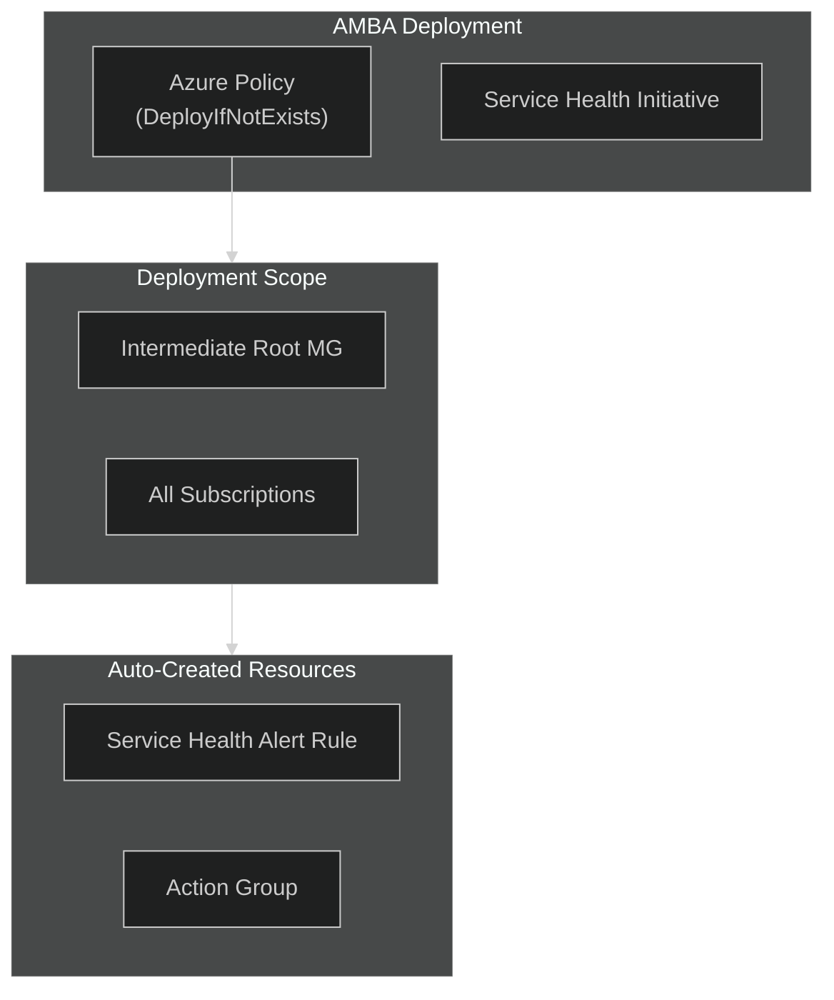

**AMBA Service Health Initiative includes alerts for:**
- Service Issues
- Planned Maintenance  
- Health Advisories
- Security Advisories

> 📖 **Reference:** [Deploy Service Health Alerts at Scale](https://azure.github.io/azure-monitor-baseline-alerts/patterns/alz/HowTo/deploy/Deploy-only-Service-Health-Alerts/)

### Solution 3: Service Health Dashboard (Workbook)

Create a **Service Health Dashboard** using Azure Workbooks:

```yaml
Dashboard Sections:
  Section 1 - Current Status:
    - Active Service Issues (count)
    - Planned Maintenance (next 7 days)
    - Health Advisories (unread)
    
  Section 2 - By Service (Filter):
    - Azure AD / Entra ID
    - Azure Front Door
    - Azure Firewall
    - ExpressRoute
    - Azure Monitor
    
  Section 3 - Historical:
    - Service issues (last 90 days)
    - Impact by region
    - MTTR trends
    
  Section 4 - Resource Health:
    - Your resources current health
    - Resources with degraded status
```

### KQL: Query Service Health Events

```kusto
// Service Health events from Activity Log
AzureActivity
| where CategoryValue == "ServiceHealth"
| extend ServiceHealthEvent = parse_json(Properties)
| extend 
    EventType = tostring(ServiceHealthEvent.incidentType),
    Title = tostring(ServiceHealthEvent.title),
    Service = tostring(ServiceHealthEvent.impactedServices),
    Region = tostring(ServiceHealthEvent.impactedRegions),
    Status = tostring(ServiceHealthEvent.status)
| where TimeGenerated > ago(30d)
| project TimeGenerated, EventType, Title, Service, Region, Status
| order by TimeGenerated desc
```

### Solution 4: Proactive Notification Channels

| Channel | Use Case | Setup |
|---------|----------|-------|
| **Email** | Standard notification | Action Group → Email |
| **SMS** | Critical on-call alerts | Action Group → SMS |
| **Voice Call** | Sev 0 outages | Action Group → Voice |
| **Teams/Slack** | ChatOps integration | Action Group → Webhook |
| **PagerDuty/ServiceNow** | Ticket integration | Action Group → Webhook/Logic App |
| **Azure Mobile App** | Push notifications | Enable in app settings |

### Bicep: Deploy Service Health Alert

```bicep
resource actionGroup 'Microsoft.Insights/actionGroups@2023-01-01' = {
  name: 'ag-service-health-platform'
  location: 'Global'
  properties: {
    groupShortName: 'SvcHealth'
    enabled: true
    emailReceivers: [
      {
        name: 'Platform Team'
        emailAddress: 'platform-team@company.com'
        useCommonAlertSchema: true
      }
    ]
  }
}

resource serviceHealthAlert 'Microsoft.Insights/activityLogAlerts@2020-10-01' = {
  name: 'alert-service-health-all'
  location: 'Global'
  properties: {
    enabled: true
    scopes: [
      subscription().id
    ]
    condition: {
      allOf: [
        {
          field: 'category'
          equals: 'ServiceHealth'
        }
        {
          field: 'properties.incidentType'
          equals: 'Incident'  // or Maintenance, Informational, Security
        }
      ]
    }
    actions: {
      actionGroups: [
        {
          actionGroupId: actionGroup.id
        }
      ]
    }
  }
}
```

### Recommended Service Health Alert Configuration

| Service Category | Alert For | Priority |
|-----------------|-----------|----------|
| **Identity** | Azure AD / Entra ID, MFA | Critical |
| **Networking** | Front Door, Azure Firewall, ExpressRoute, VPN Gateway | Critical |
| **Compute** | Virtual Machines, VMSS, AKS | High |
| **Storage** | Storage Accounts, Azure Files | High |
| **Monitoring** | Azure Monitor, Log Analytics | High |
| **Security** | Key Vault, Defender for Cloud | Critical |
| **Data** | SQL, Cosmos DB | High |

### Quick Setup Checklist

- [ ] Create Action Group in **Global** region
- [ ] Add email, SMS, and webhook receivers
- [ ] Create Service Health Alert Rule
- [ ] Select all critical services and regions
- [ ] Enable all event types (Issue, Maintenance, Advisory, Security)
- [ ] Test by viewing historical events
- [ ] Document escalation process for Sev 0

> 📖 **Reference:** [Create Service Health Alerts in Azure Portal](https://learn.microsoft.com/en-us/azure/service-health/alerts-activity-log-service-notifications-portal)

---

## Summary: Three Scenarios Answered

| Scenario | Solution | Key Feature |
|----------|----------|-------------|
| **Platform Monitoring** | AMBA + Platform Dashboards | Policy-driven alerts for platform services |
| **400 Teams Visibility** | Cross-subscription Workbooks + Azure Resource Graph | See without owning |
| **Service Health Notifications** | Service Health Alerts + Action Groups | Proactive Azure outage notifications |

---

## Additional Resources

| Resource | Link |
|----------|------|
| Azure Monitor Baseline Alerts (AMBA) | https://aka.ms/amba |
| AMBA Deployment Guide | https://azure.github.io/azure-monitor-baseline-alerts/ |
| Service Health Documentation | https://learn.microsoft.com/en-us/azure/service-health/ |
| Azure Monitor Enterprise Architecture | https://learn.microsoft.com/en-us/azure/azure-monitor/fundamentals/enterprise-monitoring-architecture |
| Cross-Workspace Queries | https://learn.microsoft.com/en-us/azure/azure-monitor/logs/cross-workspace-query |

---

*Document Version: 1.0*  
*Last Updated: January 2026*  
*Author: Azure Platform Observability Guide*
