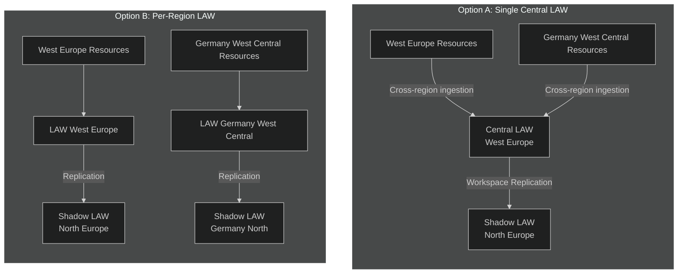
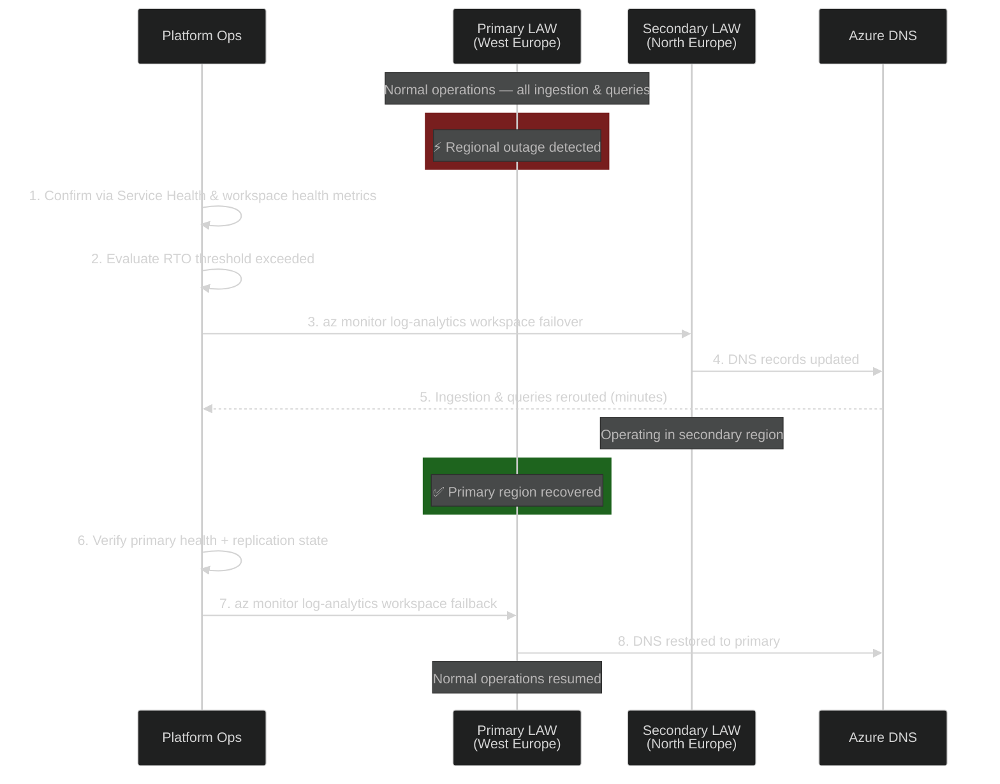

# Multi-Region Resiliency & BCDR for Monitoring Infrastructure

> **Document Type**: Decision Guide & BCDR Reference  
> **Version**: 1.0  
> **Last Updated**: April 2026  
> **Audience**: Platform Architects, Cloud Operations, Leadership

| 📚 **Quick Navigation** | [README](./README.md) | [Architecture](./01-architecture-overview.md) | [Operations Runbook](./02-operations-runbook.md) | [Advanced Topics](./03-advanced-topics.md) | [Platform Scenarios](./04-platform-observability-scenarios.md) | **BCDR** |
|---|---|---|---|---|---|---|

---

## 1. Context & Decision Scope

The customer has been asked to evaluate a **Single Log Analytics Workspace (LAW)** collecting logs from **all regions** at the platform level versus a **Per-Region LAW** model. This document provides a structured comparison with BCDR implications for the following regional topology:

| Region | Pair Type | Paired With | LAW Replication Supported |
|--------|-----------|-------------|---------------------------|
| **West Europe** | Fixed pair | North Europe | ✅ Yes (same Europe group) |
| **Germany West Central** | Fixed pair | Germany North | ✅ Yes (same Europe group) |
| **Germany West Central** | Non-paired | Sweden Central | ✅ Yes (same Europe group) |

> **Key Fact**: Azure LAW Workspace Replication supports any target within the same **region group** — not limited to fixed pairs. The full Europe group includes: France Central, Germany West Central, North Europe, South UK, West Europe, West UK, and others.

---

## 2. Single LAW vs Per-Region LAW — Architecture Comparison

### 2.1 Architecture Overview



### 2.2 Head-to-Head Comparison

| Criteria | Single Central LAW | Per-Region LAW | Winner |
|----------|-------------------|----------------|--------|
| **Operational simplicity** | One workspace, one pane of glass | Multiple workspaces to manage | Single |
| **Cross-region query** | Native (all data in one place) | Requires `workspace()` cross-queries | Single |
| **Data sovereignty / residency** | ⚠️ All data flows to one region | ✅ Data stays in region of origin | Per-Region |
| **Blast radius** | 🔴 Single point of failure — total loss of visibility | 🟢 Failure isolated to one region | Per-Region |
| **Ingestion latency** | Higher for remote regions (network hop) | Lower (local ingestion) | Per-Region |
| **Egress costs** | Cross-region egress charges apply | Minimal (local ingestion) | Per-Region |
| **Replication cost** | Pay once for one workspace | Pay per workspace replicated | Single |
| **RBAC granularity** | Resource-context RBAC required | Natural workspace-level isolation | Per-Region |
| **Regulatory compliance** | May violate German data residency requirements | ✅ Compliant by default | Per-Region |
| **Sentinel integration** | One Sentinel instance | Multiple Sentinel instances or cross-workspace | Single |
| **Alert rule management** | Centralized | Per-region alert rules needed | Single |
| **Scalability (ingestion)** | Risk of hitting single LAW limits | Distributed load | Per-Region |

### 2.3 Recommendation Summary

| Use Case | Recommended Model |
|----------|-------------------|
| No data residency requirements, small footprint (<50 GB/day total) | **Single LAW** |
| German data residency (BDSG/GDPR strict), multi-region production | **Per-Region LAW** |
| Compliance-driven (financial, healthcare) | **Per-Region LAW** |
| Enterprise with 400+ landing zones across EU | **Per-Region LAW** with cross-workspace queries |

---

## 3. BCDR: Failover Scenarios by Region

### 3.1 Azure LAW Resilience Layers

| Layer | Protection Scope | Cost | Activation | RTO |
|-------|-----------------|------|------------|-----|
| **Availability Zones** | Datacenter failure within region | **Free** | Automatic | ~0 min |
| **Workspace Replication** | Full regional outage | Paid (per replicated GB) | **Manual** switchover | 15–30 min |
| **Continuous Data Export** | Data backup (no service failover) | Export + Storage costs | Manual restore | 1–4 hours |

> ⚠️ **Critical**: Azure does **NOT** provide automatic geo-failover for LAW. Workspace Replication requires a **manual `az monitor log-analytics workspace failover`** command.

### 3.2 Failover Matrix — Three Regional Scenarios

#### Scenario A: West Europe → North Europe (Fixed Pair)

| Attribute | Value |
|-----------|-------|
| **Primary** | West Europe |
| **Secondary** | North Europe |
| **Pair type** | Fixed Azure region pair |
| **Replication** | ✅ Supported natively |
| **RTO** | 15–30 min (DNS propagation + manual trigger) |
| **RPO** | ~0 (continuous replication from enablement) |
| **Switchover** | `az monitor log-analytics workspace failover --location northeurope` |
| **Switchback** | `az monitor log-analytics workspace failback` |
| **Data residency** | Both in EU geography ✅ |

#### Scenario B: Germany West Central → Germany North (Fixed Pair)

| Attribute | Value |
|-----------|-------|
| **Primary** | Germany West Central |
| **Secondary** | Germany North |
| **Pair type** | Fixed Azure region pair |
| **Replication** | ✅ Supported natively |
| **RTO** | 15–30 min |
| **RPO** | ~0 (continuous replication) |
| **Switchover** | `az monitor log-analytics workspace failover --location germanynorth` |
| **Switchback** | `az monitor log-analytics workspace failback` |
| **Data residency** | Both in German geography ✅ — satisfies BDSG |

#### Scenario C: Germany West Central → Sweden Central (Non-Paired)

| Attribute | Value |
|-----------|-------|
| **Primary** | Germany West Central |
| **Secondary** | Sweden Central |
| **Pair type** | **Non-paired** (but same Europe region group) |
| **Replication** | ✅ Supported — LAW replication works within region groups, not limited to pairs |
| **RTO** | 15–30 min |
| **RPO** | ~0 (continuous replication) |
| **Switchover** | `az monitor log-analytics workspace failover --location swedencentral` |
| **Switchback** | `az monitor log-analytics workspace failback` |
| **Data residency** | ⚠️ Data leaves German geography → review legal/compliance requirements |

### 3.3 Failover Flow — Step by Step



### 3.4 Key Operational Facts for Failover

| Item | Detail |
|------|--------|
| **Trigger** | Manual only — no auto-failover |
| **DNS propagation** | Minutes, but some clients with sticky connections take longer |
| **Pre-requisite** | Replication must be enabled ≥7 days before switchover (data build-up) |
| **Logs before enablement** | NOT replicated — only new logs post-enablement are copied |
| **Alert rules** | NOT auto-replicated — must be manually exported/imported to secondary region |
| **Private Links** | NOT supported during failover |
| **VM Insights / Container Insights** | NOT supported during failover |
| **Sentinel Watchlists** | Up to 12 days to fully replicate |
| **Workspace management ops** | Blocked during switchover (retention, pricing tier, schema changes) |

---

## 4. SLA, RTO, RPO Matrix

### 4.1 Azure Monitor & LAW SLA Reference

| Component | Microsoft SLA | Notes |
|-----------|---------------|-------|
| **Azure Monitor Logs ingestion** | 99.9% | Per-region SLA |
| **Azure Monitor Metrics** | 99.9% | Platform metrics |
| **Log Analytics query availability** | 99.9% | Does not cover regional outage |
| **Workspace Replication** | No additional SLA | Feature enhances resilience but is not a separate SLA commitment |
| **Availability Zones** | 99.99% (with AZ) | Free, automatic in supported regions |

### 4.2 RTO/RPO by DR Strategy

| Strategy | RPO | RTO | Annual Cost Impact | Best For |
|----------|-----|-----|--------------------|----------|
| **AZ only (no replication)** | 0 | 0 (auto) | **Free** | Datacenter-level failure |
| **Workspace Replication (fixed pair)** | ~0 | 15–30 min | ~1× ingestion cost for replication | Regional outage, compliance |
| **Workspace Replication (non-paired)** | ~0 | 15–30 min | ~1× ingestion cost | Regional outage, flexibility |
| **Dual DCR ingestion** | 0 | ~0 (both active) | 2× full ingestion cost | Maximum resilience, budget available |
| **Continuous Export to GRS Storage** | 5–15 min | 1–4 hours | Export + Storage costs | Cost-optimized backup |

### 4.3 Business Impact Mapping

| Outage Duration | Impact Without DR | Impact With Workspace Replication |
|----------------|-------------------|----------------------------------|
| **< 15 min** | Minor — buffered by AMA agent retry | Not triggered (within AZ tolerance) |
| **15 min – 1 hour** | Alert blindness, no new data | Switchover triggered, visibility restored in ~15 min |
| **1 – 4 hours** | ⚠️ SLA breach risk, no incident correlation | Full operations on secondary |
| **4+ hours** | 🔴 Critical gap in audit trail, compliance exposure | Full operations on secondary |

---

## 5. Cost Analysis

### 5.1 Cost Model — Single LAW vs Per-Region LAW

> Assumption: 100 GB/day total ingestion (60 GB West Europe, 40 GB Germany West Central), Pay-As-You-Go pricing, 90-day retention.

| Cost Component | Single LAW | Per-Region LAW (2 workspaces) |
|----------------|-----------|-------------------------------|
| **Ingestion (100 GB/day × ~€2.76/GB)** | ~€276/day | ~€276/day (same total volume) |
| **Cross-region egress** | ~€0.02/GB × 40 GB = €0.80/day | €0/day |
| **Workspace Replication** | 1 workspace × 100 GB = ~€276/day | 2 workspaces × (60+40) GB = ~€276/day |
| **Retention (90d included)** | Included | Included |
| **Total (without replication)** | ~€277/day | ~€276/day |
| **Total (with replication)** | ~€553/day | ~€552/day |

> **Note**: Costs are illustrative. Commitment Tiers (100 GB/day, 200 GB/day, etc.) reduce per-GB cost significantly. Check the [Azure Monitor pricing page](https://azure.microsoft.com/pricing/details/monitor/) for current rates.

### 5.2 Cost Optimization Tactics

| Tactic | Savings Potential | Effort |
|--------|-------------------|--------|
| **Commitment Tier** (100/200/300 GB/day) | 20–35% off ingestion | Low |
| **DCR transformations** — filter noisy logs before ingestion | 15–40% | Medium |
| **Basic Logs plan** for verbose/debug tables | ~67% on applicable tables | Low |
| **Replicate only critical tables** via selective DCR-to-DCE association | 30–60% on replication cost | Medium |
| **Archive tier** for data >90 days | ~90% vs interactive retention | Low |

---

## 6. Decision Framework — Quick Reference

### Which model should you choose?

```
START
  │
  ├─ Is German data residency required (BDSG/EU strict)?
  │    ├─ YES → Per-Region LAW ✅
  │    └─ NO ──┐
  │            │
  │   ├─ Total ingestion > 200 GB/day across regions?
  │   │    ├─ YES → Per-Region LAW ✅ (distributed load)
  │   │    └─ NO ──┐
  │   │            │
  │   │   ├─ Need blast radius isolation?
  │   │   │    ├─ YES → Per-Region LAW ✅
  │   │   │    └─ NO → Single LAW ✅ (simplicity)
```

### Final Architecture Recommendation for This Customer

Given the customer's use of **West Europe + Germany West Central** with data residency considerations:

| Decision | Recommendation |
|----------|---------------|
| **LAW Model** | **Per-Region LAW** — one per primary region |
| **Replication** | Enable Workspace Replication on each LAW |
| **West Europe LAW** | Replicate to **North Europe** (fixed pair) |
| **Germany West Central LAW** | Replicate to **Germany North** (fixed pair, stays in German geography) |
| **Cross-workspace visibility** | Use `workspace()` function in KQL and Azure Workbooks |
| **Alerting** | Deploy AMBA per region + manually replicate critical alert rules to secondary |
| **Sentinel** | Single Sentinel instance with cross-workspace connectors if needed |

---

## 7. Microsoft Official References

| Topic | URL |
|-------|-----|
| LAW Workspace Replication | https://learn.microsoft.com/azure/azure-monitor/logs/workspace-replication |
| Azure Region Pairs | https://learn.microsoft.com/azure/reliability/cross-region-replication-azure |
| LAW Best Practices | https://learn.microsoft.com/azure/azure-monitor/logs/best-practices-logs |
| Azure Monitor Reliability | https://learn.microsoft.com/azure/azure-monitor/best-practices-reliability |
| Workspace Design | https://learn.microsoft.com/azure/azure-monitor/logs/workspace-design |
| Azure Monitor Pricing | https://azure.microsoft.com/pricing/details/monitor/ |
| LAW SLA | https://www.microsoft.com/licensing/docs/view/Service-Level-Agreements-SLA-for-Online-Services |

---

> **Related UMS Documents**: This guide extends [03-Advanced Topics § Disaster Recovery](./03-advanced-topics.md#3-disaster-recovery-for-monitoring) with customer-specific multi-region scenarios.
